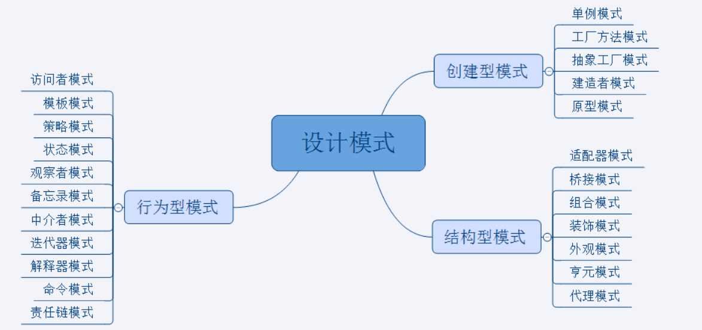

# 一、设计模式概要

## 1、什么是设计模式

设计模式（Design pattern）是一套被反复使用、多数人知晓的、经过分类编目的、代码设计经验的总结。使用设计模式是为了可重用代码、让代码更容易被他人理解、保证代码可靠性。 毫无疑问，设计模式于己于他人于系统都是多赢的，设计模式使代码编制真正工程化，设计模式是软件工程的基石，如同大厦的一块块砖石一样。项目中合理的运用设计模式可以完美的解决很多问题，每种模式在现在中都有相应的原理来与之对应，每一个模式描述了一个在我们周围不断重复发生的问题，以及该问题的核心解决方案，这也是它能被广泛应用的原因。简单说：

模式：在某些场景下，针对某类问题的某种通用的解决方案。 

> 场景：项目所在的环境 
>
> 问题：约束条件，项目目标等
>
> 解决方案：通用、可复用的设计，解决约束达到目标。

## 2、设计模式的三个分类

> **创建型模式**：对象实例化的模式，创建型模式用于解耦对象的实例化过程。 
>
> **结构型模式**：把类或对象结合在一起形成一个更大的结构。 
>
> **行为型模式**：类和对象如何交互，及划分责任和算法。 

如下图所示：



## 3、各分类中模式的关键点  

### 创建型

单例模式：某个类只能有一个实例，提供一个全局的访问点。

简单工厂：一个工厂类根据传入的参量决定创建出那一种产品类的实例。

工厂方法：定义一个创建对象的接口，让子类决定实例化那个类。

抽象工厂：创建相关或依赖对象的家族，而无需明确指定具体类。

建造者模式：封装一个复杂对象的构建过程，并可以按步骤构造。

原型模式：通过复制现有的实例来创建新的实例。

###  结构型

适配器模式：将一个类的方法接口转换成客户希望的另外一个接口。

组合模式：将对象组合成树形结构以表示“”部分-整体“”的层次结构。

装饰模式：动态的给对象添加新的功能。

代理模式：为其他对象提供一个代理以便控制这个对象的访问。

亨元（蝇量）模式：通过共享技术来有效的支持大量细粒度的对象。

外观模式：对外提供一个统一的方法，来访问子系统中的一群接口。

桥接模式：将抽象部分和它的实现部分分离，使它们都可以独立的变化。

### 行为型

模板模式：定义一个算法结构，而将一些步骤延迟到子类实现。

解释器模式：给定一个语言，定义它的文法的一种表示，并定义一个解释器。

策略模式：定义一系列算法，把他们封装起来，并且使它们可以相互替换。

状态模式：允许一个对象在其对象内部状态改变时改变它的行为。

观察者模式：对象间的一对多的依赖关系。

备忘录模式：在不破坏封装的前提下，保持对象的内部状态。

中介者模式：用一个中介对象来封装一系列的对象交互。

命令模式：将命令请求封装为一个对象，使得可以用不同的请求来进行参数化。

访问者模式：在不改变数据结构的前提下，增加作用于一组对象元素的新功能。

责任链模式：将请求的发送者和接收者解耦，使的多个对象都有处理这个请求的机会。

迭代器模式：一种遍历访问聚合对象中各个元素的方法，不暴露该对象的内部结构。

# 二、创建型模式

## 1、单例模式

[源代码](https://gitee.com/healer0604/BackCode/tree/master/DesignPattern/src/com/daniel/singlet)

### 饿汉模式

单例模式（Singleton Pattern）是 Java 中最简单的设计模式之一。这种类型的设计模式属于创建型模式，它提供了一种创建对象的最佳方式。
这种模式涉及到一个单一的类，该类负责创建自己的对象，同时确保只有单个对象被创建。这个类提供了一种访问其唯一的对象的方式，可以直接访问，不需要实例化该类的对象。

> 是否 Lazy 初始化：否
>
> 是否多线程安全：是
>
> 实现难度：易
>
> 描述：这种方式比较常用，但容易产生垃圾对象。
>
> 优点：没有加锁，执行效率会提高。
>
> 缺点：类加载时就初始化，浪费内存。

它基于 `classloader `机制避免了多线程的同步问题，不过，`instance `在类装载时就实例化，虽然导致类装载的原因有很多种，在单例模式中大多数都是调用 `getInstance `方法， 但是也不能确定有其他的方式（或者其他的静态方法）导致类装载，这时候初始化 `instance `显然没有达到` lazy loading` 的效果。

**实现：**

```java
public class SingletonTest1 {
    public static void main(String[] args) {
        Student student1 = Student.getInstance();
        Student student2 = Student.getInstance();
        student1.setName("daniel");
        System.out.println(student2.getName());//daniel
    }
}
class Student{

//    使用private关键字修饰构造方法防止外部创建实例
    private Student(){
    }
//    使用static修饰实例变量
    private static Student instance =  new Student();
//    通过静态方法获取对象实例
    public static Student getInstance(){
        return instance;
    }
    

private String name;
public void setName(String name){
    this.name = name;
}
public String getName(){
    return name;
}

}
```

### 懒汉模式

> 是否 Lazy 初始化：是
>
> 是否多线程安全：是
>
> 实现难度：易
>
> 描述：这种方式具备很好的 lazy loading，能够在多线程中很好的工作，但是，效率很低，99% 情况下不需要同步。
>
> 优点：第一次调用才初始化，避免内存浪费。
>
> 缺点：必须加锁 synchronized 才能保证单例，但加锁会影响效率。

getInstance() 的性能对应用程序不是很关键（该方法使用不太频繁）。

**实现：**

```java
package com.daniel.java1;

import javax.lang.model.element.NestingKind;

/**

 * 单例模式中的懒汉模式
   */
public class SingletonTest2 {
    public static void main(String[] args) {
        Bank bank1 = Bank.getInstance();
        Bank bank2 = Bank.getInstance();
        bank1.setAccount("123456");
        System.out.println(bank2.getAccount());

    }
}
class Bank{
    private Bank(){
    }
    //    创建变量
    private static Bank instance = null;
    //    调用方法时进行创建,考虑多线程访问,加同步锁才能解决同步问题
    public static Bank getInstance(){
        if (instance==null)
            instance = new Bank();
        return instance;
    }
    public String account ;
    public void setAccount(String account){
        this.account = account;
    }
    public String getAccount(){
        return account;
    }
}
```

#### 懒汉模式的同步问题

通过加方法同步锁

```java
public synchronized static Bank getInstance(){
    if (instance==null)
        instance = new Bank();
    return instance;
}
```

通过加同步代码块

```java
public static Bank getInstance() {//效率更好
    if (instance == null) {//此处加判断是为了防止在优先进入的线程创建实例时导致其他大量线程等待的情况
        synchronized (Bank.class) {
            instance = new Bank();
        }
    }
    return instance;
}
```

## 2、工厂模式

[源代码](https://gitee.com/healer0604/BackCode/tree/master/DesignPattern/src/com/daniel/factory)

工厂模式（Factory Pattern）是 Java 中最常用的设计模式之一。这种类型的设计模式属于创建型模式，它提供了一种创建对象的最佳方式。

在工厂模式中，我们在创建对象时不会对客户端暴露创建逻辑，并且是通过使用一个共同的接口来指向新创建的对象。

### 介绍

> 意图：定义一个创建对象的接口，让其子类自己决定实例化哪一个工厂类，工厂模式使其创建过程延迟到子类进行。
>
> 主要解决：主要解决接口选择的问题。
>
> 何时使用：我们明确地计划不同条件下创建不同实例时。
>
> 如何解决：让其子类实现工厂接口，返回的也是一个抽象的产品。
>
> 关键代码：创建过程在其子类执行。
>
> 应用实例： 1、您需要一辆汽车，可以直接从工厂里面提货，而不用去管这辆汽车是怎么做出来的，以及这个汽车里面的具体实现。 

### 优点：

 1、一个调用者想创建一个对象，只要知道其名称就可以了。 

2、扩展性高，如果想增加一个产品，只要扩展一个工厂类就可以。 

3、屏蔽产品的具体实现，调用者只关心产品的接口。

缺点：每次增加一个产品时，都需要增加一个具体类和对象实现工厂，使得系统中类的个数成倍增加，在一定程度上增加了系统的复杂度，同时也增加了系统具体类的依赖。这并不是什么好事。

#### 使用场景： 

1、日志记录器：记录可能记录到本地硬盘、系统事件、远程服务器等，用户可以选择记录日志到什么地方。 

2、数据库访问，当用户不知道最后系统采用哪一类数据库，以及数据库可能有变化时。

 3、设计一个连接服务器的框架，需要三个协议，"POP3"、"IMAP"、"HTTP"，可以把这三个作为产品类，共同实现一个接口。

==注意事项==：作为一种创建类模式，在任何需要生成复杂对象的地方，都可以使用工厂方法模式。有一点需要注意的地方就是复杂对象适合使用工厂模式，而简单对象，特别是只需要通过 new 就可以完成创建的对象，无需使用工厂模式。如果使用工厂模式，就需要引入一个工厂类，会增加系统的复杂度。

### **实现：**

我们将创建一个 Shape 接口和实现 Shape 接口的实体类。下一步是定义工厂类 ShapeFactory。

FactoryPatternDemo 类使用 ShapeFactory 来获取 Shape 对象。它将向 ShapeFactory 传递信息（CIRCLE / RECTANGLE / SQUARE），以便获取它所需对象的类型。

#### 步骤 1

创建一个接口:
Shape.java

图形接口类

```JAVA
public interface Shape {
   void draw();
}
```

#### 步骤 2

创建实现接口的实体类。

Rectangle.java

矩形类

```java
public class Rectangle implements Shape {

   @Override
   public void draw() {
      System.out.println("Inside Rectangle::draw() method.");
   }
}
```

Square.java

正方形类

```java
public class Square implements Shape {

   @Override
   public void draw() {
      System.out.println("Inside Square::draw() method.");
   }
}
```

Circle.java

圆形类

```java
public class Circle implements Shape {

   @Override
   public void draw() {
      System.out.println("Inside Circle::draw() method.");
   }
}
```


#### 步骤 3

创建一个工厂，生成基于给定信息的实体类的对象。
ShapeFactory.java

```java
public class ShapeFactory {
    
   //使用 getShape 方法获取形状类型的对象
   public Shape getShape(String shapeType){
      if(shapeType == null){
         return null;
      }        
      if(shapeType.equalsIgnoreCase("CIRCLE")){
         return new Circle();
      } else if(shapeType.equalsIgnoreCase("RECTANGLE")){
         return new Rectangle();
      } else if(shapeType.equalsIgnoreCase("SQUARE")){
         return new Square();
      }
      return null;
   }
}
```

#### 步骤 4

使用该工厂，通过传递类型信息来获取实体类的对象。

FactoryPatternDemo.java

```java
public class FactoryPatternDemo {

   public static void main(String[] args) {
      ShapeFactory shapeFactory = new ShapeFactory();

  //获取 Circle 的对象，并调用它的 draw 方法
  Shape shape1 = shapeFactory.getShape("CIRCLE");

  //调用 Circle 的 draw 方法
  shape1.draw();

  //获取 Rectangle 的对象，并调用它的 draw 方法
  Shape shape2 = shapeFactory.getShape("RECTANGLE");

  //调用 Rectangle 的 draw 方法
  shape2.draw();

  //获取 Square 的对象，并调用它的 draw 方法
  Shape shape3 = shapeFactory.getShape("SQUARE");

  //调用 Square 的 draw  方法
  shape3.draw();

   }
}
```

#### 步骤 5

执行程序，输出结果：

```java
Inside Circle::draw() method.
Inside Rectangle::draw() method.
Inside Square::draw() method.
```

