# 1、Java语言概述

## **1、Java语言概述**

1. SUN（Stanford University Network 斯坦福大学校园网）公司1995年推出的一门高级编程语言
2. 2009年被Oracle公司收购
3. 随着Java技术在web方面的不断成熟,已经成为Web应用程序的首选开发语言
4. 是Hadoop等大数据开源框架首选开发语言
5. 特点是:完全面向对象,安全可靠,与平台无关

## **2、Java语言的三种技术架构**

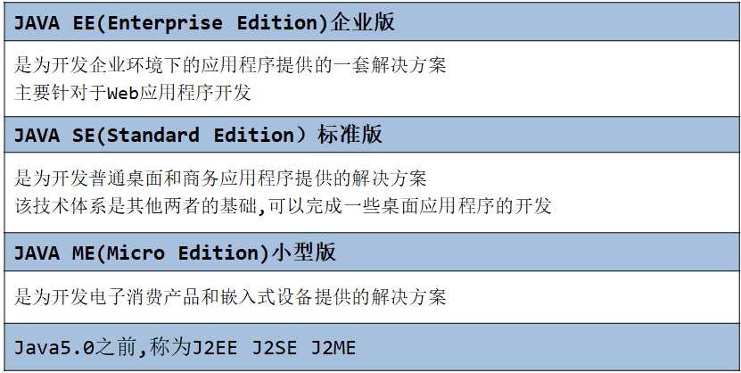

 

## **3、Java语言的特点：跨平台性什么是跨平台性?**

平台:OS--Operation System 操作系统 ，通过Java语言编写的应用程序在不同的操作系统平台上都可以运行。

Java语言跨平台原理：

各种平台上装有不同JVM虚拟机  =>Java virtual machine

传统编程语言:平台相关(非跨平台)

针对Windows平台开发的程序,只能运行在Windows平台上,同样的Java程序,在不同平台上都能运行

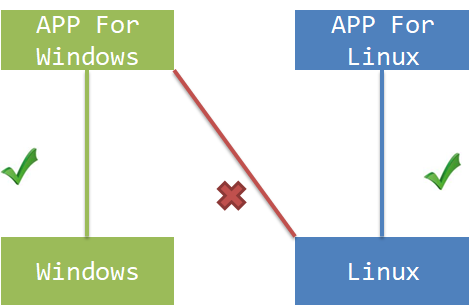

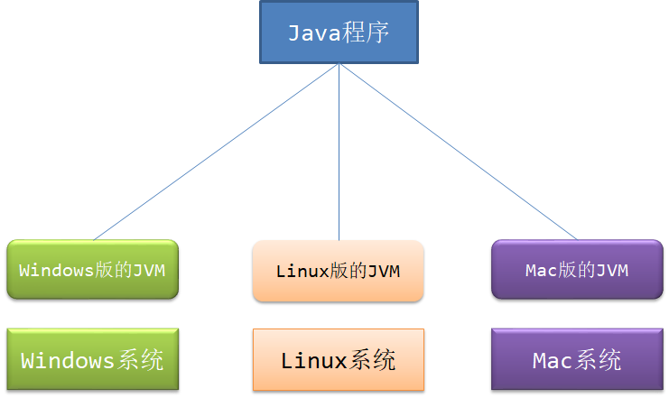

## **4、Java语言的环境搭建**

**明确什么是JRE,JDK** 

**（jre）java runtime environment**

**（jdk）java development kit**

下载JDK 安装JDK 配置环境变量 验证

## **5.什么是JRE,JDK?**

JRE(Java Runtime Environment Java运行环境) ：包括Java虚拟机(JVM Java Virtual Machine)和Java程序所需的核心类库等

JDK(Java Development Kit Java开发工具包) ：JDK是提供给Java开发人员使用的,其中包含了java的开发工具,也包括了JRE。所以安装了JDK,就不用在单独安装JRE了

其中的开发工具： 编译工具(javac.exe) 打包工具(jar.exe) 等

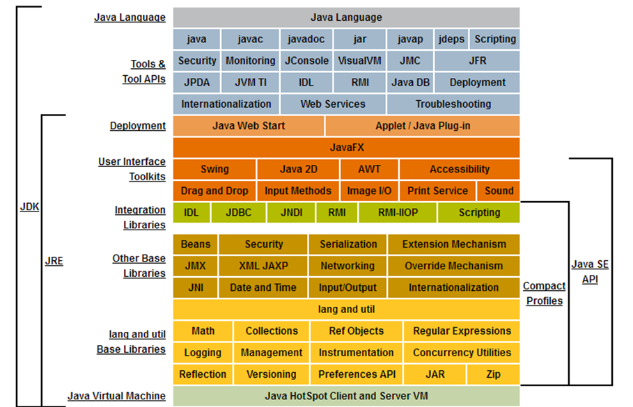

##  **6、 下载JDK**

JDK(Java Development Kit)：Java开发工具包

官方网址：www.oracle.com

注意操作系统和版本的选择

### **6.1 验证安装是否成功?**

进入控制台窗口,在任意目录下输入命令

```
java -version
```


如果出现”不是内部命令或外部命令,也不是可运行的程序”说明没有找到该命令,需要配置一下环境变量

环境变量：系统寻找命令的路径

### **6.2 配置环境变量Path**

我的电脑--属性--高级--环境变量

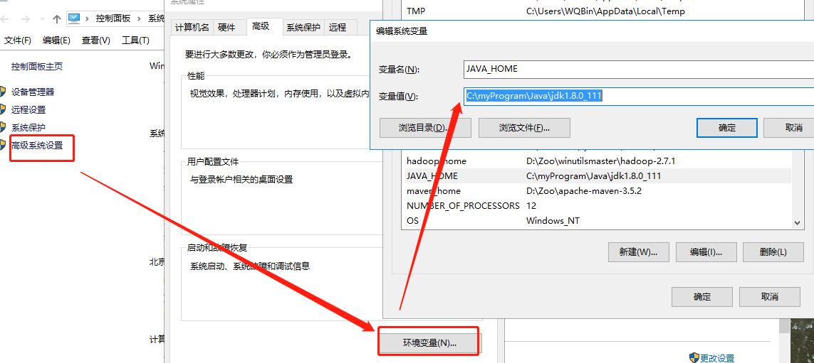

 

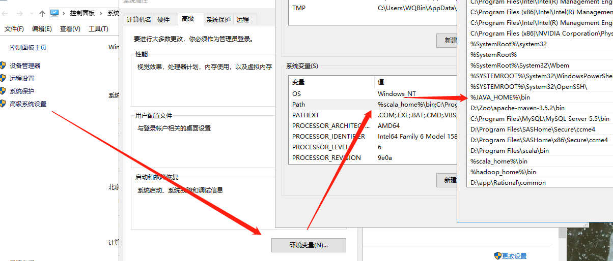

 

编辑Path环境变量,加上java工具所在目录,各个路径之间用英文的“;”分隔,建议放在最前面

打开DOS命令行,任意目录下执行javac命令

如果出现java -version 的信息,配置成功

1、检查“系统变量：JAVA_HOME ”的配置，确认-变量值，是本地的jdk的安装路径； 

2、检查“系统变量：CLASSPATH”的配置，确认-变量值： 

```java
%JAVA_HOME%\lib;%JAVA_HOME%\lib\tools.jar; 
```

3、检查“系统变量：path值”，系统变量path前已添加下面内容：

```java
;%JAVA_HOME%\bin;    前边没有“;”要加上
```

==**如果还是无法运行javac将目录加入path**==


==**配置classpath的目的是使用java 命令执行class文件时可在任意位置执行，前提是在环境变量中配置CLASSPATH变量，并且想要执行的class文件在classpath所映射的目录下**==

## **7.Java程序开发流程**

1. 将Java代码编写到后缀名为.java的文件中
2. 通过javac命令对该java文件进行编译
3. 通过java命令运行生成的class文件


### **步骤一：编写**

编写之前调整系统,取消隐藏已知类型文件的扩展名

文本编辑器：记事本/notepad++/EditPlus

新建文件Demo.java,编辑此文件,输入代码

```java
public class Demo{ 
	public static void main(String[] args){
		System.out.println("HelloWorld");  
	}
}
```


### **步骤二：编译**

**运行时可在当前文件夹下地址栏输入cmd直接进入该目录所在终端窗口**


将源码文件（源文件）编译成JVM可以识别的文件

在该源文件目录下,通过javac编译工具对Demo.java文件进行编译

如果程序没有错误,没有任何提示,但在当前目录下会出现一个Demo.class文件,该文件称为字节码文件,也是可以执行的java的程序

 

### **步骤三：运行**

通过运行工具java.exe对字节码文件进行执行

==注意java 命令后边的文件不能加.class==

一切正常的话,会显示Hello World

### **常见错误：**

缺少大括号（大括号不成对）

字母大小写错误

关键字单词拼错

## **8.classpath的作用**

### **配置classpath**

既然class文件(字节码文件)是java的运行文件,可不可以实现,==在任意目录下都可以执行某一目录下的class文件呢？==

根据path环境变量的原理,可以定义一个名为classpath环境变量,将要运行的class文件所在目录定义在该变量中。

```java
例：set classpath=c:/code
```

classpath变量值是java类文件的目录

path变量是windows程序文件的目录

### **JVM查找类文件的顺序：**

==如果没有配置classpath环境变量,JVM只在当前目录下查找要运行的类文件==

==如果配置了classpath环境,JVM会先在classpath环境变量值的目录中查找要运行的类文件==

值的结尾处如果加上分号,那么JVM在classpath目录下没有找到要指定的类文件,会在当前目录下再查找一次

值的结尾出如果没有分号,那么JVM在classpath目录下没有找到要指定的类文件,不会在当前目录下查找,即使当前目录下有,也不会运行。

## **9.问题及解决方法**

### 9.1源文件名不存在或者写错,或者当前路径错误。


类文件名写错,或者类文件不在当前路径下,或者不在classpath指定路径下。

### 9.2编译失败,注意错误出现的行数,在到源代码中指定位置排错


 

## **10.注释**

用于注解,说明,解释程序的文字就是注释给开发人员看的

Java中的注释种类： 

单行注释：line comment 

　　一行中,两个//开始,到行尾的内容都会被当成注释

　　　　格式： //注释文字

　　多行注释/块注释 block comment

　　　　格式： /* 注释文字 */

　　文档注释：javadoc comment（以后讲）

　　　　格式：/** 注释文字 */

　　　　通常是加在类定义的前面和方法定义的前面

note:

单行和多行注释,不会被JVM（java虚拟机）解释执行。

对于文档注释,是java特有的注释,注释内容可以被Java提供的工具: javadoc 所解析,生成一套以网页文件形式体现的说明文档

```java
/*
需求：在屏幕上打印Hello World字符串

*/
//类定义
public class Hello{    
    /*
    main方法,程序的入口点,被JVM直接执行的类需要有main方法
    其格式是固定的  
    */
    public static void main(String[] args){
        //这是输出语句,用于将括号里的内容打印到控制台
        System.out.println("Hello World");
    }
}
```

# 2、jdk、jre、jvm

## **jdk、jre、jvm三者之间的联系**

==**JDK=JRE+java开发工具包（javac.exe、java.exe、javadoc.exe）**==

==**JRE=JVM+java核心类库**==

### **1首先是JDK**

JDK(Java Development Kit) 是 Java 语言的软件开发工具包(SDK)。 **在JDK的安装目录下有一个jre目录**，里面有两个文件夹bin和lib，在这里可以认为**bin里的就是jvm，lib中则是jvm工作所需要的类库，而jvm和 lib合起来就称为jre。**

### **2JRE**

**（Java Runtime Environment，Java运行环境）**

**包含JVM标准实现及Java核心类库。**JRE是Java运行环境，并不是一个开发环境，所以没有包含任何开发工具（如编译器和调试器）

最后JVM也一目了然了

JVM是Java Virtual Machine（Java[虚拟机](http://baike.baidu.com/view/1132.htm)）的缩写，JVM是一种用于计算设备的规范，它是**一个虚构出来的计算机**，是通过在实际的计算机上仿真模拟各种计算机功能来实现的。

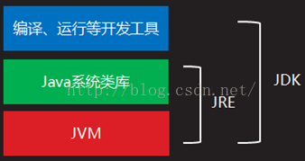

由上图一目了然：

JDK是整个Java的核心，包括了Java运行环境JRE、Java工具和Java基础类库。JRE是运行JAVA程序所必须的环境的集合，包含JVM标准实现及Java核心类库。JVM是整个java实现跨平台的最核心的部分，能够运行以Java语言写的程序。

JVM体系结构与运行原理：

Java语言写的源程序通过Java编译器，编译成与平台无关的‘字节码程序’(.class文件，也就是0，1二进制程序)，然后在OS之上的Java解释器中解释执行。


### 3.JVM整个类加载过程的步骤：

#### **1.**    装载

装载过程负责找到二进制字节码并加载至JVM中，JVM通过类名、类所在的包名通过ClassLoader来完成类的加载，同样，也采用以上三个元素来标识一个被加载了的类：类名+包名+ClassLoader实例ID。

#### **2.**    链接

链接过程负责对二进制字节码的格式进行校验、初始化装载类中的静态变量以及解析类中调用的接口、类。

完成校验后，JVM初始化类中的静态变量，并将其值赋为默认值。

最后对类中的所有属性、方法进行验证，以确保其需要调用的属性、方法存在，以及具备应的权限（例如public、private域权限等），会造成NoSuchMethodError、NoSuchFieldError等错误信息。

#### **3.**    初始化

初始化过程即为执行类中的静态初始化代码、构造器代码以及静态属性的初始化，在四种情况下初始化过程会被触发执行：

调用了new；

反射调用了类中的方法；

子类调用了初始化；

JVM启动过程中指定的初始化类。


#### **ClassLoader**抽象类的几个关键方法：

##### （1）    loadClass

此方法负责加载指定名字的类，ClassLoader的实现方法为先从已经加载的类中寻找，如没有则继续从parent ClassLoader中寻找，如仍然没找到，则从System ClassLoader中寻找，最后再调用findClass方法来寻找，如要改变类的加载顺序，则可覆盖此方法

##### （2）    findLoadedClass

此方法负责从当前ClassLoader实例对象的缓存中寻找已加载的类，调用的为native的方法。

##### （3）    findClass

此方法直接抛出ClassNotFoundException，因此需要通过覆盖loadClass或此方法来以自定义的方式加载相应的类。

##### （4）    findSystemClass

此方法负责从System ClassLoader中寻找类，如未找到，则继续从Bootstrap ClassLoader中寻找，如仍然为找到，则返回null。

##### （5）    defineClass

此方法负责将二进制的字节码转换为Class对象

##### （6）    resolveClass

此方法负责完成Class对象的链接，如已链接过，则会直接返回。

####   **JVM** 运行时数据区：

##### 第一块：**PC**寄存器

PC寄存器是用于存储每个线程下一步将执行的JVM指令，如该方法为native的，则PC寄存器中不存储任何信息。

##### 第二块：**JVM**栈

JVM栈是线程私有的，每个线程创建的同时都会创建JVM栈，JVM栈中存放的为当前线程中局部基本类型的变量（java中定义的八种基本类型：boolean、char、byte、short、int、long、float、double）、部分的返回结果以及Stack Frame，非基本类型的对象在JVM栈上仅存放一个指向堆上的地址

##### 第三块：堆（**Heap**）

它是JVM用来存储对象实例以及数组值的区域，可以认为Java中所有通过new创建的对象的内存都在此分配，Heap中的对象的内存需要等待GC进行回收。

##### 第四块：方法区域（**Method Area**）

（1）在Sun JDK中这块区域对应的为PermanetGeneration，又称为持久代。

（2）方法区域存放了所加载的类的信息（名称、修饰符等）、类中的静态变量、类中定义为final类型的常量、类中的Field信息、类中的方法信息，当开发人员在程序中通过Class对象中的getName、isInterface等方法来获取信息时，这些数据都来源于方法区域，同时方法区域也是全局共享的，在一定的条件下它也会被GC，当方法区域需要使用的内存超过其允许的大小时，会抛出OutOfMemory的错误信息。

##### 第五块：运行时常量池（**Runtime Constant Pool**）

存放的为类中的固定的常量信息、方法和Field的引用信息等，其空间从方法区域中分配。

##### 第六块：本地方法堆栈（**Native Method Stacks**）

JVM采用本地方法堆栈来支持native方法的执行，此区域用于存储每个native方法调用的状态。

# 3、java语言介绍

## 介绍

Java是一门面向对象编程语言，不仅吸收了C++语言的各种优点，还摒弃了C++里难以理解的多继承、指针等概念，因此Java语言具有功能强大和简单易用两个特征。Java语言作为静态面向对象编程语言的代表，极好地实现了面向对象理论，允许程序员以优雅的思维方式进行复杂的编程。

Java具有简单性、面向对象、分布式、健壮性、安全性、平台独立与可移植性、多线程、动态性等特点 。Java可以编写桌面应用程序、Web应用程序、分布式系统和嵌入式系统应用程序等。

## 历史

Java是由Sun Microsystems公司于1995年5月推出的Java面向对象程序设计语言和Java平台的总称。由James Gosling和同事们共同研发，并在1995年正式推出。

Java分为三个体系：

**JavaSE（J2SE）**（Java2 Platform Standard Edition，java平台标准版）

**JavaEE(J2EE)**        (Java 2 Platform,Enterprise Edition，java平台企业版)

**JavaME(J2ME)**     (Java 2 Platform Micro Edition，java平台微型版)。

2005年6月，JavaOne大会召开，SUN公司公开Java SE 6。此时，Java的各种版本已经更名以取消其中的数字"2"：J2EE更名为Java EE, J2SE更名为Java SE，J2ME更名为Java ME。

## Java语言主要特性

- #### 简单的：

Java语言的语法与C语言和C++语言很接近，使得大多数程序员很容易学习和使用。另一方面，Java丢弃了C++中很少使用的、很难理解的、令人迷惑的那些特性，如操作符重载、多继承、自动的强制类型转换。特别地，Java语言不使用指针，而是引用。并提供了自动的废料收集，使得程序员不必为内存管理而担忧。

- #### 面向对象的：

Java语言提供类、接口和继承等面向对象的特性，为了简单起见，只支持类之间的单继承，但支持接口之间的多继承，并支持类与接口之间的实现机制（关键字为implements）。Java语言全面支持动态绑定，而C++语言只对虚函数使用动态绑定。总之，Java语言是一个纯的面向对象程序设计语言。

- #### 分布式的：

Java语言支持Internet应用的开发，在基本的Java应用编程接口中有一个网络应用编程接口（java net），它提供了用于网络应用编程的类库，包括URL、URLConnection、Socket、ServerSocket等。Java的RMI（远程方法激活）机制也是开发分布式应用的重要手段。

- #### 健壮的：

Java的强类型机制、异常处理、垃圾的自动收集等是Java程序健壮性的重要保证。对指针的丢弃是Java的明智选择。Java的安全检查机制使得Java更具健壮性。

- #### 安全的：

Java通常被用在网络环境中，为此，Java提供了一个安全机制以防恶意代码的攻击。除了Java语言具有的许多安全特性以外，Java对通过网络下载的类具有一个安全防范机制（类ClassLoader），如分配不同的名字空间以防替代本地的同名类、字节代码检查，并提供安全管理机制（类SecurityManager）让Java应用设置安全哨兵。

- #### 体系结构中立的：

Java程序（后缀为java的文件）在Java平台上被编译为体系结构中立的字节码格式（后缀为class的文件），然后可以在实现这个Java平台的任何系统中运行。这种途径适合于异构的网络环境和软件的分发。

- #### 跨平台的**：**

这种可移植性来源于体系结构中立性，另外，Java还严格规定了各个基本数据类型的长度。Java系统本身也具有很强的可移植性，Java编译器是用Java实现的，Java的运行环境是用ANSI C实现的。

- #### 解释型的：

如前所述，Java程序在Java平台上被编译为字节码格式，然后可以在实现这个Java平台的任何系统中运行。在运行时，Java平台中的Java解释器对这些字节码进行解释执行，执行过程中需要的类在联接阶段被载入到运行环境中。

- #### 高性能的：

与那些解释型的高级脚本语言相比，Java的确是高性能的。事实上，Java的运行速度随着JIT(Just-In-Time）编译器技术的发展越来越接近于C++。

- #### 多线程的：

在Java语言中，线程是一种特殊的对象，它必须由Thread类或其子（孙）类来创建。通常有两种方法来创建线程：其一，使用型构为Thread(Runnable)的构造子类将一个实现了Runnable接口的对象包装成一个线程，其二，从Thread类派生出子类并重写run方法，使用该子类创建的对象即为线程。值得注意的是Thread类已经实现了Runnable接口，因此，任何一个线程均有它的run方法，而run方法中包含了线程所要运行的代码。线程的活动由一组方法来控制。Java语言支持多个线程的同时执行，并提供多线程之间的同步机制（关键字为synchronized）。

- #### 动态的：

Java语言的设计目标之一是适应于动态变化的环境。Java程序需要的类能够动态地被载入到运行环境，也可以通过网络来载入所需要的类。这也有利于软件的升级。另外，Java中的类有一个运行时刻的表示，能进行运行时刻的类型检查。

编译与运行

```java
public class Test{
	public static void main(String [] rags){
		System.out.print("hello world!");
	}
}
```

使用了两个命令 javac（进行编译）和 java（执行编译后的class文件。

  	javac 后面跟着的是java文件的文件名，例如 HelloWorld.java。 该命令用于将 java 源文件编译为 class 字节码文件，如： javac HelloWorld.java。

运行javac命令后，如果成功编译没有错误的话，会出现一个 HelloWorld.class 的文件。

java 后面跟着的是java文件中的类名,例如 HelloWorld 就是类名，如: java HelloWorld。

注意：java命令后面不要加.class。

# 4、关键字保留字标识符

## 关键字保留字

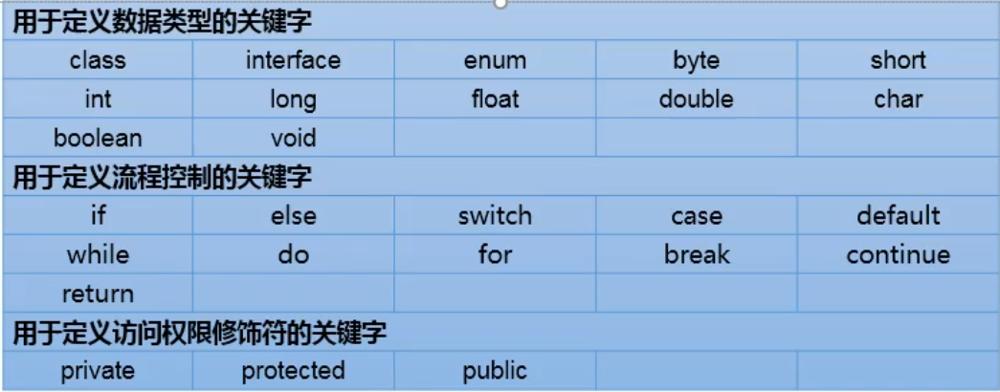

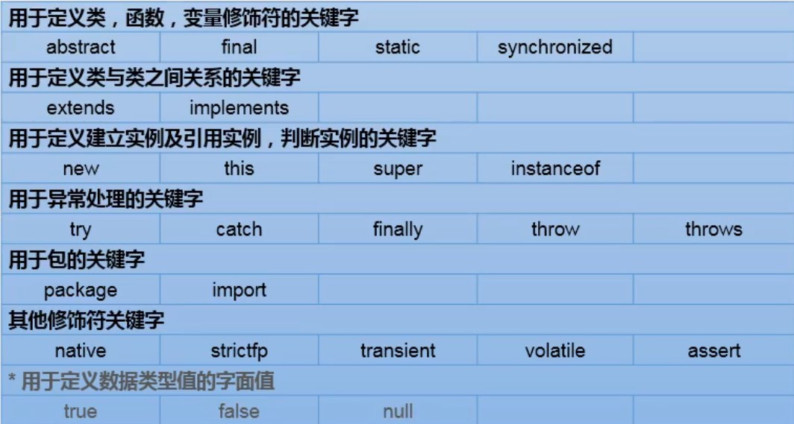

| 类别                 | 关键字                         | 说明                 |
| -------------------- | ------------------------------ | -------------------- |
| 访问控制             | private                        | 私有的               |
| protected            | 受保护的                       |                      |
| public               | 公共的                         |                      |
| 类、方法和变量修饰符 | abstract                       | 声明抽象             |
| class                | 类                             |                      |
| extends              | 扩充,继承                      |                      |
| final                | 最终值,不可改变的              |                      |
| implements           | 实现（接口）                   |                      |
| interface            | 接口                           |                      |
| native               | 本地，原生方法（非 Java 实现） |                      |
| new                  | 新,创建                        |                      |
| static               | 静态                           |                      |
| strictfp             | 严格,精准                      |                      |
| synchronized         | 线程,同步                      |                      |
| transient            | 短暂                           |                      |
| volatile             | 易失                           |                      |
| 程序控制语句         | break                          | 跳出循环             |
| case                 | 定义一个值以供 switch 选择     |                      |
| continue             | 继续                           |                      |
| default              | 默认                           |                      |
| do                   | 运行                           |                      |
| else                 | 否则                           |                      |
| for                  | 循环                           |                      |
| if                   | 如果                           |                      |
| instanceof           | 实例                           |                      |
| return               | 返回                           |                      |
| switch               | 根据值选择执行                 |                      |
| while                | 循环                           |                      |
| 错误处理             | assert                         | 断言表达式是否为真   |
| catch                | 捕捉异常                       |                      |
| finally              | 有没有异常都执行               |                      |
| throw                | 抛出一个异常对象               |                      |
| throws               | 声明一个异常可能被抛出         |                      |
| try                  | 捕获异常                       |                      |
| 包相关               | import                         | 引入                 |
| package              | 包                             |                      |
| 基本类型             | boolean                        | 布尔型               |
| byte                 | 字节型                         |                      |
| char                 | 字符型                         |                      |
| double               | 双精度浮点                     |                      |
| float                | 单精度浮点                     |                      |
| int                  | 整型                           |                      |
| long                 | 长整型                         |                      |
| short                | 短整型                         |                      |
| 变量引用             | super                          | 父类,超类            |
| this                 | 本类                           |                      |
| void                 | 无返回值                       |                      |
| 保留关键字           | goto                           | 是关键字，但不能使用 |
| const                | 是关键字，但不能使用           |                      |
| null                 | 空                             |                      |

## 标识符

Java 所有的组成部分都需要名字。类名、变量名以及方法名都被称为标识符。

关于 Java 标识符，有以下几点需要注意：

- 所有的标识符都应该以字母（A-Z 或者 a-z）,美元符（$）、或者下划线’ _ ‘开始
- 首字符之后可以是字母（A-Z 或者 a-z）,美元符（$）、下划线（_）或数字的任何字符组合
- 关键字不能用作标识符
- 标识符是大小写敏感的
- 合法标识符举例：age、$salary、_value、__1_value
- 非法标识符举例：123abc、-salary

## 标识符命名规范

java中标识符的组成：由52个字母A-Z ，a-z ，数字0-9 ，下划线_ ， 美元符$ 组成

定义包名：推荐使用倒写域名的方式声明，全小写。“com.公司名.项目名.模块名.……”。**例:  com.xxx.dao**

定义常量名：基本数据类型的常量名全部大写，自定义数据类型的常量名可以大小写混写，多个单词用下划线连接。**例:  MMM_SSS_KKK**

定义变量名：可大小写混写，首字符小写，不用下划线，少用美元符，尽量做到见名知义。例:   userName

定义类或者接口的名字：大驼峰命名法，首字母大写，第二个单词首字母大写。 例:   UserMapper

定义方法的名字：小驼峰命名法，首字母小写，第二个单词起每个单词首字母大写。例:  userName

注意： 不能以数字开头，不能是java的关键字/保留字，不能有空格

# 5、变量

## 1.变量

### **1.1 变量的概念：**

- 内存中的一个存储区域
- 该区域有自己的名称（变量名）和类型（数据类型）和值
- Java中每个变量必须先声明，再赋值，然后才能使用
- 该区域的数据可以在同一类型范围内不断变化
- Java 中的变量有四个基本属性：变量名，数据类型，存储单元和变量值

**变量名：**合法的标识符

**变量的数据类型：**可以是基本类型和引用类型（必须包含类型）

**存储单元：**存储单元大小是由数据类型决定的，如：int 为4 个字节32 位

**变量值：**在存储单元中放的就是变量值（如果是基本类型放的就是具体值，如果是引用类型放的是内存地址，如果null，表示不指向任何对象）

### **1.2 定义变量的格式：数据类型  变量名 = 初始化值**

### **1.3 变量是通过使用变量名来访问这块区域的**

```java
//int是一种数据类型，是整型。
int a; //在内存中开辟一块空间，这块空间的类型是整型，给这块空间起名叫a
//赋值
a = 100;
//通过变量名去访问那块内存。
System.out.println(a);
//重复访问
System.out.println(a);
```

### **1.4 使用变量注意：**

- 变量的作用域：一对{ }之间有效。出了大括号就不认识了。
- 初始化值
- 变量可以重复赋值，但不能重复声明，在同一个域中，变量名不能重复。

## 2.1 关于java中的字面值：

### 2.1.什么是字面值？

​     一眼看上去就知道是多少的数据，就是字面值

### 2.2字面值本质：

​     字面值是有数据类型的：

​          整型 100

​          浮点型 3.14

​          布尔型 true/false

​          字符型 '中'

​          字符串型 "ABC"

​          在内存中占用空间。

​          字面值就是内存中的一块空间，这块空间有类型，有值。

​         ==只有字面值内存无法得到重复利用。==

​          java语言中所有的字符都采用“单引号”括起来

​          java语言中所有的字符串都采用“双引号”括起来。

```java
public class ConstTest01{
         public static void main(String[] args){
                   System.out.println(10);   //整数型的字面值
                   System.out.println(3.14);         //浮点型的字面值
                   System.out.println(true);         //布尔型字面值
                   System.out.println(false);       
                   System.out.println('a');   //字符字面值
                   System.out.println("Hello");   //字符串字面值
                   System.out.println(10); //新内存
                   //Error
                   //System.out.println('AB'); //AB本身不是一个字符，而是字符串.
                   System.out.println("A"); //这是一个字符串类型。
         }
}
```

### **2.2 java中变量按照数据类型来分类：**

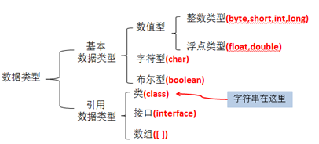

 

 

 

==引用类型默认值：null==

==**8种基本数据类型：注意定义值时不能超过范围**==

   ==整型：byte（8 bit） short  int（默认类型）**long：变量值的末尾要加“L”或“l”==

eg：byte = 1，存储在计算机上为 0000 0001。

   浮点型：**==float：末尾要加上“F”或“f”==**、  ==double (默认类型)==

   字符型：char（用''括起来）只能表示一个字符（英文/中文/标点/转义字符等），==**默认值是“\u0000”**==，要定义多个字符用String(不是基本数据类型)。

   布尔类型： boolean（==**只能取值为true 或false**==，不能取null），==**默认值是false**==。

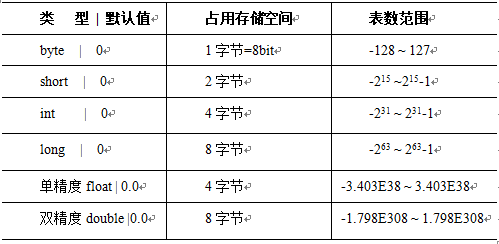

### **2.3 java中变量按照声明位置的不同来分类：**


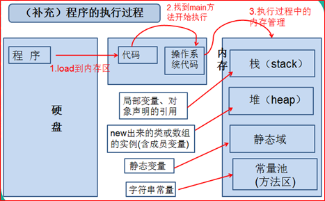

### **2.4进制（了解）：**

```java
public static void main(String[] args) {
    int num1 = 0b10;//二进制
    int num2 = 010;//八进制
    int num3 = 10;//十进制
    int num4 = 0x10;//十六进制
    
    System.out.println("num1:"+num1);
    System.out.println("num2:"+num2);
    System.out.println("num3:"+num3);
    System.out.println("num4:"+num4);
}
```

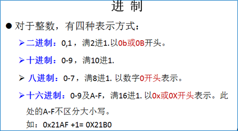

#### **2.4.1二进制：计算机底层都是用二进制来存储、运算。**

#### **2.4.2二进制与十进制之间的转换。**

**二进制转换为十进制：**从右向左，2^0 + 2^1 +···+2^n

**十进制转换为二进制：**

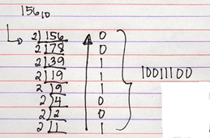

#### **2.4.3二进制在底层存储：正数、负数都是以补码的形式存储的。（原码、反码、补码）**

正数：原码、反码、补码三码合一

负数：正数的原码符号位由0变1è**负数的原码**è负数原码除符号位按位取反è**负数的反码**è负数反码加1è**负数的补码**

#### **2.4.4四种进制间的转换**

 

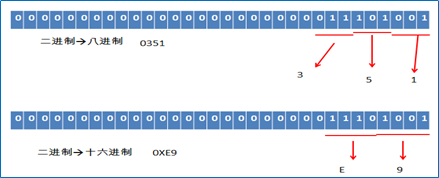

 

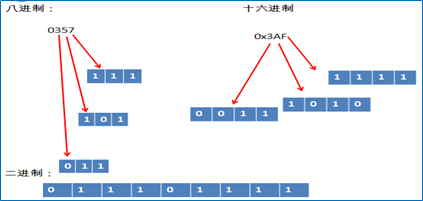

### **2.5变量的运算：不考虑布尔Boolean类型**

  ①自动类型转换：容量小的数据类型自动转换为容量大的数据类型。

short s = 12;   int i = s + 2;  char c1 = ’a’;//97 char c2 = ‘A’;//65

  **注意：byte 、short、 char之间做运算，结果为int型！**èlong èfloatèdouble

  ②强制类型转换：是①的逆过程。使用“（）”实现强转。

**会导致精度的损失（高位截掉了）。**

```java
Eg: long a1 = 12345L; int a2 = (int)a1;
```

\----------------------------------------------------------------------------------------------------------------------

```java
//字符串与基本数据类型之间的运算:只能是连接运算：+。得到的结果仍为一个字符串**

String str = "abc";        
String str1 = str + m1;//abc12345        
System.out.println(str1);
```

\----------------------------------------------------------------------------------------------------------------------

**//题目：**

```java
String st1 = "hello";
int myInt1 = 12;
char ch1 = 'a';//97
System.out.println(str1 + myInt1 + ch1);//输出：hello12a
System.out.println(myInt1 + ch1 + str1);//输出：109hello
System.out.println(ch1 + str1 + myInt1);//输出：ahello12
```

   

\------------------------------------------------------------------------------------------------- 

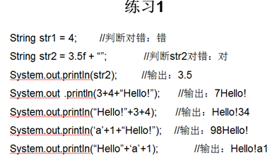

 

 

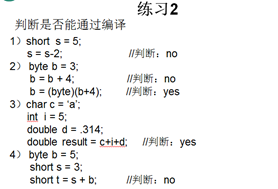

======================================================================

## **3.补充**

### **一、关于变量**

​    1.java中如何定义变量，语法：

```
数据类型 变量名;
```

​    2.如何给变量赋值，语法：

```
           变量名 = 值;
```

​    3.变量的本质是什么？

​       变量就是内存中的一块空间，这块空间有“类型”，“名字”，“值”

```java
public class VarTest01{
       public static void main(String[] args){
              //int是一种数据类型，是整型。
              int a; //在内存中开辟一块空间，这块空间的类型是整型，给这块空间起名叫a
              //赋值
              a = 100;
              //通过变量名去访问那块内存。
              System.out.println(a);
              //重复访问
              System.out.println(a);
              System.out.println(a);
       }
}
```

### **二、变量的声明**

```java
public class VarTest02{
              public static void main(String[] args){
              //申请一块int类型的空间，起名i，并赋值10
              int i = 10;
              System.out.println(i);
              //重新赋值
              i = 100;
              System.out.println(i);
              //变量可以重新赋值，但不能重复声明
              //在同一个域中，变量名不能重复。
              //int i = 200; //Error
              //java语言中的变量必须先声明，再赋值，才能使用。
              int a;
              a = 10;
              System.out.println(a);
              //声明三个变量i1,i2,i3，类型都是int类型，i1,i2两个变量没有赋值，只有i3变量赋值。
              int i1,i2,i3 = 456;
              //Error
              //System.out.println(i1); //i1没有赋值不能访问。
              System.out.println(i3);
       }
       public static void m1(){
              int i = 10; //不在同一个区域中可以声明。
       }}
```


### **三、关于变量的作用域：有效范围。作用范围。**

出了大括号就不认识了。

```java
public class VarTest03{
       //类体
       //声明变量
       int m = 100;
       public void m1(){
              int m = 200;
              System.out.println(m); //200 (就近原则.)
       }
       public static void m(){
             
              int k = 10;
       }
       public static void main(String[] args){
              int i = 10;
              System.out.println(i);
              //Error
              //无法访问m方法中的k变量.
              //System.out.println(k);
              //for循环
              /*
              for(int j=0;j<10;j++){
                     System.out.println(j);
              }
              //Error,j变量是属于for循环的。
              System.out.println(j);
              */
              //j的作用域在整个main方法中。
              int j;
                     for(j=0;j<10;j++){
                     System.out.println(j);
              }
              System.out.println(j);}}
```

### **四、变量根据出现的位置可以分为两种：**

​       1.局部变量,在方法体中声明的变量叫做局部变量。包括形式参数列表。

​       2.成员变量,在类体中，方法之外声明的变量统称成员变量。

```java
public class VarTest04{
       //成员变量
       int i = 10;
       //成员变量
       int m;
       public void m1(int m){ //m也是局部变量.
              int k = 10; //局部变量  
       }
       public void m2(){
              System.out.println(m); //0
       }
       public static void main(String[] args){
              VarTest04 vt = new VarTest04();
              vt.m2();
       }
}
```

### **五、关于整型类型：一个整数默认是int类型**

```java
byte    1byte(8bit) -128~127 short    2byte int     4byte long    8byte
```

​    整数型有三种表示方式：

​       十进制

​       八进制 以0开始

​       十六进制 以0x开始

```java
public class DataTypeTest01{
       public static void main(String[] args){
              //十进制
              int i1 = 10; //常用.
              //八进制
              int i2 = 010;
              //十六进制
              int i3 = 0x10;
              System.out.println(i1); //10
              System.out.println(i2); //8
              System.out.println(i3); //16
              //将一个int类型100字面值赋值给i4变量。
              int i4 = 100;
              //将一个int类型的123字面值赋值给long类型的l1
              //int类型容量小于long类型.
              //以下程序存在类型转换.只不过叫“自动类型转换”
              long l1 = 123;
              //由于123后面有一个L，所以上来就会把123看做long类型。
              //所以以下程序不存在类型转换，只是一个普通的赋值运算。
              long l2 = 123L;
              //可以(int类型-->long类型，自动类型转换)
              long l3 = 2147483647;
              //程序将2147483648看做int类型，但是这个数据本身已经超出了int的取值范围。
              //long l4 = 2147483648;
              long l4 = 2147483648L;
       }
}
```

### **六、整型类型间转换**

```java
public class DataTypeTest02{
       public static void main(String[] args){
              long l1 = 1000L;
              //将long类型转换成int类型，不能自动类型转换.
              //int i1 = l1;
              //需要强制类型转换
              //需要加强制类型转换符
              //以下的程序虽然编译通过了，但是程序在运行阶段可能损失精度，所以一定要谨慎使用。
              int i1 = (int)l1; //大容量向小容量转换，需要强制类型转换.
              //记忆一个规则：如果这个整数没有超出byte的取值范围，可以直接将这个整数赋值给byte类型.
              byte b1 = 10;
              byte b2 = 127;
              //Error
              //128本身已经超出了byte的取值范围。
              //byte b3 = 128;
              //如果整数本身没有超出short的取值范围，可以将这个整数直接赋值给short
              short s1 = 32767;
              //short s2 = 32768;
              //最后结论：如果整数没有超出byte,short,char的取值范围，可以直接将这个整数赋值给byte,short,char
              char c1 = 97;
              char c2 = 65535;          
              //char c3 = 65536;
       }
}
```

### **七、关于浮点类型：一个小数默认是double类型**

​       float ==4个字节==

​       double ==8个字节==

```java
public class DataTypeTest03{
       public static void main(String[] args){
              double d1 = 1.2;
              //强制类型转换
              //float f1 = 3.2;
              float f1 = (float)3.2;
              //自动赋值运算
              float f2 = 3.2F;
       }
}
```

### **八、关于char类型**

​    char是字符类型，java中采用UNICODE编码。

​    底层占用两个字节。

​    char类型涉及到字符编码方式：

​       1.字符编码方式是现实世界中的文字和计算机的表示方式的转换规则。

```java
ASCII
    'a'   97
    'A'    65
    '0'    48
ISO-8859-1
GB2312<GBK<GB18030
unicode UTF-8  UTF-16 UTF-32
```

​       2.字符如果采用的编码和解码不一致的话，会出现乱码。

```java
public class CharTest01{
       public static void main(String[] args){
              char c1 = 'a';
              //Error
              //char c2 = 'ab';
              //汉子占用2个字节，所以java中的char可以存储一个汉字。
              char c3 = '中';
              System.out.println(c1);
              System.out.println(c3);
       }
}
```

### **九、关于转义字符**

```java
public class CharTest02{
       public static void main(String[] args){
              /*
              char c1 = 't';
              System.out.print(c1);
              System.out.println("abc");
              */
              // 斜线在java语言中有转义功能，可以将普通t字符，转换成“制表符”
              char c1 = '\t';
              System.out.print(c1);
              System.out.println("abc");
              //这是一个普通的“单引号”字符
              char c2 = '\'';
              System.out.println(c2);
              //这是一个普通的“斜线”字符
              char c3 = '\\';
              System.out.println(c3);
              //这是一个普通的“双引号”字符
              char c4 = '\"';
              System.out.println(c4);
              //这是一个普通的换行符。
              char c5 = '\n';
              System.out.print("abc");
              System.out.print(c5);
              System.out.print("def");
              char c6 = '中';
              char c7 = '\u4e2d'; //'中'对的unicode码是 4e2d
              System.out.println(c6);
              System.out.println(c7);
       }
}
```


### **十、关于布尔类型**

​       1.boolean类型的数据只有两个值：true/false,没有1和0。

​       2.boolean类型的数据主要用在逻辑运算和条件控制语句中。

```java
public class DataTypeTest04{
       public static void main(String[] args){
              //Error:boolean只能是true/false
              //boolean b1 = 1;
              boolean sex = false;
              if(sex){
                     System.out.println("男");
              }else{
                     System.out.println("女");
              }
       }
}
```


### **十一、混合类型间运算**

```java
//byte,short,char做混合运算的时候先各自转换成int在做运算。
public class DataTypeTest05{
       public static void main(String[] args){
              byte b1 = 10;
              short s1 = 20;
              int i1 = b1 + s1;    
              System.out.println(i1); //30(int)
              //java程序分编译期和运行期
              //编译阶段只是知道b1+s1的结果是int类型。
              //int类型无法直接赋值给byte类型.
              //byte b2 = b1 + s1;
              //可以.
              byte b3 = 100;
       }
}
```


### **十二、关于基本数据类型转换规则**

​       1. 8种基本数据类型除boolean类型之外都可以相互转换.

​       2. 小容量向大容量转换叫做自动类型转换：

```java
byte<short<int<long<float<double
      char<
```

​       3. byte,short,char做混合运算的时候，各自都先转换成int在做运算

​       4.大容量向小容量转换是强制类型转换，需要加强制转换符，

​       编译虽然通过，运行期可能损失精度。谨慎使用。

​       5.如果整数没有超出byte,short,char的取值范围，可以直接将这个整数赋值给byte,short,char

​       6.多种数据类型做混合运算，先转换成容量最大的那种再做运算。

### **==为什么double比long范围大==**

  double是计算机使用的一种数据类型。比起单精度浮点数(float)，double(双精度浮点数)使用 64 位（8字节） 来储存一个浮点数。 它可以表示十进制的15或16位有效数字，负值取值范围为 -1.7976E+308 到 -4.94065645841246544E-324，正值取值范围为 4.94065645841246544E-324 到 1.797693E+308。

​    double在计算机中的存储方法：==无论是单精度还是双精度在存储中都分为三个部分：==

==符号位(Sign) : 0代表正，1代表为负==

==指数位（Exponent）:用于存储科学计数法中的指数数据，并且采用移位存储==

==尾数部分（Mantissa）：尾数部分==

​    正是它==不同于long long的存储方法==，使得它虽然只有64位但是可以比同样是64位的long long 类型取值范围大很多。

对于long long

​    64位的范围应该是[-2^63 ，2^63],既-9223372036854775808~9223372036854775807。

​    它的存储方法就是按位存储。有符号位就有一位符号位，没有符号位就64位全部来存储这个数。

```java
public class DataTypeTest06 {
       public static void main(String[] args) {
              //出现错误，1000超出了byte的范围
              //byte a = 1000;
              //正确，因为20没有超出byte范围
              //所以赋值
              byte a = 20;
              //变量不能重名
              //short a =  1000;
              //正确，因为数值1000没有超出short类型的范围
              //所以赋值正确
              short b =  1000;
              //正确，因为默认就是int，并且没有超出int范围
              int c = 1000;
              //正确，可以自动转换
              long d = c;
              //错误，出现精度丢失问题，大类型-->>小类型会出现问题
              //int e = d;
              //将long强制转换成int类型
              //因为值1000，没有超出int范围，所以转换是正确的
              int e = (int)d;
              //因为java中的运算会会转成最大类型
              //而10和3默认为int,所以运算后的最大类型也是int
              //所以是正确的
              int f = 10/3;   
              //声明10为long类型
              long g = 10;
              //出现错误，多个数值在运算过程中，会转换成容量最大的类型
              //以下示例最大的类型为double，而h为int，所以就会出现大类型（long）到小类型（int）的转换，将会出现精度丢失问题
              //int h = g/3;
//可以强制转换,因为运算结果没有超出int范围
              //int h = (int)g/3;
              //可以采用long类型来接收运算结果
              //long h = g/3;
              //出现精度损失问题，以下问题主要是优先级的问题
              //将g转换成int，然后又将int类型的g转换成byte,最后byte类型的g和3运算，那么它的运算结果类型就是int，所以int赋值给byte就出现了精度损失问题
              //byte h = (byte)(int)g/3;
              //正确
              //byte h = (byte)(int)(g/3);                  
              //不能转换,还有因为优先级的问题
              //byte h = (byte)g/3;     
              //可以转换，因为运算结果没有超出byte范围
              //byte h = (byte)(g/3);
              //可以转换，因为运算结果没有超出short范围
              short h = (short)(g/3);
              short i = 10;
              byte j = 5;
              //错误，short和byte运算，首先会转换成int再运算
              //所以运算结果为int，int赋值给short就会出现精度丢失问题
              //short k = i + j;
              //可以将运算结果强制转换成short
              //short k = (short)(i + j);
              //因为运算结果为int，所以可以采用int类型接收
              int k  = i + j;
              char l = 'a';
              System.out.println(l);
              //输出结果为97，也就是a的ascii值
              System.out.println((byte)l);
              int m = l + 100;
              //输出结构为197,取得a的ascii码值，让后与100进行相加运算
              System.out.println(m);
       }
}
```


# 6、String

Java 提供了 String 类来创建和操作字符串。

## 创建字符串

创建字符串最简单的方式如下:

```
String greeting = "Hello";
```

在代码中遇到字符串常量时，这里的值是 "Hello""，编译器会使用该值创建一个 String 对象。

和其它对象一样，可以使用关键字和构造方法来创建 String 对象。

String 类有 11 种构造方法，这些方法提供不同的参数来初始化字符串，比如提供一个字符数组参数:

StringDemo.java 文件代码：

```java
public class StringDemo{
   public static void main(String args[]){
      char[] helloArray = { 'r', 'u', 'n', 'o', 'o', 'b'};
      String helloString = new String(helloArray);  
      System.out.println( helloString );
   }
}
```

以上实例编译运行结果如下：

```java
runoob
```

注意:String 类是不可改变的，所以你一旦创建了 String 对象，那它的值就无法改变了。

如果需要对字符串做很多修改，那么应该选择使用 StringBuffer & StringBuilder 类。

## 字符串长度

用于获取有关对象的信息的方法称为访问器方法。

String 类的一个访问器方法是 length() 方法，它返回字符串对象包含的字符数。

下面的代码执行后，len 变量等于 5:

StringDemo.java 文件代码：

```java
public class StringDemo {    public static void main(String args[]) {        String site = "Hello";        int len = site.length();        System.out.println( "Hello: " + len );   } }
```

以上实例编译运行结果如下：

```java
Hello: 5
```


## 连接字符串

String 类提供了连接两个字符串的方法：

```java
string1.concat(string2);
```

返回 string2 连接 string1 的新字符串。也可以对字符串常量使用 concat() 方法，如：

```java
"我的名字是 ".concat("daniel");
```

更常用的是使用'+'操作符来连接字符串，如：

```java
"Hello," + " daniel" + "!"
```

结果如下:

```java
"Hello, daniel!"
```

下面是一个例子:

StringDemo.java 文件代码：

```java
public class StringDemo {    public static void main(String args[]) {             String string1 = "daniel：";             System.out.println("1、" + string1 + "很开心");      } }
```

以上实例编译运行结果如下：

1、daniel：很开心

注意string与其他类型的连接

```java
public static void main(String[] args) {
//        String a=4; 编译不通过
    String a= 4+"";
    System.out.println(a);//4
    System.out.println('a'+1+"hello");//98hello
    System.out.println("hello"+'a'+1);//helloa1
    System.out.println(4+1+"hello");//5hello
    System.out.println("hello"+4+1);//hello41
}
```
## 创建格式化字符串

我们知道输出格式化数字可以使用 printf() 和 format() 方法。

String 类使用静态方法 format() 返回一个String 对象而不是 PrintStream 对象。

String 类的静态方法 format() 能用来创建可复用的格式化字符串，而不仅仅是用于一次打印输出。

如下所示：

```java
System.out.printf("浮点型变量的值为 " +
                  "%f, 整型变量的值为 " +
                  " %d, 字符串变量的值为 " +
                  "is %s", floatVar, intVar, stringVar);
```

你也可以这样写

```java
String fs;
fs = String.format("浮点型变量的值为 " +
                   "%f, 整型变量的值为 " +
                   " %d, 字符串变量的值为 " +
                   " %s", floatVar, intVar, stringVar);
```

## ==常用string方法==

### Java split()用法

特殊情况有`  * ^ : | . \  `

**一、单个符号作为分隔符** 

```java
String address="上海\上海市\闵行区\吴中路"; 
String[] splitAddress=address.split("\\"); 
String address="上海:上海市:闵行区:吴中路";
String[] splitAddress=address.split("\\:");
String address="上海.上海市.闵行区.吴中路";
String[] splitAddress=address.split("\\.");
String address="上海^上海市^闵行区^吴中路";
String[] splitAddress=address.split("\\^");
String address="上海@上海市@闵行区@吴中路";
String[] splitAddress=address.split("@");
```

**二、多个符号作为分隔符**

```java
String address="上海^上海市@闵行区#吴中路";
String[] splitAddress=address.split("\\^|@|#");
System.out.println(splitAddress[0]+splitAddress[1]+splitAddress[2]+splitAddress[3]);    
```

### 其他常用方法

```java
public static void main(String[] args) {
    String str = "Hello World！ ";
//        返回字符串的长度
    System.out.println(str.length());//13
//        返回指定索引的字符charAt(),注意索引从0开始
    System.out.println(str.charAt(2));//l
//        截取子字符串，从指定位置（包含指定位置）截取到最后
    System.out.println(str.substring(6));//World！
//        截取子字符串，从指定位置（包含指定位置）截取到指定末位置(不包含末位置)
    System.out.println(str.substring(1, 3));//el
//        拆分字符串为String型数组，根据指定正则表达式，不包含正则内容
    String[] s = str.split("o");
    for (String s1 : s) { System.out.println(s1);
        //Hell
        // W
        //rld！
    }
//        查找字符第一次出现的位置，索引从0开始,未找到返回-1
    System.out.println(str.indexOf('o'));//4
//        查找字符串第一次出现的位置，索引从0开始,未找到返回-1
    System.out.println(str.indexOf("Wo"));//6
//        将字符串转换为字符数组
    char[] chars = str.toCharArray();
//        将字符串字母全部大写
    System.out.println(str.toUpperCase());//HELLO WORLD！
//        将字符串字母全部小写
    System.out.println(str.toLowerCase());//hello world！ 
}
```

## String 方法

下面是 String 类支持的方法，更多详细，参看 Java String API 文档:

| SN(序号) | 方法描述                                                     |
| -------- | ------------------------------------------------------------ |
| 1        | char charAt(int index)返回指定索引处的 char 值。             |
| 2        | int compareTo(Object o)把这个字符串和另一个对象比较。        |
| 3        | int compareTo(String anotherString)按字典顺序比较两个字符串。 |
| 4        | int compareToIgnoreCase(String str)按字典顺序比较两个字符串，不考虑大小写。 |
| 5        | String concat(String str)将指定字符串连接到此字符串的结尾。  |
| 6        | boolean contentEquals(StringBuffer sb)当且仅当字符串与指定的StringBuffer有相同顺序的字符时候返回真。 |
| 7        | [static String copyValueOf(char[] data)](https://www.runoob.com/java/java-string-copyvalueof.html)返回指定数组中表示该字符序列的 String。 |
| 8        | [static String copyValueOf(char[] data, int offset, int count)](https://www.runoob.com/java/java-string-copyvalueof.html)返回指定数组中表示该字符序列的 String。 |
| 9        | boolean endsWith(String suffix)测试此字符串是否以指定的后缀结束。 |
| 10       | boolean equals(Object anObject)将此字符串与指定的对象比较。  |
| 11       | boolean equalsIgnoreCase(String anotherString)将此 String 与另一个 String 比较，不考虑大小写。 |
| 12       | [byte[] getBytes()](https://www.runoob.com/java/java-string-getbytes.html) 使用平台的默认字符集将此 String 编码为 byte 序列，并将结果存储到一个新的 byte 数组中。 |
| 13       | [byte[] getBytes(String charsetName)](https://www.runoob.com/java/java-string-getbytes.html)使用指定的字符集将此 String 编码为 byte 序列，并将结果存储到一个新的 byte 数组中。 |
| 14       | [void getChars(int srcBegin, int srcEnd, char[] dst, int dstBegin)](https://www.runoob.com/java/java-string-getchars.html)将字符从此字符串复制到目标字符数组。 |
| 15       | int hashCode()返回此字符串的哈希码。                         |
| 16       | int indexOf(int ch)返回指定字符在此字符串中第一次出现处的索引。 |
| 17       | int indexOf(int ch, int fromIndex)返回在此字符串中第一次出现指定字符处的索引，从指定的索引开始搜索。 |
| 18       | int indexOf(String str) 返回指定子字符串在此字符串中第一次出现处的索引。 |
| 19       | int indexOf(String str, int fromIndex)返回指定子字符串在此字符串中第一次出现处的索引，从指定的索引开始。 |
| 20       | String intern() 返回字符串对象的规范化表示形式。             |
| 21       | int lastIndexOf(int ch) 返回指定字符在此字符串中最后一次出现处的索引。 |
| 22       | int lastIndexOf(int ch, int fromIndex)返回指定字符在此字符串中最后一次出现处的索引，从指定的索引处开始进行反向搜索。 |
| 23       | int lastIndexOf(String str)返回指定子字符串在此字符串中最右边出现处的索引。 |
| 24       | int lastIndexOf(String str, int fromIndex) 返回指定子字符串在此字符串中最后一次出现处的索引，从指定的索引开始反向搜索。 |
| 25       | int length()返回此字符串的长度。                             |
| 26       | boolean matches(String regex)告知此字符串是否匹配给定的正则表达式。 |
| 27       | boolean regionMatches(boolean ignoreCase, int toffset, String other, int ooffset, int len)测试两个字符串区域是否相等。 |
| 28       | boolean regionMatches(int toffset, String other, int ooffset, int len)测试两个字符串区域是否相等。 |
| 29       | String replace(char oldChar, char newChar)返回一个新的字符串，它是通过用 newChar 替换此字符串中出现的所有 oldChar 得到的。 |
| 30       | String replaceAll(String regex, String replacement)使用给定的 replacement 替换此字符串所有匹配给定的正则表达式的子字符串。 |
| 31       | String replaceFirst(String regex, String replacement) 使用给定的 replacement 替换此字符串匹配给定的正则表达式的第一个子字符串。 |
| 32       | [String[] split(String regex)](https://www.runoob.com/java/java-string-split.html)根据给定正则表达式的匹配拆分此字符串。 |
| 33       | [String[] split(String regex, int limit)](https://www.runoob.com/java/java-string-split.html)根据匹配给定的正则表达式来拆分此字符串。 |
| 34       | boolean startsWith(String prefix)测试此字符串是否以指定的前缀开始。 |
| 35       | boolean startsWith(String prefix, int toffset)测试此字符串从指定索引开始的子字符串是否以指定前缀开始。 |
| 36       | CharSequence subSequence(int beginIndex, int endIndex) 返回一个新的字符序列，它是此序列的一个子序列。 |
| 37       | String substring(int beginIndex)返回一个新的字符串，它是此字符串的一个子字符串。 |
| 38       | String substring(int beginIndex, int endIndex)返回一个新字符串，它是此字符串的一个子字符串。 |
| 39       | [char[] toCharArray()](https://www.runoob.com/java/java-string-tochararray.html)将此字符串转换为一个新的字符数组。 |
| 40       | String toLowerCase()使用默认语言环境的规则将此 String 中的所有字符都转换为小写。 |
| 41       | String toLowerCase(Locale locale) 使用给定 Locale 的规则将此 String 中的所有字符都转换为小写。 |
| 42       | String toString() 返回此对象本身（它已经是一个字符串！）。   |
| 43       | String toUpperCase()使用默认语言环境的规则将此 String 中的所有字符都转换为大写。 |
| 44       | String toUpperCase(Locale locale)使用给定 Locale 的规则将此 String 中的所有字符都转换为大写。 |
| 45       | String trim()返回字符串的副本，忽略前导空白和尾部空白。      |
| 46       | static String valueOf(primitive data type x)返回给定data type类型x参数的字符串表示形式。 |
| 47       | contains(CharSequence chars)判断是否包含指定的字符系列。     |
| 48       | isEmpty()判断字符串是否为空。                                |

# 7、Java 运算符

## Java 运算符

计算机的最基本用途之一就是执行数学运算，作为一门计算机语言，Java也提供了一套丰富的运算符来操纵变量。我们可以把运算符分成以下几组：
算术运算符
关系运算符
位运算符
逻辑运算符
赋值运算符
其他运算符

## 算术运算符

算术运算符用在数学表达式中，它们的作用和在数学中的作用一样。下表列出了所有的算术运算符。
表格中的实例假设整数变量A的值为10，变量B的值为20：

| **操作符** | **描述**                              | **例子**                               |
| ---------- | ------------------------------------- | -------------------------------------- |
| **+**      | **加法 - 相加运算符两侧的值**         | **A + B 等于 30**                      |
| **-**      | **减法 - 左操作数减去右操作数**       | **A – B 等于 -10**                     |
| *****      | **乘法 - 相乘操作符两侧的值**         | **A \* B等于200**                      |
| **/**      | **除法 - 左操作数除以右操作数**       | **B / A等于2**                         |
| **％**     | **取余 - 左操作数除以右操作数的余数** | **B%A等于0**                           |
| **++**     | **自增: 操作数的值增加1**             | **B++ 或 ++B 等于 21（区别详见下文）** |
| **--**     | **自减: 操作数的值减少1**             | **B-- 或 --B 等于 19（区别详见下文）** |

实例
下面的简单示例程序演示了算术运算符。复制并粘贴下面的 Java 程序并保存为 Test.java 文件，然后编译并运行这个程序：
实例

```java
public class Test {
 
  public static void main(String[] args) {
     int a = 10;
     int b = 20;
     int c = 25;
     int d = 25;
     System.out.println("a + b = " + (a + b) );
     System.out.println("a - b = " + (a - b) );
     System.out.println("a * b = " + (a * b) );
     System.out.println("b / a = " + (b / a) );
     System.out.println("b % a = " + (b % a) );
     System.out.println("c % a = " + (c % a) );
     System.out.println("a++   = " +  (a++) );
     System.out.println("a--   = " +  (a--) );
     // 查看  d++ 与 ++d 的不同
     System.out.println("d++   = " +  (d++) );
     System.out.println("++d   = " +  (++d) );
  }
}
```

运行实例 »
以上实例编译运行结果如下：
```java
a + b = 30
a - b = -10
a * b = 200
b / a = 2
b % a = 0
c % a = 5
a++   = 10
a--   = 11
d++   = 25
++d   = 27
```
## 自增自减运算符

1、自增（++）自减（--）运算符是一种特殊的算术运算符，在算术运算符中需要两个操作数来进行运算，而自增自减运算符是一个操作数。
实例

```java
public class selfAddMinus{
    public static void main(String[] args){
        int a = 3;//定义一个变量；
        int b = ++a;//自增运算
        int c = 3;
        int d = --c;//自减运算
        System.out.println("进行自增运算后的值等于"+b);
        System.out.println("进行自减运算后的值等于"+d);
    }
}
```
运行结果为：

```
进行自增运算后的值等于4
进行自减运算后的值等于2
```

解析：
```java
int b = ++a; 拆分运算过程为: a=a+1=4; b=a=4, 最后结果为b=4,a=4
int d = --c; 拆分运算过程为: c=c-1=2; d=c=2, 最后结果为d=2,c=2
```
2、前缀自增自减法(++a,--a): 先进行自增或者自减运算，再进行表达式运算。
3、后缀自增自减法(a++,a--): 先进行表达式运算，再进行自增或者自减运算 实例：
实例
```java
public class selfAddMinus{
    public static void main(String[] args){
        int a = 5;//定义一个变量；
        int b = 5;
        int x = 2*++a;
        int y = 2*b++;
        System.out.println("自增运算符前缀运算后a="+a+",x="+x);
        System.out.println("自增运算符后缀运算后b="+b+",y="+y);
    }
}
```
运行结果为：
```java
自增运算符前缀运算后a=6，x=12
自增运算符后缀运算后b=6，y=10
```

--------------------------------------------------------------------------------
## 关系运算符

下表为Java支持的关系运算符
表格中的实例整数变量A的值为10，变量B的值为20：

| **运算符** | **描述**                                                     | **例子**             |
| ---------- | ------------------------------------------------------------ | -------------------- |
| **==**     | **检查如果两个操作数的值是否相等，如果相等则条件为真。**     | **（A == B）为假。** |
| **!=**     | **检查如果两个操作数的值是否相等，如果值不相等则条件为真。** | **(A != B) 为真。**  |
| **>**      | **检查左操作数的值是否大于右操作数的值，如果是那么条件为真。** | **（A> B）为假。**   |
| **<**      | **检查左操作数的值是否小于右操作数的值，如果是那么条件为真。** | **（A <B）为真。**   |
| **>=**     | **检查左操作数的值是否大于或等于右操作数的值，如果是那么条件为真。** | **（A> = B）为假。** |
| **<=**     | **检查左操作数的值是否小于或等于右操作数的值，如果是那么条件为真。** | **（A <= B）为真。** |

实例
下面的简单示例程序演示了关系运算符。复制并粘贴下面的Java程序并保存为Test.java文件，然后编译并运行这个程序：
Test.java 文件代码：

```java
public class Test {
 
  public static void main(String[] args) {
     int a = 10;
     int b = 20;
     System.out.println("a == b = " + (a == b) );
     System.out.println("a != b = " + (a != b) );
     System.out.println("a > b = " + (a > b) );
     System.out.println("a < b = " + (a < b) );
     System.out.println("b >= a = " + (b >= a) );
     System.out.println("b <= a = " + (b <= a) );
  }
}
```
以上实例编译运行结果如下：
```java
a == b = false
a != b = true
a > b = false
a < b = true
b >= a = true
b <= a = false
```

--------------------------------------------------------------------------------
## 位运算符

Java定义了位运算符，应用于整数类型(int)，长整型(long)，短整型(short)，字符型(char)，和字节型(byte)等类型。
位运算符作用在所有的位上，并且按位运算。假设a = 60，b = 13;它们的二进制格式表示将如下：

```java
A = 0011 1100
B = 0000 1101
-----------------
A&B = 0000 1100
A | B = 0011 1101
A ^ B = 0011 0001
~A= 1100 0011
```
下表列出了位运算符的基本运算，假设整数变量 A 的值为 60 和变量 B 的值为 13：

| **操作符** | **描述**                                                     | **例子**                           |
| ---------- | ------------------------------------------------------------ | ---------------------------------- |
| **＆**     | **如果相对应位都是1，则结果为1，否则为0**                    | **（A＆B），得到12，即0000 1100**  |
| **\|**     | **如果相对应位都是 0，则结果为 0，否则为 1**                 | **（A \| B）得到61，即 0011 1101** |
| **^**      | **如果相对应位值相同，则结果为0，否则为1**                   | **（A ^ B）得到49，即 0011 0001**  |
| **〜**     | **按位取反运算符翻转操作数的每一位，即0变成1，1变成0。**     | **（〜A）得到-61，即1100 0011**    |
| **<<**     | **按位左移运算符。左操作数按位左移右操作数指定的位数。**     | **A << 2得到240，即 1111 0000**    |
| **>>**     | **按位右移运算符。左操作数按位右移右操作数指定的位数。**     | **A >> 2得到15即 1111**            |
| **>>>**    | **按位右移补零操作符。左操作数的值按右操作数指定的位数右移，移动得到的空位以零填充。** | **A>>>2得到15即0000 1111**         |

实例
下面的简单示例程序演示了位运算符。复制并粘贴下面的Java程序并保存为Test.java文件，然后编译并运行这个程序：
Test.java 文件代码：

```java
public class Test {
  public static void main(String[] args) {
     int a = 60; /* 60 = 0011 1100 */ 
     int b = 13; /* 13 = 0000 1101 */
     int c = 0;
     c = a & b;       /* 12 = 0000 1100 */
     System.out.println("a & b = " + c );
 
     c = a | b;       /* 61 = 0011 1101 */
     System.out.println("a | b = " + c );
 
     c = a ^ b;       /* 49 = 0011 0001 */
     System.out.println("a ^ b = " + c );
 
     c = ~a;          /*-61 = 1100 0011 */
     System.out.println("~a = " + c );
 
     c = a << 2;     /* 240 = 1111 0000 */
     System.out.println("a << 2 = " + c );
 
     c = a >> 2;     /* 15 = 1111 */
     System.out.println("a >> 2  = " + c );
  
     c = a >>> 2;     /* 15 = 0000 1111 */
     System.out.println("a >>> 2 = " + c );
  }
} 
```
以上实例编译运行结果如下：
```java
a & b = 12
a | b = 61
a ^ b = 49
~a = -61
a << 2 = 240
a >> 2  = 15
a >>> 2 = 15

```
--------------------------------------------------------------------------------
## 逻辑运算符

下表列出了逻辑运算符的基本运算，假设布尔变量A为真，变量B为假
操作符 描述 例子
&& 称为逻辑与运算符。当且仅当两个操作数都为真，条件才为真。 （A && B）为假。
| | 称为逻辑或操作符。如果任何两个操作数任何一个为真，条件为真。 （A | | B）为真。
！ 称为逻辑非运算符。用来反转操作数的逻辑状态。如果条件为true，则逻辑非运算符将得到false。 ！（A && B）为真。
实例
下面的简单示例程序演示了逻辑运算符。复制并粘贴下面的Java程序并保存为Test.java文件，然后编译并运行这个程序：
实例

```java
public class Test {
  public static void main(String[] args) {
     boolean a = true;
     boolean b = false;
     System.out.println("a && b = " + (a&&b));
     System.out.println("a || b = " + (a||b) );
     System.out.println("!(a && b) = " + !(a && b));
  }
}
```
以上实例编译运行结果如下：
```java
a && b = false
a || b = true
!(a && b) = true
```
短路逻辑运算符
当使用与逻辑运算符时，在两个操作数都为true时，结果才为true，但是当得到第一个操作为false时，其结果就必定是false，这时候就不会再判断第二个操作了。
实例
```java
public class LuoJi{
    public static void main(String[] args){
        int a = 5;//定义一个变量；
        boolean b = (a<4)&&(a++<10);
        System.out.println("使用短路逻辑运算符的结果为"+b);
        System.out.println("a的结果为"+a);
    }
}
```
运行结果为：
使用短路逻辑运算符的结果为false
a的结果为5

 **解析： 该程序使用到了短路逻辑运算符(&&)，首先判断 a<4 的结果为 false，则 b 的结果必定是 false，所以不再执行第二个操作 a++<10 的判断，所以 a 的值为 5。**

## 赋值运算符

下面是Java语言支持的赋值运算符：

| **操作符**  | **描述**                                                     | **例子**                                     |
| ----------- | ------------------------------------------------------------ | -------------------------------------------- |
| **=**       | **简单的赋值运算符，将右操作数的值赋给左侧操作数**           | **C = A + B将把A + B得到的值赋给C**          |
| **+ =**     | **加和赋值操作符，它把左操作数和右操作数相加赋值给左操作数** | **C + = A等价于C = C + A**                   |
| **- =**     | **减和赋值操作符，它把左操作数和右操作数相减赋值给左操作数** | **C - = A等价于C = C - A**                   |
| *** =**     | **乘和赋值操作符，它把左操作数和右操作数相乘赋值给左操作数** | **C \* = A等价于C = C \* A**                 |
| **/ =**     | **除和赋值操作符，它把左操作数和右操作数相除赋值给左操作数** | **C / = A，C 与 A 同类型时等价于 C = C / A** |
| **（％）=** | **取模和赋值操作符，它把左操作数和右操作数取模后赋值给左操作数** | **C％= A等价于C = C％A**                     |
| **<< =**    | **左移位赋值运算符**                                         | **C << = 2等价于C = C << 2**                 |
| **>> =**    | **右移位赋值运算符**                                         | **C >> = 2等价于C = C >> 2**                 |
| **＆=**     | **按位与赋值运算符**                                         | **C＆= 2等价于C = C＆2**                     |
| **^ =**     | **按位异或赋值操作符**                                       | **C ^ = 2等价于C = C ^ 2**                   |
| **\| =**    | **按位或赋值操作符**                                         | **C \| = 2等价于C = C \| 2**                 |

实例
面的简单示例程序演示了赋值运算符。复制并粘贴下面的Java程序并保存为Test.java文件，然后编译并运行这个程序：
Test.java 文件代码：

```java
public class Test {
    public static void main(String[] args) {
        int a = 10;
        int b = 20;
        int c = 0;
        c = a + b;
        System.out.println("c = a + b = " + c );
        c += a ;
        System.out.println("c += a  = " + c );
        c -= a ;
        System.out.println("c -= a = " + c );
        c *= a ;
        System.out.println("c *= a = " + c );
        a = 10;
        c = 15;
        c /= a ;
        System.out.println("c /= a = " + c );
        a = 10;
        c = 15;
        c %= a ;
        System.out.println("c %= a  = " + c );
        c <<= 2 ;
        System.out.println("c <<= 2 = " + c );
        c >>= 2 ;
        System.out.println("c >>= 2 = " + c );
        c >>= 2 ;
        System.out.println("c >>= 2 = " + c );
        c &= a ;
        System.out.println("c &= a  = " + c );
        c ^= a ;
        System.out.println("c ^= a   = " + c );
        c |= a ;
        System.out.println("c |= a   = " + c );
    }
}
```
以上实例编译运行结果如下：
```java
c = a + b = 30
c += a  = 40
c -= a = 30
c *= a = 300
c /= a = 1
c %= a  = 5
c <<= 2 = 20
c >>= 2 = 5
c >>= 2 = 1
c &= a  = 0
c ^= a   = 10
c |= a   = 10

```
--------------------------------------------------------------------------------
## 条件运算符（?:）

条件运算符也被称为==三元运算符==。该运算符有3个操作数，并且需要判断布尔表达式的值。该运算符的主要是决定哪个值应该赋值给变量。

```java
variable x = (expression) ? value if true : value if false
```

实例
```java
Test.java 文件代码：
public class Test {
   public static void main(String[] args){
      int a , b;
      a = 10;
      // 如果 a 等于 1 成立，则设置 b 为 20，否则为 30
      b = (a == 1) ? 20 : 30;
      System.out.println( "Value of b is : " +  b );
 
      // 如果 a 等于 10 成立，则设置 b 为 20，否则为 30
      b = (a == 10) ? 20 : 30;
      System.out.println( "Value of b is : " + b );
   }
}
```

以上实例编译运行结果如下：
```java
Value of b is : 30
Value of b is : 20
```

--------------------------------------------------------------------------------
## instanceof 运算符

该运算符用于操作对象实例，检查该对象是否是一个特定类型（类类型或接口类型）。
instanceof运算符使用格式如下：

```java
( Object reference variable ) instanceof  (class/interface type)
```
如果运算符左侧变量所指的对象，是操作符右侧类或接口(class/interface)的一个对象，那么结果为真。
下面是一个例子：

```java
String name = "James";
boolean result = name instanceof String; // 由于 name 是 String 类型，所以返回真
```
如果被比较的对象兼容于右侧类型,该运算符仍然返回true。
看下面的例子：
```java
class Vehicle {}
 
public class Car extends Vehicle {
   public static void main(String[] args){
      Vehicle a = new Car();
      boolean result =  a instanceof Car;
      System.out.println( result);
   }
}
```
以上实例编译运行结果如下：
```java
true
```

--------------------------------------------------------------------------------
## Java运算符优先级

当多个运算符出现在一个表达式中，谁先谁后呢？这就涉及到运算符的优先级别的问题。在一个多运算符的表达式中，运算符优先级不同会导致最后得出的结果差别甚大。
例如，（1+3）＋（3+2）*2，这个表达式如果按加号最优先计算，答案就是 18，如果按照乘号最优先，答案则是 14。
再如，x = 7 + 3 * 2;这里x得到13，而不是20，因为乘法运算符比加法运算符有较高的优先级，所以先计算3 * 2得到6，然后再加7。
下表中具有最高优先级的运算符在的表的最上面，最低优先级的在表的底部。

| **类别**     | **操作符**                                      | **关联性**   |
| ------------ | ----------------------------------------------- | ------------ |
| **后缀**     | **() [] . (点操作符)**                          | **左到右**   |
| **一元**     | **expr++ expr--**                               | **从左到右** |
| **一元**     | **++expr --expr + - ～ ！**                     | **从右到左** |
| **乘性**     | *** /％**                                       | **左到右**   |
| **加性**     | **+ -**                                         | **左到右**   |
| **移位**     | **>> >>>  <<**                                  | **左到右**   |
| **关系**     | **> >= < <=**                                   | **左到右**   |
| **相等**     | **== !=**                                       | **左到右**   |
| **按位与**   | **＆**                                          | **左到右**   |
| **按位异或** | **^**                                           | **左到右**   |
| **按位或**   | **\|**                                          | **左到右**   |
| **逻辑与**   | **&&**                                          | **左到右**   |
| **逻辑或**   | **\| \|**                                       | **左到右**   |
| **条件**     | **？：**                                        | **从右到左** |
| **赋值**     | **= + = - = \* = / =％= >> = << =＆= ^ = \| =** | **从右到左** |
| **逗号**     | **，**                                          | **左到右**   |

# 8、Java 数组

数组对于每一门编程语言来说都是重要的数据结构之一，当然不同语言对数组的实现及处理也不尽相同。
Java 语言中提供的数组是用来存储固定大小的同类型元素。
你可以声明一个数组变量，如 numbers[100] 来代替直接声明 100 个独立变量 number0，number1，....，number99。

--------------------------------------------------------------------------------
## 声明数组变量

首先必须声明数组变量，才能在程序中使用数组。下面是声明数组变量的语法：

```JAVA
dataType[] arrayRefVar;   // 首选的方法
```

或

```java
dataType arrayRefVar[];  // 效果相同，但不是首选方法
```

注意: 建议使用 dataType[] arrayRefVar 的声明风格声明数组变量。 dataType arrayRefVar[] 风格是来自 C/C++ 语言 ，在Java中采用是为了让 C/C++ 程序员能够快速理解java语言。
实例
下面是这两种语法的代码示例：

```java
double[] myList;         // 首选的方法

或

double myList[];         //  效果相同，但不是首选方法
```


--------------------------------------------------------------------------------
## 创建数组

Java语言使用new操作符来创建数组，语法如下：

```java
arrayRefVar = new dataType[arraySize];
```

上面的语法语句做了两件事：
一、使用 dataType[arraySize] 创建了一个数组。
二、把新创建的数组的引用赋值给变量 arrayRefVar。
数组变量的声明，和创建数组可以用一条语句完成，如下所示：

```java
dataType[] arrayRefVar = new dataType[arraySize];
```

另外，你还可以使用如下的方式创建数组。

```java
dataType[] arrayRefVar = {value0, value1, ..., valuek};
```

数组的元素是通过索引访问的。数组索引从 0 开始，所以索引值从 0 到 arrayRefVar.length-1。
实例
下面的语句首先声明了一个数组变量 myList，接着创建了一个包含 10 个 double 类型元素的数组，并且把它的引用赋值给 myList 变量。
TestArray.java 文件代码：

```java
public class TestArray {
   public static void main(String[] args) {
      // 数组大小
      int size = 10;
      // 定义数组
      double[] myList = new double[size];
      myList[0] = 5.6;
      myList[1] = 4.5;
      myList[2] = 3.3;
      myList[3] = 13.2;
      myList[4] = 4.0;
      myList[5] = 34.33;
      myList[6] = 34.0;
      myList[7] = 45.45;
      myList[8] = 99.993;
      myList[9] = 11123;
      // 计算所有元素的总和
      double total = 0;
      for (int i = 0; i < size; i++) {
         total += myList[i];
      }
      System.out.println("总和为： " + total);
   }
}
```

以上实例输出结果为：

```
总和为： 11367.373
```

下面的图片描绘了数组 myList。这里 myList 数组里有 10 个 double 元素，它的下标从 0 到 9。

--------------------------------------------------------------------------------
## 处理数组

数组的元素类型和数组的大小都是确定的，所以当处理数组元素时候，我们通常使用基本循环或者 For-Each 循环。
示例
该实例完整地展示了如何创建、初始化和操纵数组：
TestArray.java 文件代码：

```java
public class TestArray {
   public static void main(String[] args) {
      double[] myList = {1.9, 2.9, 3.4, 3.5};

  // 打印所有数组元素
  for (int i = 0; i < myList.length; i++) {
     System.out.println(myList[i] + " ");
  }
  // 计算所有元素的总和
  double total = 0;
  for (int i = 0; i < myList.length; i++) {
     total += myList[i];
  }
  System.out.println("Total is " + total);
  // 查找最大元素
  double max = myList[0];
  for (int i = 1; i < myList.length; i++) {
     if (myList[i] > max) max = myList[i];
  }
  System.out.println("Max is " + max);

   }
}
```

以上实例编译运行结果如下：

```
1.9
2.9
3.4
3.5
Total is 11.7
Max is 3.5
```


--------------------------------------------------------------------------------
## For-Each 循环

JDK 1.5 引进了一种新的循环类型，被称为 For-Each 循环或者加强型循环，它能在不使用下标的情况下遍历数组。
语法格式如下：

```java
for(type element: array)
{
    System.out.println(element);
}
```

实例
该实例用来显示数组 myList 中的所有元素：
TestArray.java 文件代码：

```java
public class TestArray {
   public static void main(String[] args) {
      double[] myList = {1.9, 2.9, 3.4, 3.5};

  // 打印所有数组元素
  for (double element: myList) {
     System.out.println(element);
  }

   }
}
```

以上实例编译运行结果如下：

```java
1.9
2.9
3.4
3.5
```


--------------------------------------------------------------------------------
## 数组作为函数的参数

数组可以作为参数传递给方法。
例如，下面的例子就是一个打印 int 数组中元素的方法:

```java
public static void printArray(int[] array) {
  for (int i = 0; i < array.length; i++) {
    System.out.print(array[i] + " ");
  }
}
```

下面例子调用 printArray 方法打印出 3，1，2，6，4 和 2：

```java
printArray(new int[]{3, 1, 2, 6, 4, 2});
```

## 数组作为函数的返回值

```java
public static int[] reverse(int[] list) {
  int[] result = new int[list.length];

  for (int i = 0, j = result.length - 1; i < list.length; i++, j--) {
    result[j] = list[i];
  }
  return result;
}
```


以上实例中 result 数组作为函数的返回值。

## 多维数组

多维数组可以看成是数组的数组，比如二维数组就是一个特殊的一维数组，其每一个元素都是一个一维数组，例如：

```java
String str[][] = new String[3][4];
```

多维数组的动态初始化（以二维数组为例）

1. 直接为每一维分配空间，格式如下：

  ```java
  type[][] typeName = new type[typeLength1][typeLength2];
  ```

  

type 可以为基本数据类型和复合数据类型，arraylength1 和 arraylength2 必须为正整数，arraylength1 为行数，arraylength2 为列数。
例如：

```java
int a[][] = new int[2][3];
```

解析：
二维数组 a 可以看成一个两行三列的数组。
2. 从最高维开始，分别为每一维分配空间，例如：

  ```java
  String s[][] = new String[2][];
  s[0] = new String[2];
  s[1] = new String[3];
  s[0][0] = new String("Good");
  s[0][1] = new String("Luck");
  s[1][0] = new String("to");
  s[1][1] = new String("you");
  s[1][2] = new String("!");
  ```

  

解析：
==s[0]=new String[2] 和 s[1]=new String[3]==是为最高维分配引用空间，也就是为最高维限制其能保存数据的最长的长度，然后再为其每个数组元素单独分配空间 s0=new String("Good") 等操作。
多维数组的引用（以二维数组为例）
对二维数组中的每个元素，引用方式为

```java
arrayName[index1][index2]
```

例如：

例如：

```java
num[1][0];
```


--------------------------------------------------------------------------------
## Arrays 类

java.util.Arrays 类能方便地操作数组，它提供的所有方法都是静态的。
具有以下功能：
给数组赋值：通过 fill 方法。
对数组排序：通过 sort 方法,按升序。
比较数组：通过 equals 方法比较数组中元素值是否相等。
查找数组元素：通过 binarySearch 方法能对排序好的数组进行二分查找法操作。
具体说明请查看下表：

| **序号** | **方法和说明**                                               |
| -------- | :----------------------------------------------------------- |
| **1**    | **public static int binarySearch(Object[] a, Object key)****用二分查找算法在给定数组中搜索给定值的对象(Byte,Int,double等)。数组在调用前必须排序好的。如果查找值包含在数组中，则返回搜索键的索引；否则返回 (-(****插入点****) - 1)。** |
| **2**    | **public static boolean equals(long[] a, long[] a2)****如果两个指定的 long 型数组彼此****相等****，则返回 true。如果两个数组包含相同数量的元素，并且两个数组中的所有相应元素对都是相等的，则认为这两个数组是相等的。换句话说，如果两个数组以相同顺序包含相同的元素，则两个数组是相等的。同样的方法适用于所有的其他基本数据类型（Byte，short，Int等）。** |
| **3**    | **public static void fill(int[] a, int val)****将指定的 int 值分配给指定 int 型数组指定范围中的每个元素。同样的方法适用于所有的其他基本数据类型（Byte，short，Int等）。 |
| **4**    | **public static void sort(Object[] a)****对指定对象数组根据其元素的自然顺序进行升序排列。同样的方法适用于所有的其他基本数据类型（Byte，short，Int等）。 |

# 9、流程控制

## 1.条件语句

### if语句

```java
if(布尔表达式)
{
   //如果布尔表达式为true将执行的语句
}
```

### if···else语句

```java
if(布尔表达式){
   //如果布尔表达式的值为true
}else{
   //如果布尔表达式的值为false
}
```

### if···else···if语句

```java
if(布尔表达式 1){
   //如果布尔表达式 1的值为true执行代码
}else if(布尔表达式 2){
   //如果布尔表达式 2的值为true执行代码
}else if(布尔表达式 3){
   //如果布尔表达式 3的值为true执行代码
}else {
   //如果以上布尔表达式都不为true执行代码
}
```

### 嵌套的 if…else 语句

```java
if(布尔表达式 1){
   ////如果布尔表达式 1的值为true执行代码
   if(布尔表达式 2){
      ////如果布尔表达式 2的值为true执行代码
   }
}
```

## 2.循环结构

顺序结构的程序语句只能被执行一次。如果您想要同样的操作执行多次,，就需要使用循环结构。

Java中有三种主要的循环结构：

- **while** 循环
- **do…while** 循环
- **for** 循环

### **while** 循环

```java
while( 布尔表达式 ) {
  //循环内容
}
```

### **do…while** 循环

对于 while 语句而言，如果不满足条件，则不能进入循环。但有时候我们需要即使不满足条件，也至少执行一次。

do…while 循环和 while 循环相似，不同的是，==do…while 循环至少会执行一次==。

```java
do {
       //代码语句
}while(布尔表达式);
```

### **for** 循环

虽然所有循环结构都可以用 while 或者 do...while表示，但 Java 提供了另一种语句 —— for 循环，使一些循环结构变得更加简单。

==for循环执行的次数是在执行前就确定的。==

```java
for(初始化; 布尔表达式; 更新) {
    //代码语句
}
```

关于 for 循环有以下几点说明：

- 最先执行初始化步骤。可以声明一种类型，但可初始化一个或多个循环控制变量，也可以是空语句。
- 然后，检测布尔表达式的值。如果为 true，循环体被执行。如果为false，循环终止，开始执行循环体后面的语句。
- 执行一次循环后，更新循环控制变量。
- 再次检测布尔表达式。循环执行上面的过程。

### Java 增强 for 循环

Java5 引入了一种主要用于数组的增强型 for 循环。

Java 增强 for 循环语法格式如下:

```java
for(声明语句 : 表达式) {   
	//代码句子 
}
```

**声明语句：**声明新的局部变量，该变量的类型必须和数组元素的类型匹配。其作用域限定在循环语句块，其值与此时数组元素的值相等。

**表达式：**表达式是要访问的数组名，或者是返回值为数组的方法。

## 3.switch case 语句

switch case 语句==判断一个变量与一系列值中某个值是否相等，每个值称为一个分支==。

```java
switch(expression){
    case value :
       //语句
       break; //可选
    case value :
       //语句
       break; //可选
    //你可以有任意数量的case语句
    default : //可选
       //语句
}
```

switch case 语句有如下规则：

- switch 语句中的变量类型可以是：==byte、short、int 或者 char==。从==Java SE 7==开始，==switch 支持字符串 String 类型了，同时 case 标签必须为字符串常量或字面量==。
- switch 语句可以拥有多个 case 语句。每个 case 后面跟一个要比较的值和冒号。
- case 语句中的值的数据类型必须与变量的数据类型相同，而且只能是常量或者字面常量。
- 当变量的值与 case 语句的值相等时，那么 case 语句之后的语句开始执行，==直到 break 语句出现才会跳出 switch 语句==。
- 当遇到 break 语句时，switch 语句终止。程序跳转到 switch 语句后面的语句执行。case 语句不必须要包含 break 语句。==如果没有 break 语句出现，程序会继续执行下一条 case 语句，直到出现 break 语句==。
- switch 语句可以包含一个 default 分支，该分支一般是 switch 语句的最后一个分支（==可以在任何位置，但建议在最后一个==）。==default 在没有 case 语句的值和变量值相等的时候执行。default 分支不需要 break 语句==。

**switch case 执行时，一定会先进行匹配，匹配成功返回当前 case 的值，再根据是否有 break，判断是否继续输出，或是跳出判断。**

# 10、java常用类

## 1.Number类

一般地，当需要使用数字的时候，我们通常使用内置数据类型，如：**byte、int、long、double** 等。

然而，在实际开发过程中，我们经常会遇到需要使用对象，而不是内置数据类型的情形。为了解决这个问题，Java 语言为每一个内置数据类型提供了对应的包装类。

所有的包装类**（Integer、Long、Byte、Double、Float、Short）**都是抽象类==Number==的子类。

| 包装类    | 基本数据类型 |
| :-------- | :----------- |
| Boolean   | boolean      |
| Byte      | byte         |
| Short     | short        |
| Integer   | int          |
| Long      | long         |
| Character | char         |
| Float     | float        |
| Double    | double       |

这种由编译器特别支持的包装称为==装箱==，所以当内置数据类型被当作对象使用的时候，==编译器会把内置类型装箱为包装类==。相似的，==编译器也可以把一个对象拆箱为内置类型==。Number 类属于 java.lang 包。


```java
public class Test{
 
   public static void main(String args[]){
      Integer x = 5;	//x为整型，进行装箱
      x =  x + 10; //此时x为Integer对象，进行拆箱
      System.out.println(x); 
   }
}
```

==当 x 被赋为整型值时，由于x是一个对象，所以编译器要对x进行装箱。然后，为了使x能进行加运算，所以要对x进行拆箱==。

### 方法

| 序号 | 方法与描述                                             |
| :--- | :----------------------------------------------------- |
| 1    | xxxValue() 将 Number 对象转换为xxx数据类型的值并返回。 |
| 2    | compareTo() 将number对象与参数比较。                   |
| 3    | equals() 判断number对象是否与参数相等。                |
| 4    | valueOf() 返回一个 Number 对象指定的内置数据类型       |
| 5    | toString() 以字符串形式返回值。                        |
| 6    | parseInt()将字符串解析为int类型。                      |

## 2.Math 类

Java 的 Math 包含了用于执行基本数学运算的属性和方法，如初等指数、对数、平方根和三角函数。

Math 的方法都被定义为==static==形式，通过 Math 类==可以在主函数中直接调用== 。

### 常量值

math中定义了两个常用的常量值：

```java
    public static final double E = 2.7182818284590452354;

    public static final double PI = 3.14159265358979323846;
```

通过类名直接调用：

```java
System.out.println(Math.PI);
System.out.println(Math.E);
```

### 方法

下面的表中列出的是Math 类常用的一些方法：

| 1    | abs() 返回参数的绝对值。                                     |
| ---- | ------------------------------------------------------------ |
| 2    | ==ceil() 返回大于等于( >= )给定参数的的最小整数，类型为双精度浮点型== |
| 3    | ==floor() 返回小于等于（<=）给定参数的最大整数==。           |
| 4    | rint() 返回与参数最接近的整数。返回类型为==double== 。       |
| 5    | ==round() 它表示四舍五入，算法为 Math.floor(x+0.5)，即将原来的数字加上 0.5 后再向下取整，所以，Math.round(11.5) 的结果为12，Math.round(-11.5) 的结果为-11。== |
| 6    | ==min() 返回两个参数中的最小值== 。                          |
| 7    | ==max() 返回两个参数中的最大值。==                           |
| 8    | exp() 返回自然数底数e的参数次方。                            |
| 9    | log() 返回参数的自然数底数的对数值。                         |
| 10   | ==pow() 返回第一个参数的第二个参数次方。==                   |
| 11   | ==sqrt() 求参数的算术平方根。==                              |
| 12   | sin() 求指定double类型参数的正弦值。                         |
| 13   | cos() 求指定double类型参数的余弦值。                         |
| 14   | tan() 求指定double类型参数的正切值。                         |
| 15   | asin() 求指定double类型参数的反正弦值。                      |
| 16   | acos() 求指定double类型参数的反余弦值。                      |
| 17   | atan() 求指定double类型参数的反正切值。                      |
| 18   | atan2() 将笛卡尔坐标转换为极坐标，并返回极坐标的角度值。     |
| 19   | toDegrees() 将参数转化为角度。                               |
| 20   | toRadians() 将角度转换为弧度。                               |
| 21   | ==random() 返回一个0-1的随机数==                             |

### 随机数的取法：

```java
public class MathTest {
    public static void main(String[] args) {
        System.out.println(Math.random());// (0-1)之间的随机数的
        System.out.println((int)(Math.random()*100) );// [1-100]之间的整数
        System.out.println((int)(Math.random()*5+3) );// [3-7]之间的整数
    }
}
```

## 3.Character 类

Character 类用于对单个字符进行操作。

Character 类在对象中包装一个基本类型 **char** 的值

```java
char ch = 'a';
 
// Unicode 字符表示形式
char uniChar = '\u039A'; 
 
// 字符数组
char[] charArray ={ 'a', 'b', 'c', 'd', 'e' };
```

然而，在实际开发过程中，我们经常会遇到需要使用对象，而不是内置数据类型的情况。为了解决这个问题，Java语言为内置数据类型char提供了包装类Character类。

Character类提供了一系列方法来操纵字符。你可以使用Character的构造方法创建一个Character类对象，例如：

```java
Character ch = new Character('a');
```

在某些情况下，Java编译器会自动创建一个Character对象。

例如，将一个char类型的参数传递给需要一个Character类型参数的方法时，那么编译器会自动地将char类型参数转换为Character对象。 这种特征称为装箱，反过来称为拆箱。

```java
// 原始字符 'a' 装箱到 Character 对象 ch 中
Character ch = 'a';
 
// 原始字符 'x' 用 test 方法装箱
// 返回拆箱的值到 'c'
char c = test('x');
```

### 转义序列

前面有反斜杠`\`的字符代表==转义字符==，它对编译器来说是有特殊含义的。

下面列表展示了Java的转义序列：

| 转义序列 | 描述                     |
| :------- | :----------------------- |
| \t       | 在文中该处插入一个tab键  |
| \b       | 在文中该处插入一个后退键 |
| \n       | 在文中该处换行           |
| \r       | 在文中该处插入回车       |
| \f       | 在文中该处插入换页符     |
| \'       | 在文中该处插入单引号     |
| \"       | 在文中该处插入双引号     |
| \\       | 在文中该处插入反斜杠     |

### 方法

下面是Character类的方法：

| 序号 | 方法与描述                                             |
| :--- | :----------------------------------------------------- |
| 1    | isLetter() 是否是一个字母                              |
| 2    | isDigit() 是否是一个数字字符                           |
| 3    | isWhitespace() 是否是一个空白字符                      |
| 4    | isUpperCase() 是否是大写字母                           |
| 5    | isLowerCase() 是否是小写字母                           |
| 6    | ==toUpperCase() 指定字母的大写形式==                   |
| 7    | ==toLowerCase() 指定字母的小写形式==                   |
| 8    | ==toString() 返回字符的字符串形式，字符串的长度仅为1== |

## 4.StringBuffer 和 StringBuilder 类

当对字符串进行修改的时候，需要使用 StringBuffer 和 StringBuilder 类。

和 String 类不同的是，==StringBuffer 和 StringBuilder 类的对象能够被多次的修改，并且不产生新的未使用对象==。

StringBuilder 类在 Java 5 中被提出，它和 StringBuffer 之间的最大不同在于 ==StringBuilder 的方法不是线程安全的==（不能同步访问）。

==由于 StringBuilder 相较于 StringBuffer 有速度优势，所以多数情况下建议使用 StringBuilder 类。然而在应用程序要求线程安全的情况下，则必须使用 StringBuffer 类。==

### StringBuffer 方法

| 序号 | 方法描述                                                     |
| :--- | :----------------------------------------------------------- |
| 1    | public StringBuffer ==append==(String s) 将指定的字符串追加到此字符序列。 |
| 2    | public StringBuffer ==reverse==()  将此字符序列用其反转形式取代。 |
| 3    | public delete(int start, int end) 移除此序列的子字符串中的字符。 |
| 4    | public insert(int offset, int i) 将 `int` 参数的字符串表示形式插入此序列中。 |
| 5    | replace(int start, int end, String str) 使用给定 `String` 中的字符替换此序列的子字符串中的字符。 |

==reverse方法模拟实现==

将此字符序列用其反转形式取代

```java
public class StringBufferTest {
    public static void main(String[] args) {
        StringBuffer stringBuffer = new StringBuffer();
        String str = "hello";
        stringBuffer.append(str);
        stringBuffer.reverse();
        System.out.println(stringBuffer.toString());
        System.out.println(meReverse(str));
    }
    public static String meReverse(String str){
        char[] chars = str.toCharArray();
        for( int i = (chars.length >> 1)-1 ;i >= 0 ; i-- ){
             char tmp = chars[i];
             chars[i]=chars[chars.length-1-i];
             chars[chars.length-1-i]=tmp;
        }
        return new String(chars);
    }
}

```

==下面的列表里的方法和 String 类的方法类似：==

| 序号 | 方法描述                                                     |
| :--- | :----------------------------------------------------------- |
| 1    | int capacity() 返回当前容量。                                |
| 2    | char charAt(int index) 返回此序列中指定索引处的 `char` 值。  |
| 3    | void ensureCapacity(int minimumCapacity) 确保容量至少等于指定的最小值。 |
| 4    | void getChars(int srcBegin, int srcEnd, char[] dst, int dstBegin) 将字符从此序列复制到目标字符数组 `dst`。 |
| 5    | int indexOf(String str) 返回第一次出现的指定子字符串在该字符串中的索引。 |
| 6    | int indexOf(String str, int fromIndex) 从指定的索引处开始，返回第一次出现的指定子字符串在该字符串中的索引。 |
| 7    | int lastIndexOf(String str) 返回最右边出现的指定子字符串在此字符串中的索引。 |
| 8    | int lastIndexOf(String str, int fromIndex) 返回 String 对象中子字符串最后出现的位置。 |
| 9    | int length()  返回长度（字符数）。                           |
| 10   | void setCharAt(int index, char ch) 将给定索引处的字符设置为 `ch`。 |
| 11   | void setLength(int newLength) 设置字符序列的长度。           |
| 12   | CharSequence subSequence(int start, int end) 返回一个新的字符序列，该字符序列是此序列的子序列。 |
| 13   | String substring(int start) 返回一个新的 `String`，它包含此字符序列当前所包含的字符子序列。 |
| 14   | String substring(int start, int end) 返回一个新的 `String`，它包含此序列当前所包含的字符子序列。 |
| 15   | String toString() 返回此序列中数据的字符串表示形式。         |

## 5.时间日历类

### 5.1 date类

java.util 包提供了 Date 类来==封装当前的日期和时间== 。 Date 类提供两个构造函数来实例化 Date 对象。

第一个构造函数使用当前日期和时间来初始化对象。

```java
Date( )
```

第二个构造函数接收一个参数，==该参数是从1970年1月1日起的毫秒数==。

```java
Date(long millisec)
```

#### Data对象方法

| 序号 | 方法和描述                                                   |
| :--- | :----------------------------------------------------------- |
| 1    | **boolean after(Date date)** 若当调用此方法的Date对象在指定日期之后返回true,否则返回false。 |
| 2    | **boolean before(Date date)** 若当调用此方法的Date对象在指定日期之前返回true,否则返回false。 |
| 3    | **Object clone( )** 返回此对象的副本。                       |
| 4    | **int compareTo(Date date)** 比较当调用此方法的Date对象和指定日期。两者相等时候返回0。调用对象在指定日期之前则返回负数。调用对象在指定日期之后则返回正数。 |
| 5    | **int compareTo(Object obj)** 若obj是Date类型则操作等同于compareTo(Date) 。否则它抛出ClassCastException。 |
| 6    | **boolean equals(Object date)** 当调用此方法的Date对象和指定日期相等时候返回true,否则返回false。 |
| 7    | **long getTime( )** 返回自 1970 年 1 月 1 日 00:00:00 GMT 以来此 Date 对象表示的毫秒数。 |
| 8    | **int hashCode( )**  返回此对象的哈希码值。                  |
| 9    | **void ==setTime==(long time)**   用自1970年1月1日00:00:00 GMT以后time毫秒数设置时间和日期。 |
| 10   | **String toString( )** 把此 Date 对象转换为以下形式的 String： dow mon dd hh:mm:ss zzz yyyy 其中： dow 是一周中的某一天 (Sun, Mon, Tue, Wed, Thu, Fri, Sat)。 |

#### 获取当前日期时间

Java中获取当前日期和时间很简单，使用 Date 对象的 toString() 方法来打印当前日期和时间，如下所示：

```java
import java.util.Date;
  
public class DateDemo {
   public static void main(String args[]) {
       // 初始化 Date 对象
       Date date = new Date();
        
       // 使用 toString() 函数显示日期时间
       System.out.println(date.toString());
   }
}
```

#### 日期比较

Java使用以下三种方法来比较两个日期：

- 使用 ==getTime()==方法获取两个日期（==自1970年1月1日经历的毫秒数值==），然后比较这两个值。

- 使用方法 before()之前，after() 和 equals()。例如，一个月的12号比18号早，则 new Date(99, 2, 12).before(new Date (99, 2, 18)) 返回true。

- 使用 compareTo() 方法，它是由 Comparable 接口定义的，Date 类实现了这个接口。

#### 使用 SimpleDateFormat 格式化日期

SimpleDateFormat 是一个以语言环境敏感的方式来格式化和分析日期的类SimpleDateFormat 允许你选择任何用户自定义日期时间格式来运行。

```java
public class SimpleDateFormatTest {
    public static void main(String[] args) throws ParseException {
        String str = "2017-10-01 12:11";//格式必须与定义格式相同
        Date date = str2Date(str);
        System.out.println(date);
    
        Date date1 = new Date();//获取本地当前时间
        System.out.println(date1);
        String s = date2Str(date1);
        System.out.println(s);
    }
    
    /**
     * 字符串转时间格式
     * @param str
     * @return
     * @throws ParseException
     */
    public static Date str2Date(String str) throws ParseException {
        SimpleDateFormat simpleDateFormat = new SimpleDateFormat("yyyy-MM-dd HH:mm");
        Date parse = simpleDateFormat.parse(str);
        return parse;
    }
    
    /**
     * 时间转字符串格式
     * @param date
     * @return
     */
    public static String date2Str(Date date){
        SimpleDateFormat simpleDateFormat = new SimpleDateFormat("yyyy-MM-dd HH:mm:ss");
        String format = simpleDateFormat.format(date);
        return format;
    }
}
```

这一行代码确立了转换的格式，其中 yyyy 是完整的公元年，MM 是月份，dd 是日期，HH:mm:ss 是时、分、秒。

**注意**:有的格式大写，有的格式小写，例如 ==MM 是月份，mm 是分；HH 是 24 小时制，而 hh 是 12 小时制==。

#### 日期和时间的格式化编码

时间模式字符串用来指定时间格式。在此模式中，所有的 ASCII 字母被保留为模式字母，定义如下：

| **字母** | **描述**                 | **示例**                |
| :------- | :----------------------- | :---------------------- |
| G        | 纪元标记                 | AD                      |
| y        | 四位年份                 | 2001                    |
| M        | 月份                     | July or 07              |
| d        | 一个月的日期             | 10                      |
| h        | A.M./P.M. (1~12)格式小时 | 12                      |
| H        | 一天中的小时 (0~23)      | 22                      |
| m        | 分钟数                   | 30                      |
| s        | 秒数                     | 55                      |
| S        | 毫秒数                   | 234                     |
| E        | 星期几                   | Tuesday                 |
| D        | 一年中的日子             | 360                     |
| F        | 一个月中第几周的周几     | 2 (second Wed. in July) |
| w        | 一年中第几周             | 40                      |
| W        | 一个月中第几周           | 1                       |
| a        | A.M./P.M. 标记           | PM                      |
| k        | 一天中的小时(1~24)       | 24                      |
| K        | A.M./P.M. (0~11)格式小时 | 10                      |
| z        | 时区                     | Eastern Standard Time   |
| '        | 文字定界符               | Delimiter               |
| "        | 单引号                   | `                       |

------

#### 使用printf格式化日期

printf 方法可以很轻松地格式化时间和日期。使用两个字母格式，它以 **%t** 开头并且以下面表格中的一个字母结尾。

| 转 换 符 | 说  明                      | 示  例                           |
| :------- | :-------------------------- | :------------------------------- |
| c        | 包括全部日期和时间信息      | 星期六 十月 27 14:21:20 CST 2007 |
| F        | "年-月-日"格式              | 2007-10-27                       |
| D        | "月/日/年"格式              | 10/27/07                         |
| r        | "HH:MM:SS PM"格式（12时制） | 02:25:51 下午                    |
| T        | "HH:MM:SS"格式（24时制）    | 14:28:16                         |
| R        | "HH:MM"格式（24时制）       | 14:28                            |

例如：

```java
System.out.printf("%tc\n",date1);//包括全部日期和时间信息
System.out.printf("%tF\n",date1);//"年-月-日"格式
System.out.printf("%tD\n",date1);//"月/日/年"格式
System.out.printf("%tT\n",date1);//"HH:MM:SS"格式（24时制）
```

### 5.2 Calendar类

我们现在已经能够格式化并创建一个日期对象了，但是我们如何才能设置和获取日期数据的特定部分呢，比如说小时，日，或者分钟? 我们又如何在日期的这些部分加上或者减去值呢? 答案是使用Calendar 类。

Calendar类的功能要比Date类强大很多，而且在实现方式上也比Date类要复杂一些。

==Calendar类是一个抽象类== ，在实际使用时实现特定的子类的对象，创建对象的过程对程序员来说是透明的，只需要使用getInstance方法创建即可。


#### 创建当前日期的对象

```java
Calendar c = Calendar.getInstance();//默认是当前日期

System.out.println(instance);
        java.util.GregorianCalendar[time=1604885971578,areFieldsSet=true,areAllFieldsSet=true,lenient=true,zone=sun.util.calendar.ZoneInfo[id="Asia/Shanghai",offset=28800000,dstSavings=0,useDaylight=false,transitions=19,lastRule=null],firstDayOfWeek=1,minimalDaysInFirstWeek=1,ERA=1,YEAR=2020,MONTH=10,WEEK_OF_YEAR=46,WEEK_OF_MONTH=2,DAY_OF_MONTH=9,DAY_OF_YEAR=314,DAY_OF_WEEK=2,DAY_OF_WEEK_IN_MONTH=2,AM_PM=0,HOUR=9,HOUR_OF_DAY=9,MINUTE=39,SECOND=31,MILLISECOND=578,ZONE_OFFSET=28800000,DST_OFFSET=0]
```

注意：==此处的月份为0-11== 

#### 创建指定日期的对象

使用Calendar类代表特定的时间，需要首先创建一个Calendar的对象，然后再设定该对象中的年月日参数来完成。

```java
//创建一个代表2009年6月12日的Calendar对象
Calendar c1 = Calendar.getInstance();
c1.set(2009, 6 - 1, 12);//这里之所以月份减一是因为默认获取的月份是0-11的，所以定义6月份需要减一
```

#### Calendar类对象字段类型

Calendar类中用以下这些==常量==表示不同的意义，jdk内的很多类其实都是采用的这种思想

| 常量                  | 描述                           |
| :-------------------- | :----------------------------- |
| Calendar.YEAR         | 年份                           |
| Calendar.MONTH        | 月份                           |
| Calendar.DATE         | 日期                           |
| Calendar.DAY_OF_MONTH | 日期，和上面的字段意义完全相同 |
| Calendar.HOUR         | 12小时制的小时                 |
| Calendar.HOUR_OF_DAY  | 24小时制的小时                 |
| Calendar.MINUTE       | 分钟                           |
| Calendar.SECOND       | 秒                             |
| Calendar.DAY_OF_WEEK  | 星期几                         |

#### Calendar类对象信息的设置

##### **Set设置**

如：

```java
Calendar c1 = Calendar.getInstance();
```

调用：

```java
public final void set(int year,int month,int date)
c1.set(2009, 6, 12);//把Calendar对象c1的年月日分别设这为：2009、6、12
```

利用字段类型设置

如果只设定某个字段，例如日期的值，则可以使用如下set方法：

```java
public void set(int field,int value)
```

把 c1对象代表的日期设置为10号，==其它所有的数值会被重新计算==

```java
c1.set(Calendar.DATE,10);
```

把c1对象代表的年份设置为2008年，其他的所有数值会被重新计算

```java
c1.set(Calendar.YEAR,2008);
```

其他字段属性set的意义以此类推

##### **Add设置**

```java
Calendar c1 = Calendar.getInstance();
```

把c1对象的日期加上10，也就是c1也就表示为10天后的日期，==其它所有的数值会被重新计算==

```java
c1.add(Calendar.DATE, 10);
```

把c1对象的日期减去10，也就是c1也就表示为10天前的日期，其它所有的数值会被重新计算

```java
c1.add(Calendar.DATE, -10);
```

其他字段属性的add的意义以此类推

##### Calendar类对象信息的获得

```java
Calendar instance = Calendar.getInstance();
System.out.println("获取年份："+instance.get(Calendar.YEAR));
System.out.println("获取月份："+instance.get(Calendar.MONTH)+1);//月份的储存为0-11，所以加一才是正确的月份
System.out.println("获取日期（日）："+instance.get(Calendar.DATE));
System.out.println("获取小时："+instance.get(Calendar.HOUR));
System.out.println("获取分钟："+instance.get(Calendar.MINUTE));
System.out.println("获取秒："+instance.get(Calendar.SECOND));
System.out.println("获得星期几："+instance.get(Calendar.DAY_OF_WEEK));//注意（这个与Date类是不同的）：1代表星期日、2代表星期1、3代表星期二，以此类推
```

### 5.3 GregorianCalendar类

Calendar类实现了公历日历，==GregorianCalendar==是Calendar类的一个具体实现。

==Calendar 的getInstance（）方法返回一个默认用当前的语言环境和时区初始化的GregorianCalendar对象==。GregorianCalendar定义了两个字段：AD和BC。这是代表公历定义的两个时代。

下面列出GregorianCalendar对象的几个构造方法：

| **序号** | **构造函数和说明**                                           |
| -------- | ------------------------------------------------------------ |
| 1        | **GregorianCalendar()** 在具有默认语言环境的默认时区内使用当前时间构造一个默认的 GregorianCalendar。 |
| 2        | **GregorianCalendar(int year, int month, int date)** 在具有默认语言环境的默认时区内构造一个带有给定日期设置的 GregorianCalendar |
| 3        | **GregorianCalendar(int year, int month, int date, int hour, int minute)** 为具有默认语言环境的默认时区构造一个具有给定日期和时间设置的 GregorianCalendar。 |
| 4        | **GregorianCalendar(int year, int month, int date, int hour, int minute, int second)**  为具有默认语言环境的默认时区构造一个具有给定日期和时间设置的 GregorianCalendar。 |
| 5        | **GregorianCalendar(Locale aLocale)** 在具有给定语言环境的默认时区内构造一个基于当前时间的 GregorianCalendar。 |
| 6        | **GregorianCalendar(TimeZone zone)** 在具有默认语言环境的给定时区内构造一个基于当前时间的 GregorianCalendar。 |
| 7        | **GregorianCalendar(TimeZone zone, Locale aLocale)**  在具有给定语言环境的给定时区内构造一个基于当前时间的 GregorianCalendar。 |

这里是GregorianCalendar 类提供的一些有用的方法列表：

| **序号** | **方法和说明**                                               |
| -------- | ------------------------------------------------------------ |
| 1        | **void add(int field, int amount)** 根据日历规则，将指定的（有符号的）时间量添加到给定的日历字段中。 |
| 2        | **protected void computeFields()** 转换UTC毫秒值为时间域值   |
| 3        | **protected void computeTime()** 覆盖Calendar ，转换时间域值为UTC毫秒值 |
| 4        | **boolean equals(Object obj)** 比较此 GregorianCalendar 与指定的 Object。 |
| 5        | **int get(int field)** 获取指定字段的时间值                  |
| 6        | **int getActualMaximum(int field)** 返回当前日期，给定字段的最大值 |
| 7        | **int getActualMinimum(int field)** 返回当前日期，给定字段的最小值 |
| 8        | **int getGreatestMinimum(int field)**  返回此 GregorianCalendar 实例给定日历字段的最高的最小值。 |
| 9        | **Date getGregorianChange()** 获得格里高利历的更改日期。     |
| 10       | **int getLeastMaximum(int field)** 返回此 GregorianCalendar 实例给定日历字段的最低的最大值 |
| 11       | **int getMaximum(int field)** 返回此 GregorianCalendar 实例的给定日历字段的最大值。 |
| 12       | **Date getTime()** 获取日历当前时间。                        |
| 13       | **long getTimeInMillis()** 获取用长整型表示的日历的当前时间  |
| 14       | **TimeZone getTimeZone()** 获取时区。                        |
| 15       | **int getMinimum(int field)** 返回给定字段的最小值。         |
| 16       | **int hashCode()** 重写hashCode.                             |
| 17       | **boolean isLeapYear(int year)** 确定给定的年份是否为闰年。  |
| 18       | **void roll(int field, boolean up)** 在给定的时间字段上添加或减去（上/下）单个时间单元，不更改更大的字段。 |
| 19       | **void set(int field, int value)** 用给定的值设置时间字段。  |
| 20       | **void set(int year, int month, int date)** 设置年、月、日的值。 |
| 21       | **void set(int year, int month, int date, int hour, int minute)** 设置年、月、日、小时、分钟的值。 |
| 22       | **void set(int year, int month, int date, int hour, int minute, int second)** 设置年、月、日、小时、分钟、秒的值。 |
| 23       | **void setGregorianChange(Date date)** 设置 GregorianCalendar 的更改日期。 |
| 24       | **void setTime(Date date)** 用给定的日期设置Calendar的当前时间。 |
| 25       | **void setTimeInMillis(long millis)** 用给定的long型毫秒数设置Calendar的当前时间。 |
| 26       | **void setTimeZone(TimeZone value)** 用给定时区值设置当前时区。 |
| 27       | **String toString()** 返回代表日历的字符串。                 |

 例:

```java
public class GregorianCalendarTest {
    public static void main(String args[]) {
        String months[] = {
                "Jan", "Feb", "Mar", "Apr",
                "May", "Jun", "Jul", "Aug",
                "Sep", "Oct", "Nov", "Dec"};
        
        int year;
        // 初始化 Gregorian 日历
        // 使用当前时间和日期
        // 默认为本地时间和时区
        GregorianCalendar gcalendar = new GregorianCalendar();
        // 显示当前时间和日期的信息
        System.out.print("Date: ");
        System.out.print(months[gcalendar.get(Calendar.MONTH)]);
        System.out.print(" " + gcalendar.get(Calendar.DATE) + " ");
        System.out.println(year = gcalendar.get(Calendar.YEAR));
        System.out.print("Time: ");
        System.out.print(gcalendar.get(Calendar.HOUR) + ":");
        System.out.print(gcalendar.get(Calendar.MINUTE) + ":");
        System.out.println(gcalendar.get(Calendar.SECOND));
        
        // 测试当前年份是否为闰年
        if(gcalendar.isLeapYear(year)) {
            System.out.println("当前年份是闰年");
        }
        else {
            System.out.println("当前年份不是闰年");
        }
    }
}
```

以上实例编译运行结果如下：

```java
Date: Apr 22 2009
Time: 11:25:27
当前年份不是闰年
```

# 11、Java 正则表达式

正则表达式定义了字符串的模式。

正则表达式可以用来搜索、编辑或处理文本。

正则表达式并不仅限于某一种语言，但是在每种语言中有细微的差别。

## 正则表达式实例

一个字符串其实就是一个简单的正则表达式，例如 **Hello World** 正则表达式匹配 "Hello World" 字符串。

**.**（点号）也是一个正则表达式，它匹配任何一个字符如："a" 或 "1"。

下表列出了一些正则表达式的实例及描述：

| 正则表达式       | 描述                                                         |
| :--------------- | :----------------------------------------------------------- |
| this is text     | 匹配字符串 "this is text"                                    |
| this\s+is\s+text | 匹配单词 "this" 后面的 <br />**\s+** 可以匹配多个空格，之后匹配 is 字符串，再之后 **\s+** 匹配多个空格然后再跟上 text 字符串。<br />可以匹配这个实例：this is text |
| ^\d+(\.\d+)?     | ^ 定义了以什么开始<br />\d+ 匹配一个或多个数字<br />? 设置括号内的选项是可选的<br />`\. `匹配 "."可以匹配的<br />实例："5", "1.5" 和 "2.21"。 |

Java 正则表达式和 Perl 的是最为相似的。

java.util.regex 包主要包括以下三个类：

- Pattern 类：

  pattern 对象是一个正则表达式的编译表示。Pattern 类没有公共构造方法。要创建一个 Pattern 对象，你必须首先调用其公共静态编译方法，它返回一个 Pattern 对象。该方法接受一个正则表达式作为它的第一个参数。

- Matcher 类：

  Matcher 对象是对输入字符串进行解释和匹配操作的引擎。与Pattern 类一样，Matcher 也没有公共构造方法。你需要调用 Pattern 对象的 matcher 方法来获得一个 Matcher 对象。

- PatternSyntaxException：

  PatternSyntaxException 是一个非强制异常类，它表示一个正则表达式模式中的语法错误。

以下实例中使用了正则表达式 **.\*runoob.\*** 用于查找字符串中是否包了 **runoob** 子串：

### 实例

```java
import java.util.regex.*;
 
class RegexExample1{
   public static void main(String args[]){
      String content = "I am noob " +
        "from runoob.com.";
 
      String pattern = ".*runoob.*";
 
      boolean isMatch = Pattern.matches(pattern, content);
      System.out.println("字符串中是否包含了 'runoob' 子字符串? " + isMatch);
   }
}
```

实例输出结果为：

字符串中是否包含了 'runoob' 子字符串? true

------

## 捕获组

捕获组是把多个字符当一个单独单元进行处理的方法，它通过对括号内的字符分组来创建。

例如，正则表达式 (dog) 创建了单一分组，组里包含"d"，"o"，和"g"。

捕获组是通过从左至右计算其开括号来编号。例如，在表达式（（A）（B（C））），有四个这样的组：

- ((A)(B(C)))
- (A)
- (B(C))
- (C)

可以通过调用 matcher 对象的 groupCount 方法来查看表达式有多少个分组。groupCount 方法返回一个 int 值，表示matcher对象当前有多个捕获组。

还有一个特殊的组（group(0)），它总是代表整个表达式。该组不包括在 groupCount 的返回值中。

### 实例

下面的例子说明如何从一个给定的字符串中找到数字串：

RegexMatches.java 文件代码：

```java
import java.util.regex.Matcher;
import java.util.regex.Pattern;
 
public class RegexMatches
{
    public static void main( String args[] ){
 
      // 按指定模式在字符串查找
      String line = "This order was placed for QT3000! OK?";
      String pattern = "(\\D*)(\\d+)(.*)";
 
      // 创建 Pattern 对象
      Pattern r = Pattern.compile(pattern);
 
      // 现在创建 matcher 对象
      Matcher m = r.matcher(line);
      if (m.find( )) {
         System.out.println("Found value: " + m.group(0) );
         System.out.println("Found value: " + m.group(1) );
         System.out.println("Found value: " + m.group(2) );
         System.out.println("Found value: " + m.group(3) ); 
      } else {
         System.out.println("NO MATCH");
      }
   }
}
```

以上实例编译运行结果如下：

```
Found value: This order was placed for QT3000! OK?
Found value: This order was placed for QT
Found value: 3000
Found value: ! OK?
```

------

## 正则表达式语法

在其他语言中，**\\** 表示：**我想要在正则表达式中插入一个普通的（字面上的）反斜杠，请不要给它任何特殊的意义。**

在 Java 中，**\\** 表示：**我要插入一个正则表达式的反斜线，所以其后的字符具有特殊的意义。**

所以，在其他的语言中（如Perl），一个反斜杠 **\** 就足以具有转义的作用，而在 Java 中正则表达式中则需要有两个反斜杠才能被解析为其他语言中的转义作用。也可以简单的理解在 Java 的正则表达式中，两个 **\\** 代表其他语言中的一个 **\**，这也就是为什么表示一位数字的正则表达式是 **\\d**，而表示一个普通的反斜杠是 **\\\\**。

| 字符          | 说明                                                         |
| :------------ | :----------------------------------------------------------- |
| \             | 将下一字符标记为特殊字符、文本、反向引用或八进制转义符。例如，"n"匹配字符"n"。"\n"匹配换行符。序列"\\\\"匹配"\\"，"\\("匹配"("。 |
| ^             | 匹配输入字符串开始的位置。如果设置了 **RegExp** 对象的 **Multiline** 属性，^ 还会与"\n"或"\r"之后的位置匹配。 |
| $             | 匹配输入字符串结尾的位置。如果设置了 **RegExp** 对象的 **Multiline** 属性，$ 还会与"\n"或"\r"之前的位置匹配。 |
| *             | 零次或多次匹配前面的字符或子表达式。例如，zo* 匹配"z"和"zoo"。* 等效于 {0,}。 |
| +             | 一次或多次匹配前面的字符或子表达式。例如，"zo+"与"zo"和"zoo"匹配，但与"z"不匹配。+ 等效于 {1,}。 |
| ?             | 零次或一次匹配前面的字符或子表达式。例如，"do(es)?"匹配"do"或"does"中的"do"。? 等效于 {0,1}。 |
| {*n*}         | *n* 是非负整数。正好匹配 *n* 次。例如，"o{2}"与"Bob"中的"o"不匹配，但与"food"中的两个"o"匹配。 |
| {*n*,}        | *n* 是非负整数。至少匹配 *n* 次。例如，"o{2,}"不匹配"Bob"中的"o"，而匹配"foooood"中的所有 o。"o{1,}"等效于"o+"。"o{0,}"等效于"o*"。 |
| {*n*,*m*}     | *m* 和 *n* 是非负整数，其中 *n* <= *m*。匹配至少 *n* 次，至多 *m* 次。例如，"o{1,3}"匹配"fooooood"中的头三个 o。'o{0,1}' 等效于 'o?'。注意：您不能将空格插入逗号和数字之间。 |
| ?             | 当此字符紧随任何其他限定符（*、+、?、{*n*}、{*n*,}、{*n*,*m*}）之后时，匹配模式是"非贪心的"。"非贪心的"模式匹配搜索到的、尽可能短的字符串，而默认的"贪心的"模式匹配搜索到的、尽可能长的字符串。例如，在字符串"oooo"中，"o+?"只匹配单个"o"，而"o+"匹配所有"o"。 |
| .             | 匹配除"\r\n"之外的任何单个字符。若要匹配包括"\r\n"在内的任意字符，请使用诸如"[\s\S]"之类的模式。 |
| (*pattern*)   | 匹配 *pattern* 并捕获该匹配的子表达式。可以使用 **$0…$9** 属性从结果"匹配"集合中检索捕获的匹配。若要匹配括号字符 ( )，请使用"\("或者"\)"。 |
| (?:*pattern*) | 匹配 *pattern* 但不捕获该匹配的子表达式，即它是一个非捕获匹配，不存储供以后使用的匹配。这对于用"or"字符 (\|) 组合模式部件的情况很有用。例如，'industr(?:y\|ies) 是比 'industry\|industries' 更经济的表达式。 |
| (?=*pattern*) | 执行正向预测先行搜索的子表达式，该表达式匹配处于匹配 *pattern* 的字符串的起始点的字符串。它是一个非捕获匹配，即不能捕获供以后使用的匹配。例如，'Windows (?=95\|98\|NT\|2000)' 匹配"Windows 2000"中的"Windows"，但不匹配"Windows 3.1"中的"Windows"。预测先行不占用字符，即发生匹配后，下一匹配的搜索紧随上一匹配之后，而不是在组成预测先行的字符后。 |
| (?!*pattern*) | 执行反向预测先行搜索的子表达式，该表达式匹配不处于匹配 *pattern* 的字符串的起始点的搜索字符串。它是一个非捕获匹配，即不能捕获供以后使用的匹配。例如，'Windows (?!95\|98\|NT\|2000)' 匹配"Windows 3.1"中的 "Windows"，但不匹配"Windows 2000"中的"Windows"。预测先行不占用字符，即发生匹配后，下一匹配的搜索紧随上一匹配之后，而不是在组成预测先行的字符后。 |
| *x*\|*y*      | 匹配 *x* 或 *y*。例如，'z\|food' 匹配"z"或"food"。'(z\|f)ood' 匹配"zood"或"food"。 |
| [*xyz*]       | 字符集。匹配包含的任一字符。例如，"[abc]"匹配"plain"中的"a"。 |
| [^*xyz*]      | 反向字符集。匹配未包含的任何字符。例如，"[^abc]"匹配"plain"中"p"，"l"，"i"，"n"。 |
| [*a-z*]       | 字符范围。匹配指定范围内的任何字符。例如，"[a-z]"匹配"a"到"z"范围内的任何小写字母。 |
| [^*a-z*]      | 反向范围字符。匹配不在指定的范围内的任何字符。例如，"[^a-z]"匹配任何不在"a"到"z"范围内的任何字符。 |
| \b            | 匹配一个字边界，即字与空格间的位置。例如，"er\b"匹配"never"中的"er"，但不匹配"verb"中的"er"。 |
| \B            | 非字边界匹配。"er\B"匹配"verb"中的"er"，但不匹配"never"中的"er"。 |
| \c*x*         | 匹配 *x* 指示的控制字符。例如，\cM 匹配 Control-M 或回车符。*x* 的值必须在 A-Z 或 a-z 之间。如果不是这样，则假定 c 就是"c"字符本身。 |
| \d            | 数字字符匹配。等效于 [0-9]。                                 |
| \D            | 非数字字符匹配。等效于 [^0-9]。                              |
| \f            | 换页符匹配。等效于 \x0c 和 \cL。                             |
| \n            | 换行符匹配。等效于 \x0a 和 \cJ。                             |
| \r            | 匹配一个回车符。等效于 \x0d 和 \cM。                         |
| \s            | 匹配任何空白字符，包括空格、制表符、换页符等。与 [ \f\n\r\t\v] 等效。 |
| \S            | 匹配任何非空白字符。与 [^ \f\n\r\t\v] 等效。                 |
| \t            | 制表符匹配。与 \x09 和 \cI 等效。                            |
| \v            | 垂直制表符匹配。与 \x0b 和 \cK 等效。                        |
| \w            | 匹配任何字类字符，包括下划线。与"[A-Za-z0-9_]"等效。         |
| \W            | 与任何非单词字符匹配。与"[^A-Za-z0-9_]"等效。                |
| \x*n*         | 匹配 *n*，此处的 *n* 是一个十六进制转义码。十六进制转义码必须正好是两位数长。例如，"\x41"匹配"A"。"\x041"与"\x04"&"1"等效。允许在正则表达式中使用 ASCII 代码。 |
| \*num*        | 匹配 *num*，此处的 *num* 是一个正整数。到捕获匹配的反向引用。例如，"(.)\1"匹配两个连续的相同字符。 |
| \*n*          | 标识一个八进制转义码或反向引用。如果 \*n* 前面至少有 *n* 个捕获子表达式，那么 *n* 是反向引用。否则，如果 *n* 是八进制数 (0-7)，那么 *n* 是八进制转义码。 |
| \*nm*         | 标识一个八进制转义码或反向引用。如果 \*nm* 前面至少有 *nm* 个捕获子表达式，那么 *nm* 是反向引用。如果 \*nm* 前面至少有 *n* 个捕获，则 *n* 是反向引用，后面跟有字符 *m*。如果两种前面的情况都不存在，则 \*nm* 匹配八进制值 *nm*，其中 *n* 和 *m* 是八进制数字 (0-7)。 |
| \nml          | 当 *n* 是八进制数 (0-3)，*m* 和 *l* 是八进制数 (0-7) 时，匹配八进制转义码 *nml*。 |
| \u*n*         | 匹配 *n*，其中 *n* 是以四位十六进制数表示的 Unicode 字符。例如，\u00A9 匹配版权符号 (©)。 |

> 根据 Java Language Specification 的要求，Java 源代码的字符串中的反斜线被解释为 Unicode 转义或其他字符转义。因此必须在字符串字面值中使用两个反斜线，表示正则表达式受到保护，不被 Java 字节码编译器解释。例如，当解释为正则表达式时，字符串字面值 "\b" 与单个退格字符匹配，而 "\\b" 与单词边界匹配。字符串字面值 "\(hello\)" 是非法的，将导致编译时错误；要与字符串 (hello) 匹配，必须使用字符串字面值 "\\(hello\\)"。

------

## Matcher 类的方法

### 索引方法

索引方法提供了有用的索引值，精确表明输入字符串中在哪能找到匹配：

| **序号** | **方法及说明**                                               |
| :------- | :----------------------------------------------------------- |
| 1        | **public int start()** 返回以前匹配的初始索引。              |
| 2        | **public int start(int group)**  返回在以前的匹配操作期间，由给定组所捕获的子序列的初始索引 |
| 3        | **public int end()** 返回最后匹配字符之后的偏移量。          |
| 4        | **public int end(int group)** 返回在以前的匹配操作期间，由给定组所捕获子序列的最后字符之后的偏移量。 |

### 查找方法

查找方法用来检查输入字符串并返回一个布尔值，表示是否找到该模式：

| **序号** | **方法及说明**                                               |
| :------- | :----------------------------------------------------------- |
| 1        | **public boolean lookingAt()**  尝试将从区域开头开始的输入序列与该模式匹配。 |
| 2        | **public boolean find()** 尝试查找与该模式匹配的输入序列的下一个子序列。 |
| 3        | **public boolean find(int start****）** 重置此匹配器，然后尝试查找匹配该模式、从指定索引开始的输入序列的下一个子序列。 |
| 4        | **public boolean matches()** 尝试将整个区域与模式匹配。      |

### 替换方法

替换方法是替换输入字符串里文本的方法：

| **序号** | **方法及说明**                                               |
| :------- | :----------------------------------------------------------- |
| 1        | **public Matcher appendReplacement(StringBuffer sb, String replacement)** 实现非终端添加和替换步骤。 |
| 2        | **public StringBuffer appendTail(StringBuffer sb)** 实现终端添加和替换步骤。 |
| 3        | **public String replaceAll(String replacement)**  替换模式与给定替换字符串相匹配的输入序列的每个子序列。 |
| 4        | **public String replaceFirst(String replacement)**  替换模式与给定替换字符串匹配的输入序列的第一个子序列。 |
| 5        | **public static String quoteReplacement(String s)** 返回指定字符串的字面替换字符串。这个方法返回一个字符串，就像传递给Matcher类的appendReplacement 方法一个字面字符串一样工作。 |

### start 和 end 方法

下面是一个对单词 "cat" 出现在输入字符串中出现次数进行计数的例子：

RegexMatches.java 文件代码：

```java
import java.util.regex.Matcher;
import java.util.regex.Pattern;
 
public class RegexMatches
{
    private static final String REGEX = "\\bcat\\b";
    private static final String INPUT =
                                    "cat cat cat cattie cat";
 
    public static void main( String args[] ){
       Pattern p = Pattern.compile(REGEX);
       Matcher m = p.matcher(INPUT); // 获取 matcher 对象
       int count = 0;
 
       while(m.find()) {
         count++;
         System.out.println("Match number "+count);
         System.out.println("start(): "+m.start());
         System.out.println("end(): "+m.end());
      }
   }
}
```

以上实例编译运行结果如下：

```
Match number 1
start(): 0
end(): 3
Match number 2
start(): 4
end(): 7
Match number 3
start(): 8
end(): 11
Match number 4
start(): 19
end(): 22
```

可以看到这个例子是使用单词边界，以确保字母 "c" "a" "t" 并非仅是一个较长的词的子串。它也提供了一些关于输入字符串中匹配发生位置的有用信息。

Start 方法返回在以前的匹配操作期间，由给定组所捕获的子序列的初始索引，end 方法最后一个匹配字符的索引加 1。

### matches 和 lookingAt 方法

matches 和 lookingAt 方法都用来尝试匹配一个输入序列模式。它们的不同是 matches 要求整个序列都匹配，而lookingAt 不要求。

lookingAt 方法虽然不需要整句都匹配，但是需要从第一个字符开始匹配。

这两个方法经常在输入字符串的开始使用。

我们通过下面这个例子，来解释这个功能：

RegexMatches.java 文件代码：

```java
import java.util.regex.Matcher;
import java.util.regex.Pattern;
 
public class RegexMatches
{
    private static final String REGEX = "foo";
    private static final String INPUT = "fooooooooooooooooo";
    private static final String INPUT2 = "ooooofoooooooooooo";
    private static Pattern pattern;
    private static Matcher matcher;
    private static Matcher matcher2;
 
    public static void main( String args[] ){
       pattern = Pattern.compile(REGEX);
       matcher = pattern.matcher(INPUT);
       matcher2 = pattern.matcher(INPUT2);
 
       System.out.println("Current REGEX is: "+REGEX);
       System.out.println("Current INPUT is: "+INPUT);
       System.out.println("Current INPUT2 is: "+INPUT2);
 
 
       System.out.println("lookingAt(): "+matcher.lookingAt());
       System.out.println("matches(): "+matcher.matches());
       System.out.println("lookingAt(): "+matcher2.lookingAt());
   }
}
```


以上实例编译运行结果如下：

```
Current REGEX is: foo
Current INPUT is: fooooooooooooooooo
Current INPUT2 is: ooooofoooooooooooo
lookingAt(): true
matches(): false
lookingAt(): false
```

### replaceFirst 和 replaceAll 方法

replaceFirst 和 replaceAll 方法用来替换匹配正则表达式的文本。不同的是，replaceFirst 替换首次匹配，replaceAll 替换所有匹配。

下面的例子来解释这个功能：

 RegexMatches.java 文件代码：

```java
import java.util.regex.Matcher;
import java.util.regex.Pattern;
 
public class RegexMatches
{
    private static String REGEX = "dog";
    private static String INPUT = "The dog says meow. " +
                                    "All dogs say meow.";
    private static String REPLACE = "cat";
 
    public static void main(String[] args) {
       Pattern p = Pattern.compile(REGEX);
       // get a matcher object
       Matcher m = p.matcher(INPUT); 
       INPUT = m.replaceAll(REPLACE);
       System.out.println(INPUT);
   }
}
```

以上实例编译运行结果如下：

```
The cat says meow. All cats say meow.
```

### appendReplacement 和 appendTail 方法

Matcher 类也提供了appendReplacement 和 appendTail 方法用于文本替换：

看下面的例子来解释这个功能：

 RegexMatches.java 文件代码：

```java
import java.util.regex.Matcher;
import java.util.regex.Pattern;
 
public class RegexMatches
{
   private static String REGEX = "a*b";
   private static String INPUT = "aabfooaabfooabfoobkkk";
   private static String REPLACE = "-";
   public static void main(String[] args) {
      Pattern p = Pattern.compile(REGEX);
      // 获取 matcher 对象
      Matcher m = p.matcher(INPUT);
      StringBuffer sb = new StringBuffer();
      while(m.find()){
         m.appendReplacement(sb,REPLACE);
      }
      m.appendTail(sb);
      System.out.println(sb.toString());
   }
}
```

以上实例编译运行结果如下：

```
-foo-foo-foo-kkk
```

### PatternSyntaxException 类的方法

PatternSyntaxException 是一个非强制异常类，它指示一个正则表达式模式中的语法错误。

PatternSyntaxException 类提供了下面的方法来帮助我们查看发生了什么错误。

| **序号** | **方法及说明**                                               |
| :------- | :----------------------------------------------------------- |
| 1        | **public String getDescription()** 获取错误的描述。          |
| 2        | **public int getIndex()**  获取错误的索引。                  |
| 3        | **public String getPattern()** 获取错误的正则表达式模式。    |
| 4        | **public String getMessage()** 返回多行字符串，包含语法错误及其索引的描述、错误的正则表达式模式和模式中错误索引的可视化指示。 |

# 12、Java 方法

在前面几个章节中我们经常使用到 **System.out.println()**，那么它是什么呢？

- println() 是一个方法。
- System 是系统类。
- out 是标准输出对象。

这句话的用法是调用系统类 System 中的标准输出对象 out 中的方法 println()。


## 什么是方法？

Java方法是语句的集合，它们在一起执行一个功能。

- 方法是解决一类问题的步骤的有序组合
- 方法包含于类或对象中
- 方法在程序中被创建，在其他地方被引用

## 方法的优点

- \1. 使程序变得更简短而清晰。
- \2. 有利于程序维护。
- \3. 可以提高程序开发的效率。
- \4. 提高了代码的重用性。

## 方法的命名规则

- 1.方法的名字的第一个单词应以小写字母作为开头，后面的单词则用大写字母开头写，不使用连接符。例如：**addPerson**。
- 2.下划线可能出现在 JUnit 测试方法名称中用以分隔名称的逻辑组件。一个典型的模式是：**test<MethodUnderTest>_<state>**，例如 **testPop_emptyStack**。

------

## 方法的定义

一般情况下，定义一个方法包含以下语法：

```
修饰符 返回值类型 方法名(参数类型 参数名){
    ...
    方法体
    ...
    return 返回值;
}
```

方法包含一个方法头和一个方法体。下面是一个方法的所有部分：

- **修饰符：**修饰符，这是可选的，告诉编译器如何调用该方法。定义了该方法的访问类型。
- **返回值类型 ：**方法可能会返回值。returnValueType 是方法返回值的数据类型。有些方法执行所需的操作，但没有返回值。在这种情况下，returnValueType 是关键字**void**。
- **方法名：**是方法的实际名称。方法名和参数表共同构成方法签名。
- **参数类型：**参数像是一个占位符。当方法被调用时，传递值给参数。这个值被称为实参或变量。参数列表是指方法的参数类型、顺序和参数的个数。参数是可选的，方法可以不包含任何参数。
- **方法体：**方法体包含具体的语句，定义该方法的功能。


如：

```java
public static int age(int birthday){...}
```

参数可以有多个：

```java
static float interest(float principal, int year){...}
```

**注意：** 在一些其它语言中方法指过程和函数。一个返回非void类型返回值的方法称为函数；一个返回void类型返回值的方法叫做过程。

### 实例

下面的方法包含 2 个参数 num1 和 num2，它返回这两个参数的最大值。

```java
/** 返回两个整型变量数据的较大值 */
public static int max(int num1, int num2) {
   int result;
   if (num1 > num2)
      result = num1;
   else
      result = num2;
 
   return result; 
}
```

更简略的写法（三元运算符）：

```java
public static int max(int num1, int num2) {  
	return num1 > num2 ? num1 : num2; 
}
```


------

## 方法调用

Java 支持两种调用方法的方式，根据方法是否返回值来选择。

当程序调用一个方法时，程序的控制权交给了被调用的方法。当被调用方法的返回语句执行或者到达方法体闭括号时候交还控制权给程序。

当方法返回一个值的时候，方法调用通常被当做一个值。例如：

```java
int larger = max(30, 40);
```

如果方法返回值是void，方法调用一定是一条语句。例如，方法println返回void。下面的调用是个语句：

```java
System.out.println("Hello World！");
```

## 方法的重载

但如果你想得到两个浮点类型数据的最大值呢？

解决方法是创建另一个有相同名字但参数不同的方法，如下面代码所示：

```java
public static double max(double num1, double num2) {  
    if (num1 > num2)    
    	return num1;  
    else    
    	return num2; 
}
```

如果你调用max方法时传递的是int型参数，则 int型参数的max方法就会被调用；

如果传递的是double型参数，则double类型的max方法体会被调用，这叫做方法重载；

就是说一个==类的两个方法拥有相同的名字，但是有不同的参数列表。==

Java编译器根据方法签名判断哪个方法应该被调用。

方法重载可以让程序更清晰易读。执行密切相关任务的方法应该使用相同的名字。

==重载的方法必须拥有不同的参数列表。你不能仅仅依据修饰符或者返回类型的不同来重载方法==。

------

## 变量作用域

变量的范围是程序中该变量可以被引用的部分。

==方法内定义的变量被称为局部变量==。

局部变量的作用范围从声明开始，直到包含它的块结束。

局部变量必须声明才可以使用。

方法的参数范围涵盖整个方法。参数实际上是一个局部变量。

for循环的初始化部分声明的变量，其作用范围在整个循环。

但循环体内声明的变量其适用范围是从它声明到循环体结束。它包含如下所示的变量声明：


你可以在一个方法里，不同的非嵌套块中多次声明一个具有相同的名称局部变量，但你不能在嵌套块内两次声明局部变量。

## 构造方法

当一个对象被创建时候，构造方法用来初始化该对象。构造方法和它所在类的名字相同，但构造方法没有返回值。

通常会使用构造方法给一个类的实例变量赋初值，或者执行其它必要的步骤来创建一个完整的对象。

不管你是否自定义构造方法，==所有的类都有构造方法，因为Java自动提供了一个默认构造方法==，==默认构造方法的访问修改符和类的访问修改符相同==(类为 public，构造函数也为 public；类改为 protected，构造函数也改为 protected)。

==一旦你定义了自己的构造方法，默认构造方法就会失效==。


## 可变参数

JDK 1.5 开始，Java支持传递同类型的可变参数给一个方法。

方法的可变参数的声明如下所示：

```java
typeName... parameterName
```

在方法声明中，在指定参数类型后加一个省略号(...) 。

一个方法中只能指定一个可变参数，它必须是方法的最后一个参数。任何普通的参数必须在它之前声明。

### 实例

VarargsDemo.java 文件代码：

```java
public class VarargsDemo {
    public static void main(String args[]) {
        // 调用可变参数的方法
        printMax(34, 3, 3, 2, 56.5);
        printMax(new double[]{1, 2, 3});
    }
 
    public static void printMax( double... numbers) {
        if (numbers.length == 0) {
            System.out.println("No argument passed");
            return;
        }
 
        double result = numbers[0];
 
        for (int i = 1; i <  numbers.length; i++){
            if (numbers[i] >  result) {
                result = numbers[i];
            }
        }
        System.out.println("The max value is " + result);
    }
}
```

以上实例编译运行结果如下：

```
The max value is 56.5
The max value is 3.0
```

------

## finalize() 方法

Java 允许定义这样的方法，==它在对象被垃圾收集器析构(回收)之前调用，这个方法叫做 finalize( )，它用来清除回收对象==。

例如，==你可以使用 finalize() 来确保一个对象打开的文件被关闭了==。

在 finalize() 方法里，你必须指定在对象销毁时候要执行的操作。

finalize() 一般格式是：

```java
protected void finalize() {   
    // 在这里终结代码 
}
```

==关键字 protected 是一个限定符，它确保 finalize() 方法不会被该类以外的代码调用==。

当然，Java 的内存回收可以由 JVM 来自动完成。如果你手动使用，则可以使用上面的方法。

### 实例

FinalizationDemo.java 文件代码：

```java
public class FinalizationDemo {  
  public static void main(String[] args) {  
    Cake c1 = new Cake(1);  
    Cake c2 = new Cake(2);  
    Cake c3 = new Cake(3);  
      
    c2 = c3 = null;  
    System.gc(); //调用Java垃圾收集器
  }  
}  
 
class Cake extends Object {  
  private int id;  
  public Cake(int id) {  
    this.id = id;  
    System.out.println("Cake Object " + id + "is created");  
  }  
    
  protected void finalize() throws java.lang.Throwable {  
    super.finalize();  
    System.out.println("Cake Object " + id + "is disposed");  
  }  
}
```

运行以上代码，输出结果如下：

```tex
Cake Object 1is created
Cake Object 2is created
Cake Object 3is created
Cake Object 3is disposed
Cake Object 2is disposed
```

# 13、Scanner 类

java.util.Scanner 是 Java5 的新特征，我们可以==通过 Scanner 类来获取用户的输入== 。

下面是创建 Scanner 对象的基本语法：

```java
Scanner s = new Scanner(System.in);
```

接下来我们演示一个最简单的数据输入，并通过 Scanner 类的 next() 与 nextLine() 方法获取输入的字符串，在读取前我们一般需要 使用 hasNext 与 hasNextLine 判断是否还有输入的数据：


## 使用 next 方法：

ScannerDemo.java 文件代码：

```java
import java.util.Scanner; 
 
public class ScannerDemo {
    public static void main(String[] args) {
        Scanner scan = new Scanner(System.in);
        // 从键盘接收数据
 
        // next方式接收字符串
        System.out.println("next方式接收：");
        // 判断是否还有输入
        if (scan.hasNext()) {
            String str1 = scan.next();
            System.out.println("输入的数据为：" + str1);
        }
        scan.close();
    }
}
```

执行以上程序输出结果为：

```
next方式接收：
runoob com
输入的数据为：runoob
```

==可以看到 com 字符串并未输出，接下来我们看 nextLine==。

## 使用 nextLine 方法：

ScannerDemo.java 文件代码：

```java
import java.util.Scanner;
 
public class ScannerDemo {
    public static void main(String[] args) {
        Scanner scan = new Scanner(System.in);
        // 从键盘接收数据
 
        // nextLine方式接收字符串
        System.out.println("nextLine方式接收：");
        // 判断是否还有输入
        if (scan.hasNextLine()) {
            String str2 = scan.nextLine();
            System.out.println("输入的数据为：" + str2);
        }
        scan.close();
    }
}
```

执行以上程序输出结果为：

```
nextLine方式接收：
runoob com
输入的数据为：runoob com
```

==可以看到 com 字符串输出。==

## next() 与 nextLine() 区别

next():

- 1、一定要读取到有效字符后才可以结束输入。
- 2、==对输入有效字符之前遇到的空白，next() 方法会自动将其去掉==。
- 3、==只有输入有效字符后才将其后面输入的空白作为分隔符或者结束符==。
- ==next() 不能得到带有空格的字符串==。

nextLine()：

- 1、以Enter为结束符,也就是说 nextLine()方法返回的是输入回车之前的所有字符。
- 2、可以获得空白。

如果要输入 int 或 float 类型的数据，在 Scanner 类中也有支持，但是在输入之前最好先使用 hasNextXxx() 方法进行验证，再使用 nextXxx() 来读取：

ScannerDemo.java 文件代码：

```java
import java.util.Scanner;
 
public class ScannerDemo {
    public static void main(String[] args) {
        Scanner scan = new Scanner(System.in);
        // 从键盘接收数据
        int i = 0;
        float f = 0.0f;
        System.out.print("输入整数：");
        if (scan.hasNextInt()) {
            // 判断输入的是否是整数
            i = scan.nextInt();
            // 接收整数
            System.out.println("整数数据：" + i);
        } else {
            // 输入错误的信息
            System.out.println("输入的不是整数！");
        }
        System.out.print("输入小数：");
        if (scan.hasNextFloat()) {
            // 判断输入的是否是小数
            f = scan.nextFloat();
            // 接收小数
            System.out.println("小数数据：" + f);
        } else {
            // 输入错误的信息
            System.out.println("输入的不是小数！");
        }
        scan.close();
    }
}
```

执行以上程序输出结果为：

```
$ javac ScannerDemo.java
$ java ScannerDemo
输入整数：12
整数数据：12
输入小数：1.2
小数数据：1.2
```

# 14、Java 异常处理

异常是程序中的一些错误，但并不是所有的错误都是异常，并且错误有时候是可以避免的。

比如说，你的代码少了一个分号，那么运行出来结果是提示是错误 java.lang.Error；如果你用System.out.println(11/0)，那么你是因为你用0做了除数，会抛出 java.lang.ArithmeticException 的异常。

异常发生的原因有很多，通常包含以下几大类：

- 用户输入了非法数据。
- 要打开的文件不存在。
- 网络通信时连接中断，或者JVM内存溢出。

这些异常有的是因为用户错误引起，有的是程序错误引起的，还有其它一些是因为物理错误引起的。-

要理解Java异常处理是如何工作的，你需要掌握以下三种类型的异常：

- **检查性异常：**最具代表的检查性异常是用户错误或问题引起的异常，这是程序员无法预见的。例如要打开一个不存在文件时，一个异常就发生了，这些异常在编译时不能被简单地忽略。
- **运行时异常：** 运行时异常是可能被程序员避免的异常。与检查性异常相反，运行时异常可以在编译时被忽略。
- **错误：** 错误不是异常，而是脱离程序员控制的问题。错误在代码中通常被忽略。例如，当栈溢出时，一个错误就发生了，它们在编译也检查不到的。

------

## Exception 类的层次

所有的异常类是从 java.lang.Exception 类继承的子类。

Exception 类是 Throwable 类的子类。除了Exception类外，Throwable还有一个子类Error 。

Java 程序通常不捕获错误。错误一般发生在严重故障时，它们在Java程序处理的范畴之外。

Error 用来指示运行时环境发生的错误。

例如，JVM 内存溢出。一般地，程序不会从错误中恢复。

异常类有两个主要的子类：IOException 类和 RuntimeException 类。


在 Java 内置类中(接下来会说明)，有大部分常用检查性和非检查性异常。

------

## Java 内置异常类

Java 语言定义了一些异常类在 java.lang 标准包中。

标准运行时异常类的子类是最常见的异常类。由于 java.lang 包是默认加载到所有的 Java 程序的，所以大部分从运行时异常类继承而来的异常都可以直接使用。

Java 根据各个类库也定义了一些其他的异常，下面的表中列出了 Java 的非检查性异常。

| **异常**                        | **描述**                                                     |
| :------------------------------ | :----------------------------------------------------------- |
| ArithmeticException             | 当出现异常的运算条件时，抛出此异常。例如，一个整数"除以零"时，抛出此类的一个实例。 |
| ArrayIndexOutOfBoundsException  | 用非法索引访问数组时抛出的异常。如果索引为负或大于等于数组大小，则该索引为非法索引。 |
| ArrayStoreException             | 试图将错误类型的对象存储到一个对象数组时抛出的异常。         |
| ClassCastException              | 当试图将对象强制转换为不是实例的子类时，抛出该异常。         |
| IllegalArgumentException        | 抛出的异常表明向方法传递了一个不合法或不正确的参数。         |
| IllegalMonitorStateException    | 抛出的异常表明某一线程已经试图等待对象的监视器，或者试图通知其他正在等待对象的监视器而本身没有指定监视器的线程。 |
| IllegalStateException           | 在非法或不适当的时间调用方法时产生的信号。换句话说，即 Java 环境或 Java 应用程序没有处于请求操作所要求的适当状态下。 |
| IllegalThreadStateException     | 线程没有处于请求操作所要求的适当状态时抛出的异常。           |
| IndexOutOfBoundsException       | 指示某排序索引（例如对数组、字符串或向量的排序）超出范围时抛出。 |
| NegativeArraySizeException      | 如果应用程序试图创建大小为负的数组，则抛出该异常。           |
| NullPointerException            | 当应用程序试图在需要对象的地方使用 `null` 时，抛出该异常     |
| NumberFormatException           | 当应用程序试图将字符串转换成一种数值类型，但该字符串不能转换为适当格式时，抛出该异常。 |
| SecurityException               | 由安全管理器抛出的异常，指示存在安全侵犯。                   |
| StringIndexOutOfBoundsException | 此异常由 `String` 方法抛出，指示索引或者为负，或者超出字符串的大小。 |
| UnsupportedOperationException   | 当不支持请求的操作时，抛出该异常。                           |

下面的表中列出了 Java 定义在 java.lang 包中的检查性异常类。

| **异常**                   | **描述**                                                     |
| :------------------------- | :----------------------------------------------------------- |
| ClassNotFoundException     | 应用程序试图加载类时，找不到相应的类，抛出该异常。           |
| CloneNotSupportedException | 当调用 `Object` 类中的 `clone` 方法克隆对象，但该对象的类无法实现 `Cloneable` 接口时，抛出该异常。 |
| IllegalAccessException     | 拒绝访问一个类的时候，抛出该异常。                           |
| InstantiationException     | 当试图使用 `Class` 类中的 `newInstance` 方法创建一个类的实例，而指定的类对象因为是一个接口或是一个抽象类而无法实例化时，抛出该异常。 |
| InterruptedException       | 一个线程被另一个线程中断，抛出该异常。                       |
| NoSuchFieldException       | 请求的变量不存在                                             |
| NoSuchMethodException      | 请求的方法不存在                                             |

------

## 异常方法

下面的列表是 Throwable 类的主要方法:

| **序号** | **方法及说明**                                               |
| :------- | :----------------------------------------------------------- |
| 1        | **public String getMessage()** 返回关于发生的异常的详细信息。这个消息在Throwable 类的构造函数中初始化了。 |
| 2        | **public Throwable getCause()** 返回一个Throwable 对象代表异常原因。 |
| 3        | **public String toString()** 使用getMessage()的结果返回类的串级名字。 |
| 4        | **public void printStackTrace()** 打印toString()结果和栈层次到System.err，即错误输出流。 |
| 5        | **public StackTraceElement [] getStackTrace()** 返回一个包含堆栈层次的数组。下标为0的元素代表栈顶，最后一个元素代表方法调用堆栈的栈底。 |
| 6        | **public Throwable fillInStackTrace()** 用当前的调用栈层次填充Throwable 对象栈层次，添加到栈层次任何先前信息中。 |

------

## 捕获异常

使用 try 和 catch 关键字可以捕获异常。try/catch 代码块放在异常可能发生的地方。

try/catch代码块中的代码称为保护代码，使用 try/catch 的语法如下：

```
try
{
   // 程序代码
}catch(ExceptionName e1)
{
   //Catch 块
}
```

Catch 语句包含要捕获异常类型的声明。当保护代码块中发生一个异常时，try 后面的 catch 块就会被检查。

如果发生的异常包含在 catch 块中，异常会被传递到该 catch 块，这和传递一个参数到方法是一样。

### 实例

下面的例子中声明有两个元素的一个数组，当代码试图访问数组的第三个元素的时候就会抛出一个异常。

## ExcepTest.java 文件代码：

// 文件名 : ExcepTest.java import java.io.*; public class ExcepTest{    public static void main(String args[]){      try{         int a[] = new int[2];         System.out.println("Access element three :" + a[3]);      }catch(ArrayIndexOutOfBoundsException e){         System.out.println("Exception thrown  :" + e);      }      System.out.println("Out of the block");   } }

以上代码编译运行输出结果如下：

```
Exception thrown  :java.lang.ArrayIndexOutOfBoundsException: 3
Out of the block
```

------

## 多重捕获块

一个 try 代码块后面跟随多个 catch 代码块的情况就叫多重捕获。

多重捕获块的语法如下所示：

try{   // 程序代码 }catch(异常类型1 异常的变量名1){  // 程序代码 }catch(异常类型2 异常的变量名2){  // 程序代码 }catch(异常类型3 异常的变量名3){  // 程序代码 }

上面的代码段包含了 3 个 catch块。

可以在 try 语句后面添加任意数量的 catch 块。

如果保护代码中发生异常，异常被抛给第一个 catch 块。

如果抛出异常的数据类型与 ExceptionType1 匹配，它在这里就会被捕获。

如果不匹配，它会被传递给第二个 catch 块。

如此，直到异常被捕获或者通过所有的 catch 块。

### 实例

该实例展示了怎么使用多重 try/catch。

try {    file = new FileInputStream(fileName);    x = (byte) file.read(); } catch(FileNotFoundException f) { // Not valid!    f.printStackTrace();    return -1; } catch(IOException i) {    i.printStackTrace();    return -1; }

------

## throws/throw 关键字：

如果一个方法没有捕获到一个检查性异常，那么该方法必须使用 throws 关键字来声明。throws 关键字放在方法签名的尾部。

也可以使用 throw 关键字抛出一个异常，无论它是新实例化的还是刚捕获到的。

下面方法的声明抛出一个 RemoteException 异常：

import java.io.*; public class className {  public void deposit(double amount) throws RemoteException  {    // Method implementation    throw new RemoteException();  }  //Remainder of class definition }

一个方法可以声明抛出多个异常，多个异常之间用逗号隔开。

例如，下面的方法声明抛出 RemoteException 和 InsufficientFundsException：

import java.io.*; public class className {   public void withdraw(double amount) throws RemoteException,                              InsufficientFundsException   {       // Method implementation   }   //Remainder of class definition }

------

## finally关键字

finally 关键字用来创建在 try 代码块后面执行的代码块。

无论是否发生异常，finally 代码块中的代码总会被执行。

在 finally 代码块中，可以运行清理类型等收尾善后性质的语句。

finally 代码块出现在 catch 代码块最后，语法如下：

try{  // 程序代码 }catch(异常类型1 异常的变量名1){  // 程序代码 }catch(异常类型2 异常的变量名2){  // 程序代码 }finally{  // 程序代码 }

### 实例

## ExcepTest.java 文件代码：

public class ExcepTest{  public static void main(String args[]){    int a[] = new int[2];    try{       System.out.println("Access element three :" + a[3]);    }catch(ArrayIndexOutOfBoundsException e){       System.out.println("Exception thrown  :" + e);    }    finally{       a[0] = 6;       System.out.println("First element value: " +a[0]);       System.out.println("The finally statement is executed");    }  } }

以上实例编译运行结果如下：

```
Exception thrown  :java.lang.ArrayIndexOutOfBoundsException: 3
First element value: 6
The finally statement is executed
```

注意下面事项：

- catch 不能独立于 try 存在。
- 在 try/catch 后面添加 finally 块并非强制性要求的。
- try 代码后不能既没 catch 块也没 finally 块。
- try, catch, finally 块之间不能添加任何代码。

------

## 声明自定义异常

在 Java 中你可以自定义异常。编写自己的异常类时需要记住下面的几点。

- 所有异常都必须是 Throwable 的子类。
- 如果希望写一个检查性异常类，则需要继承 Exception 类。
- 如果你想写一个运行时异常类，那么需要继承 RuntimeException 类。

可以像下面这样定义自己的异常类：

class MyException extends Exception{ }

只继承Exception 类来创建的异常类是检查性异常类。

下面的 InsufficientFundsException 类是用户定义的异常类，它继承自 Exception。

一个异常类和其它任何类一样，包含有变量和方法。

### 实例

以下实例是一个银行账户的模拟，通过银行卡的号码完成识别，可以进行存钱和取钱的操作。

## InsufficientFundsException.java 文件代码：

// 文件名InsufficientFundsException.java import java.io.*;  //自定义异常类，继承Exception类 public class InsufficientFundsException extends Exception {  //此处的amount用来储存当出现异常（取出钱多于余额时）所缺乏的钱  private double amount;  public InsufficientFundsException(double amount)  {    this.amount = amount;  }   public double getAmount()  {    return amount;  } }

为了展示如何使用我们自定义的异常类，

在下面的 CheckingAccount 类中包含一个 withdraw() 方法抛出一个 InsufficientFundsException 异常。

## CheckingAccount.java 文件代码：

// 文件名称 CheckingAccount.java import java.io.*;  //此类模拟银行账户 public class CheckingAccount {  //balance为余额，number为卡号   private double balance;   private int number;   public CheckingAccount(int number)   {      this.number = number;   }  //方法：存钱   public void deposit(double amount)   {      balance += amount;   }  //方法：取钱   public void withdraw(double amount) throws                              InsufficientFundsException   {      if(amount <= balance)      {         balance -= amount;      }      else      {         double needs = amount - balance;         throw new InsufficientFundsException(needs);      }   }  //方法：返回余额   public double getBalance()   {      return balance;   }  //方法：返回卡号   public int getNumber()   {      return number;   } }

下面的 BankDemo 程序示范了如何调用 CheckingAccount 类的 deposit() 和 withdraw() 方法。

## BankDemo.java 文件代码：

//文件名称 BankDemo.java public class BankDemo {   public static void main(String [] args)   {      CheckingAccount c = new CheckingAccount(101);      System.out.println("Depositing $500...");      c.deposit(500.00);      try      {         System.out.println("\nWithdrawing $100...");         c.withdraw(100.00);         System.out.println("\nWithdrawing $600...");         c.withdraw(600.00);      }catch(InsufficientFundsException e)      {         System.out.println("Sorry, but you are short $"                                  + e.getAmount());         e.printStackTrace();      }    } }

编译上面三个文件，并运行程序 BankDemo，得到结果如下所示：

```
Depositing $500...

Withdrawing $100...

Withdrawing $600...
Sorry, but you are short $200.0
InsufficientFundsException
        at CheckingAccount.withdraw(CheckingAccount.java:25)
        at BankDemo.main(BankDemo.java:13)
```

------

## 通用异常

在Java中定义了两种类型的异常和错误。

- **JVM(Java****虚拟机****)** **异常：**由 JVM 抛出的异常或错误。例如：NullPointerException 类，ArrayIndexOutOfBoundsException 类，ClassCastException 类。
- **程序级异常：**由程序或者API程序抛出的异常。例如 IllegalArgumentException 类，IllegalStateException 类。