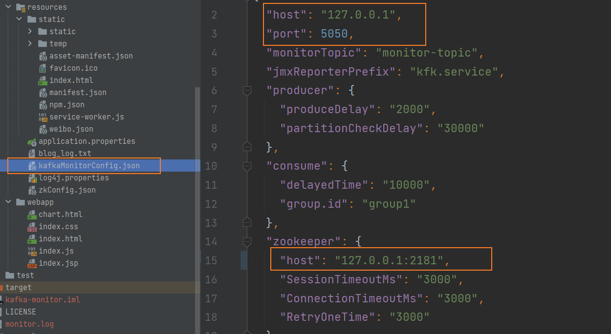

# 1、kafka安装

## 下载

注意3.0.0版本对于windows系统还有部分不兼容问题，windows下推荐安装3.0.0之前的版本


[kafka下载](https://kafka.apache.org/downloads)

## 启动

### 目录结构

下载后解压文件，目录如下

> bin目录是各种启动文件
>
> config是相关参数配置文件
>
> logs是自建的日志文件
>
> libs是使用到的相关jar文件

在bin目录下含有windows文件夹，用于在windows系统中启动

### 配置参数

进入`config`目录，编辑` server.properties`文件，找到并编辑

```properties
log.dirs= D:\\kafka\\logs
## 日志路径更改
zookeeper.connect=localhost:2181  
## 表示本地运行
```

找到`zookeeper.properties`并编辑

```properties
clientPort=2181
```

Kafka会按照默认，在9092端口上运行，并连接zookeeper的默认端口：2181

启动服务，在window目录下进入cmd，输入下面命令进行启动zookeeper服务，对应加载zookeeper的配置文件，kafka依赖zookeeper监控其状态

```sh
zookeeper-server-start.bat D:\kafka\config\zookeeper.properties
```

然后启动kafka服务，对应加载相应配置文件

```sh
kafka-server-start.bat D:\kafka\config\server.properties
```

### 启动时常见错误

命令太长错误：此时需要将kafka目录提高层级，最好直接放在D盘根目录下

## kafka-monitor项目(kafka监控工具)

### 拉取项目

kafka-monitor 项目用于监控kafka数据，项目地址为https://github.com/linxin26/kafka-monitor

通过git命令拉取项目

```sh
git clone https://github.com/linxin26/kafka-monitor.git
```

### 修改配置

等待项目下载依赖后，修改配置文件

查看zookeeper服务端口，对应修改端口号


修改配置文件




