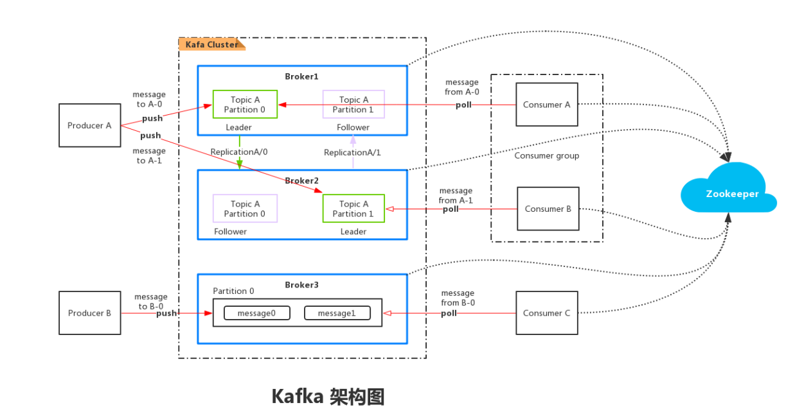
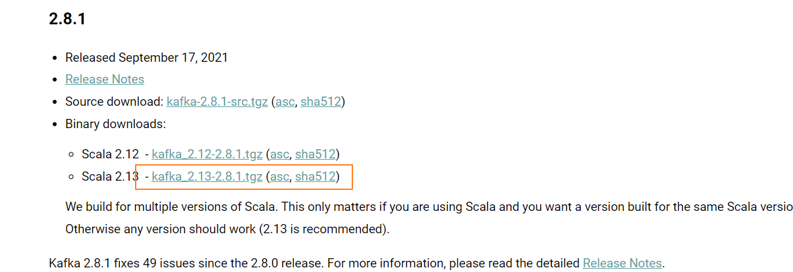
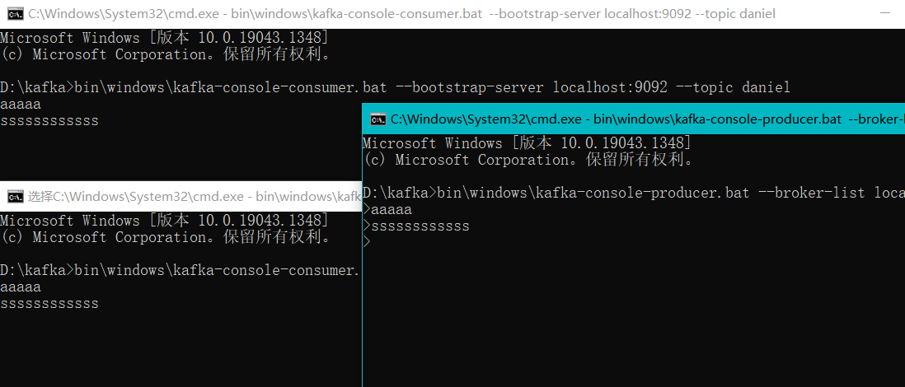
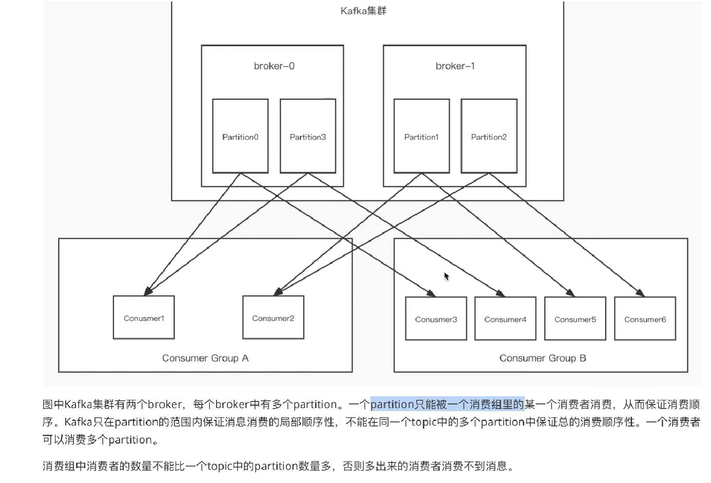
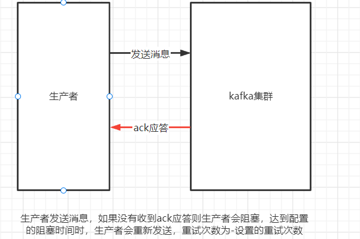

# 一、kafka安装

## 简介

### 什么是kafka

是一款分布式消息发布和订阅系统，它的特点是高性能、高吞吐量

Kafka最初由Linkedin 公司开发，是一个分布式、分区的、多副本的、多订阅者，基于zookeeper 协调的分布式日志系统，也可以作为MQ消息系统。Linkedin 公司在2010 年贡献给了Apache基金会并成为了顶级开源项目

### Kafka的应用场景

场景可以用于 web/nginx 日志、访问日志，消息服务等等。



### Kafka名词解释

#### 1、Broker

Kafka集群中包含的服务器，有一个或多个服务器，这种服务器被称为 Broker。

Broker 端不维护数据的消费状态，提升了性能。直接使用磁盘进行存储，线性读写，速度快。避免了在JVM 内存和系统内存之间的复制，减少耗性能的创建对象和垃圾回收。

#### 2、Producer

负责发布消息到Kafka Broker

#### 3、Consumer

负责从Broker 拉取（pull）数据并进行处理。

#### 4、Topic

每条发布到kafka集群的消息都有一个类别，这个类别被称为Topic

物理上不同Topic的消息分开存储，逻辑上一个Topic 的消息虽然保存于一个或多个Broker上但是用户只需指定消费的Topic即课生产或消费数据而不必关心数据存于何处。

#### 5、Partition

Partition 是物理上的概念，每个Topic 包含一个或多个Partition。kafka分配的单位是Partition

每个Topic 可以划分多个分区（每个Topic至少有一个分区），同一topic 不同分区包含不同分区包含的消息是不同的。每个消息在被添加到分区时，都会被分配一个offset （偏移量），它是消息在此分区中的唯一编号，kafka 通过offset 保证消息在分区内的顺序，offset 的顺序不跨分区，即kafka 只保证同一个分区内的消息是有序的。


#### 6、Consumer Group

每个Consumer 属于一个特定的Consumer Group

可为每个Consumer 指定Group name，若不指定group name 则属于默认的group

每条消息只可以被Consumer Goup 组中中的一个Consumer消费，但是可以指定多个Consumer Group

所以一个消息在Consumer Group 里面只可以被消费一次。已确定！

#### 7、Topic & Partition

Topic 在螺髻山行可以被认为是一个 queue，每发送一条消息必须指定它的Topic，可以简单理解为必须指明把这条消息放入到哪个queue里。

为了使得kafka 的吞吐率可以线性提高，物理上把Topic 分成一个或多个Partition，每个Partition 在物理上对应一个文件夹，该文件夹下存储这个Partition 的所有消息和索引文件。

若创建 Topic1 和Topic2 两个Topic，且分别有13个和19个分区，则整个集群上相应会生成共32个文件夹

#### 8、Replication-factor

表示该Topic 需要再不同高德broker 中保存几分

## 下载

注意3.0.0版本对于windows系统还有部分不兼容问题，windows下推荐安装3.0.0之前的版本



[kafka下载](https://kafka.apache.org/downloads)

## 启动

### 目录结构

下载后解压文件，目录如下

> bin目录是各种启动文件
>
> config是相关参数配置文件
>
> logs是自建的日志文件
>
> libs是使用到的相关jar文件

在bin目录下含有windows文件夹，用于在windows系统中启动

### 配置参数

进入`config`目录，编辑` server.properties`文件，找到并编辑

```properties
log.dirs= D:\\kafka\\logs
## 日志路径更改
zookeeper.connect=localhost:2181  
## 表示本地运行
listeners=PLAINTEXT://localhost:9092
# 配置ip
```

找到`zookeeper.properties`并编辑

```properties
clientPort=2181
```

Kafka会按照默认，在9092端口上运行，并连接zookeeper的默认端口：2181

启动服务，在window目录下进入cmd，输入下面命令进行启动zookeeper服务，对应加载zookeeper的配置文件，kafka依赖zookeeper监控其状态

```sh
zookeeper-server-start.bat D:\kafka\config\zookeeper.properties

# linux系统下启动zookeeper
bin/kafka-server-stop.sh config/server.properties
```

然后启动kafka服务，对应加载相应配置文件

```sh
kafka-server-start.bat D:\kafka\config\server.properties
# linux系统下启动kafka
bin/kafka-server-start.sh config/server.properties
```

### 启动时常见错误

命令太长错误：此时需要将kafka目录提高层级，最好直接放在D盘根目录下

## kafka-monitor项目(kafka监控工具)

### 拉取项目

kafka-monitor 项目用于监控kafka数据，项目地址为https://github.com/linxin26/kafka-monitor

通过git命令拉取项目

```sh
git clone https://github.com/linxin26/kafka-monitor.git
```

### 修改配置

等待项目下载依赖后，修改配置文件

查看zookeeper服务端口，对应修改端口号


修改配置文件


## 搭建自己的zookeeper

### 下载

[Zookeeper下载](https://zookeeper.apache.org/releases.html)

### 配置zookeeper的java环境

进入bin目录中，打开zkEnv.sh文件，添加java运行环境jdk的路径


```

```


# 二、kafka的基本使用

### 启动服务

```sh
#启动zookeeper
bin\windows\zookeeper-server-start.bat config\zookeeper.properties
#启动kafka
bin\windows\kafka-server-start.bat config\server.properties
```

### 创建Topic主题

topic可以实现消息的分类，不同消费者订阅不同的topic

执行以下命令可以创建名为`daniel`的topic ,这个topic只有一个`partition`,并且备份因子也设置为1：

```sh
bin\windows\kafka-topics.bat --create --zookeeper localhost:2181 --replication-factor 1 --partitions 1 --topic daniel
# linux下
bin/kafka-topics.sh --create --zookeeper localhost:2181 --replication-factor 1 --partitions 1 --topic daniel
```


### 删除主题

```
bin/kafka-topics.sh  --delete --zookeeper localhost:2181  --topic daniel
```


### 查看创建的topic列表

```sh
bin\windows\kafka-topics.bat --list --zookeeper localhost:2181
# linux下查看
bin/kafka-topics.sh --list --zookeeper localhost:2181
```


### 启动producer

```sh
bin\windows\kafka-console-producer.bat --broker-list localhost:9092 --topic daniel
# linux下
bin/kafka-console-producer.sh --broker-list localhost:9092 --topic daniel
```

### 启动Consumer

```sh
# --from-beginning 添加该命令则从开始获取消息
bin\windows\kafka-console-consumer.bat --bootstrap-server localhost:9092 --topic daniel --from-beginning
# --from-beginning 不添加该命令则从当前offset（偏移量）+1位置开始获取消息
bin\windows\kafka-console-consumer.bat --bootstrap-server localhost:9092 --topic daniel

#linux下
# --from-beginning 添加该命令则从开始获取消息
bin/kafka-console-consumer.sh --bootstrap-server localhost:9092 --topic daniel --from-beginning
# --from-beginning 不添加该命令则从当前offset（偏移量）+1位置开始获取消息
bin/kafka-console-consumer.sh --bootstrap-server localhost:9092 --topic daniel
```


windows中会将消息保存到本地，如图所示：


在daniel-0中会保存数据


### 多个消费者消费同一个生产者数据

```sh
# （启动cmd）生产者
bin\windows\kafka-console-producer.bat --broker-list localhost:9092 --topic daniel

# （启动两个cmd输入以下命令）消费者
bin\windows\kafka-console-consumer.bat --bootstrap-server localhost:9092 --topic daniel
```



两个都能收到

### 设置组

#### 单播消息

我们可以通过配置组的方式来定义消费者，（在同一组将收不到消息，非同一个组或未分组的消费者则可以收到数据）先设置组的的消费者会受到，后面再设置同一个组则后面的都收不到消息。同一个消费组只有一个消费者可以收到消息。

```sh
bin\windows\kafka-console-consumer.bat --bootstrap-server localhost:9092 --consumer-property group.id=danielGroup1 --topic daniel

# linux下
bin/kafka-console-consumer.sh --bootstrap-server localhost:9092 --consumer-property group.id=danielGroup1 --topic daniel
```


#### 多播消息

不同消费组订阅同一个topic，那么不同的消费组中只有一个消费者能收到消息，也就是多个消费组都能收到消息但每个组织有一个消费者能收到。

```sh
# 生产者
bin\windows\kafka-console-producer.bat --broker-list localhost:9092 --topic daniel

# danielGropu1组（可以收到）
# 消费者
bin\windows\kafka-console-consumer.bat --bootstrap-server localhost:9092 --consumer-property group.id=danielGroup1 --topic daniel

# danielGropu2组（可以收到）
# 消费者
bin\windows\kafka-console-consumer.bat --bootstrap-server localhost:9092 --consumer-property group.id=danielGroup2 --topic daniel

# danielGropu组 (只有一个消费者可以收到)
# 消费者1
bin\windows\kafka-console-consumer.bat --bootstrap-server localhost:9092 --consumer-property group.id=danielGroup --topic daniel
# 消费者2
bin\windows\kafka-console-consumer.bat --bootstrap-server localhost:9092 --consumer-property group.id=danielGroup --topic daniel
```


### 查看当前集群中组信息

```sh
bin\windows\kafka-consumer-groups.bat --bootstrap-server localhost:9092 --list
# linux下
bin/kafka-consumer-groups.sh --bootstrap-server localhost:9092 --list
```


### 查看组的详细信息

```sh
bin\windows\kafka-consumer-groups.bat --bootstrap-server localhost:9092 --describe --group danielGroup1
# linux下
bin/kafka-consumer-groups.sh --bootstrap-server localhost:9092 --describe --group danielGroup1
```


Current-offset：当前消费者已经消费的偏移量

Log-end-offset：主题对应分区消息结束的偏移量

Lag：当前消费组未消费的消息数

# 三、主题和分区

## 主题Topic

主题topic在kafka中是一个逻辑的概念，kafka通过topic对消息进行分类，不同的topic会被订阅该topic的消费者消费，但是消息会有很多，且消息通过log文件进行保存，因此kafka提出了pratition（分区的概念）分布式存储消息。

例如下面一个主题中含有三个pratition（p0,p1,p2）


## Pratition分区

kafka通过pratition分区，来将一个topic的消息进行分区存储：

​	a.分区存储避免了单个文件过大

​	b.提高了io的读写效率，可同时在多个分区读写

### 为一个topic创建多个分区

```sh
#linux下      --partitions 3 来创建分区
bin/kafka-topics.sh --create --zookeeper localhost:2181 --replication-factor 1 --partitions 3 --topic daniel2
```

### 查看该分区

```sh
#linux下
bin/kafka-topics.sh --describe --zookeeper localhost:2181 --topic daniel2
```


### kafka中的日志文件

kafka会默认创建_consumer_offsets主题，并分配50个分区，用于存储kafka其他消费者消费其他主题时上报的偏移量，至于提交给谁，通过哈希算法来决定


# 四、kafka集群及副本

## 1、集群搭建

### 模拟集群搭建

首先需要启动zookeeper服务器，详情参照[zookeeper笔记](../Zookeeper/zookeeper.md)

```sh
bin/zkServer.sh start conf/zoo.cfg
```

修改同一台服务器配置文件server.properties,复制三份

```sh
cp config/server.properties config/server1.properties
cp config/server.properties config/server2.properties
cp config/server.properties config/server3.properties
```

通过vim修改server1.properties

```properties
broker.id=1
listeners=PLAINTEXT://192.168.0.61:9092
advertised.listeners=PLAINTEXT://114.116.88.252:9092
log.dirs=/home/daniel/software/kafka_2.13-2.8.1/logs_1
zookeeper.connect=114.116.88.252:2181
```

通过vim修改server2.properties

```properties
broker.id=2
listeners=PLAINTEXT://192.168.0.61:9093
advertised.listeners=PLAINTEXT://114.116.88.252:9093
log.dirs=/home/daniel/software/kafka_2.13-2.8.1/logs_2
zookeeper.connect=114.116.88.252:2181
```

通过vim修改server3.properties

```properties
broker.id=3
listeners=PLAINTEXT://192.168.0.61:9094
advertised.listeners=PLAINTEXT://114.116.88.252:9094
log.dirs=/home/daniel/software/kafka_2.13-2.8.1/logs_3
zookeeper.connect=114.116.88.252:2181
```

另一台服务器（windows）通过vim修改server.properties

```properties
broker.id=4
listeners=PLAINTEXT://172.25.14.20:9092
advertised.listeners=PLAINTEXT://47.93.181.157:9092
log.dirs=C:\\BaiduNetdiskDownload\\kafka\\logs
zookeeper.connect=114.116.88.252:2181
```

分别启动

```sh
# linux服务器
bin/kafka-server-start.sh config/server1.properties
bin/kafka-server-start.sh config/server2.properties
bin/kafka-server-start.sh config/server3.properties
# windows服务器
bin\windows\kafka-server-start.bat config\server.properties
```

### 查看当前集群节点

通过zookeeper客户端可以查看当前连接该zookeeper的broker有哪些

```sh
# 打开zk客户端
bin/zkCli.sh
```

查看当前连接节点

```sh
ls /brokers/ids
```


至此1，2，3，4四个节点配置成功。

## 2、副本

我们先创建一个主题，该主题包含2个分区和3个副本

```sh
bin/kafka-topics.sh --create --zookeeper 114.116.88.252:2181 --replication-factor 3 --partitions 2 --topic my-replicated-topic
```

查看该主题详情

```sh
bin/kafka-topics.sh --describe --zookeeper 114.116.88.252:2181 --topic my-replicated-topic
```


leader：当前主副本为1，代表当发送消息时分区1的broker1会接收消息，当查询消息时也是broker1，只是broker2和broker3会被同步broker1的数据。

replicas：当前集群的节点

isr：表示当前同步数据的节点是否正常，例如：broker2如果效率及其慢，此时ISR只会显示：1,3

flower：接收leader同步的数据

副本其实就是作为预备的broker，防止主节点宕机

### 日志文件

我们可以查看日志文件


这三个文件分别对应三个broker，但我们初次搭建时，如果新建主题的副本数为3时，那么我们会在这三个文件夹下都看的到该主题，如果分区是2的话每个文件夹都会包含关于该主题的两个分区文件夹

值的注意的是，在没有创建生产者和消费者时，默认的存放偏移量的50个文件夹（`__consumer_offsets-xx`）不会被创建

我们尝试创建单个主题，并指定该主题为1分区，1副本，并创建其生产者和消费者，看看会有什么效果

```sh
bin/kafka-topics.sh --create --zookeeper 114.116.88.252:2181 --replication-factor 1 --partitions 1 --topic daniel
```

生产者

```sh
bin/kafka-console-producer.sh --broker-list 114.116.88.252:9092 --topic daniel
```

消费者

```sh
 bin/kafka-console-consumer.sh --bootstrap-server 114.116.88.252:9092 --topic daniel --from-beginning
```

发送消息正常


此时查看三个log文件夹会发现

logs_1文件夹


logs_2文件夹


logs_3文件夹


默认的`__consumer_offsets-xx` 文件会被轮询分到三个log文件夹中，而刚刚指定的主题daniel创建在broker1中daniel-0.

所以说在kafka集群中，所有的节点都共用`__consumer_offsets` 

### 集群消息的发送

```sh
bin/kafka-console-producer.sh --broker-list 114.116.88.252:9092,114.116.88.252:9093,114.116.88.252:9094 --topic my-replicated-topic
```

### 集群消息的接收

```sh
bin/kafka-console-consumer.sh --bootstrap-server 114.116.88.252:9092,114.116.88.252:9093,114.116.88.252:9094 --topic my-replicated-topic --from-beginning

```

指定消费组消费

```sh
bin/kafka-console-consumer.sh --bootstrap-server 114.116.88.252:9092,114.116.88.252:9093,114.116.88.252:9094 --topic my-replicated-topic --from-beginning --consumer-property group.id=cusGroup1
```

消息接收正常


### 消费原理

假设集群中有四个主题，他们分别有自己的分区，消费组A和消费组B的消费情况如下



始终想着消费者的数量必须小于等于分区数量，也就是一个消费者可以多消费消息，但一个分区不能被多个消费者消费（目的是保证消费者消费的顺序）

# 五、kafka Java客户端使用

## 生产者

### 导入依赖

```xml
<dependency>
    <groupId>org.springframework.kafka</groupId>
    <artifactId>spring-kafka</artifactId>
</dependency>
<dependency>
    <groupId>com.alibaba</groupId>
    <artifactId>fastjson</artifactId>
    <version>1.2.71</version>
</dependency>
```

### 生产者简单实现类

以下是简单的消息发送过程

```java
public class MyKafkaProducer {
    private static final String TOPIC_NAME = "my-replicated-topic";
    public static void main(String[] args) throws ExecutionException, InterruptedException {
        // 1.配置属性
        Properties pros = new Properties();
        // 设置消息发往那个kafka服务
        pros.put(ProducerConfig.BOOTSTRAP_SERVERS_CONFIG,"114.116.88.252:9092,114.116.88.252:9093,114.116.88.252:9094");
        //
        pros.put(ProducerConfig.KEY_SERIALIZER_CLASS_CONFIG, StringSerializer.class.getName());
        
        pros.put(ProducerConfig.VALUE_SERIALIZER_CLASS_CONFIG, StringSerializer.class.getName());
        
        // 2.创建生产者客户端，并传入参数
        Producer<String, String> producer = new KafkaProducer<String, String>(pros);
        
        // 3.创建要发送的消息
        ProducerRecord<String, String> producerRecord = new ProducerRecord<>(TOPIC_NAME, "mykey", "Hello World");
    
        // 4.通过producer发送消息
        RecordMetadata recordMetadata = producer.send(producerRecord).get();
        System.out.println("同步消息发送结果：");
        System.out.println("topic:"+recordMetadata.topic());
        System.out.println("partition:"+recordMetadata.partition());
        System.out.println("offset:"+recordMetadata.offset());
    }
}
```

关于生产者创建消息的细节

ProducerRecord可接收三个初始化参数，也可以接收四个参数

当传入三个参数时，参数2 `mykey` 则会通过其hash值算出往哪个分区发送。

```java
// 具体发送给那个分区：（key的hash值）% partitionNum
ProducerRecord<String, String> producerRecord = new ProducerRecord<>(TOPIC_NAME, "mykey", "Hello World");
```

当传入四个参数时，参数2传入Integer类型指定发送至那个分区。

```java
// 参数2设置为0，表示发送到partition-0
ProducerRecord<String, String> producerRecord = new ProducerRecord<>(TOPIC_NAME, 0,"mykey", "Hello World");
```

### 生产者的消息发送的同步




```java
// 4.通过producer发送消息
RecordMetadata recordMetadata = producer.send(producerRecord).get();
System.out.println("同步消息发送结果：");
System.out.println("topic:"+recordMetadata.topic());
System.out.println("partition:"+recordMetadata.partition());
System.out.println("offset:"+recordMetadata.offset());
```

当producer发送消息后会调用get()方法来获取发送后的数据，但是如果发送不成功，则get将获取不到数据，此时程序会在此阻塞，例如：当前主题有两个分区编号为0，1，但你指定分区为3此时当代码执行到send时会被阻塞，代码不会向后执行

### 生产者的消息发送的异步


```java
// 4.2通过producer异步发送消息
producer.send(producerRecord, new Callback() {
    @Override
    public void onCompletion(RecordMetadata recordMetadata, Exception e) {
        if (e!=null){
            System.err.println("发送消息失败："+e.getStackTrace());
        }
        if (recordMetadata!=null){
            System.out.println("同步消息发送结果：");
            System.out.println("topic:"+recordMetadata.topic());
            System.out.println("partition:"+recordMetadata.partition());
            System.out.println("offset:"+recordMetadata.offset());
        }
    }
});
Thread.sleep(10000);
```

通过异步则不会影响主程序的正常运行。

但是在大多数时候，为了避免消息的丢失会采用同步来发送消息。

### ack机制

在认为请求完成之前，生产者要求Leader收到的确认数。这控制了发送的记录的持久性。允许进行以下设置：

ack=0：表示消息发送后，不论集群是否接收到消息则立即返回ack，此时容易造成kafka消息的丢失，效率最高但不安全。

ack=1：这意味着leader会将记录写入其本地日志，但会在不等待所有flower的完全确认的情况下做出响应。在这种情况下，如果领导者在确认记录后立即失败，但在追随者复制它之前，则记录将丢失。表示当前消息必须被集群的leader接收后将消息存储在本地的000000000.log文件后才能进行ack应答，性能和安全性相对均衡。

ack=-1/all：配置此项时，且同时配置min.insync.replicas=2(默认此配置为1，为1表示一台副本接收到)时，表示当前消息发送到集群时需要leader和1台副本（flower）同步完数据后返回ack，此时就有两个broker接收到了消息，这种方式最安全，但效率最差。

配置方式：

```java
Properties pros = new Properties();
pros.put(ProducerConfig.ACKS_CONFIG,"1");
```

### 其他主要配置

发送重试配置，当生产者未收到ack时，可配置其重新发送

```java
// 如果没有收到ack则重试，此配置表示重试的次数，表示发送消息失败后允许共3次重试
pros.put(ProducerConfig.RETRIES_CONFIG,3);
// 表示发送失败后重试的时间间隔(300ms)
pros.put(ProducerConfig.RETRY_BACKOFF_MS_CONFIG,300);
```

缓冲区配置

```java
// 表示缓存区大小以字节为单位
// 如果设置了本地缓冲区，kafka本地会开启线程将消息先发送到缓冲区，可以提高消息的发送性能，默认值为32MB=33554432字节
pros.put(ProducerConfig.BUFFER_MEMORY_CONFIG,32*1024*1024);
// 表示批量发送消息的大小
// kafka会从缓冲区拿数据，进行批量发送，当一个batch满了16kb则发送
pros.put(ProducerConfig.BATCH_SIZE_CONFIG,16*1024);
// 表示每一个batch的等待时间，默认为0ms，表示立即发送，影响性能
// 此处配置为10毫秒，表示当10ms内，batch已经满了就发送出去
// 如果batch在10ms内没有达到16kb，那么10ms时也必须将消息发送出去，保证了消息不能延长太久发送
pros.put(ProducerConfig.LINGER_MS_CONFIG,10);
```

序列化配置

```java
 // 把发送的key从字符串序列化为字节数组
pros.put(ProducerConfig.KEY_SERIALIZER_CLASS_CONFIG, StringSerializer.class.getName());
// 把发送的value从字符串序列化为字节数组
pros.put(ProducerConfig.VALUE_SERIALIZER_CLASS_CONFIG, StringSerializer.class.getName());
```

### CountDownLatch的使用

```java
private static final String TOPIC_NAME = "my-replicated-topic";
public static void main(String[] args) throws ExecutionException, InterruptedException {
    // 1.配置属性
    Properties pros = new Properties();

    // 设置消息发往那个kafka服务
    pros.put(ProducerConfig.BOOTSTRAP_SERVERS_CONFIG,"114.116.88.252:9092,114.116.88.252:9093,114.116.88.252:9094");

    // 把发送的key从字符串序列化为字节数组
    pros.put(ProducerConfig.KEY_SERIALIZER_CLASS_CONFIG, StringSerializer.class.getName());
    // 把发送的value从字符串序列化为字节数组
    pros.put(ProducerConfig.VALUE_SERIALIZER_CLASS_CONFIG, StringSerializer.class.getName());

    // 2.创建生产者客户端，并传入参数
    Producer<String, String> producer = new KafkaProducer<String, String>(pros);

    // 
    int msgNum = 5;
    final CountDownLatch countDownLatch = new CountDownLatch(msgNum);

    for( int i = 1 ;i <= 5 ; i++ ){
        // 3.创建要发送的消息
        Order order = new Order();
        order.setOid("10000"+i);
        order.setInfo("msg"+i);
        ProducerRecord<String, String> producerRecord = new ProducerRecord<>(TOPIC_NAME,order.getOid() , JSON.toJSONString(order));
        // 4.2通过producer异步发送消息
        producer.send(producerRecord, new Callback() {
            @Override
            public void onCompletion(RecordMetadata recordMetadata, Exception e) {
                if (e!=null){
                    System.err.println("发送消息失败："+e.getStackTrace());
                }
                if (recordMetadata!=null){
                    System.out.println("同步消息发送结果：");
                    System.out.println("topic:"+recordMetadata.topic());
                    System.out.println("partition:"+recordMetadata.partition());
                    System.out.println("offset:"+recordMetadata.offset());
                }
                countDownLatch.countDown();
            }
        });
    }
    // 判断当前countDownLatch是不是0，如果不是则等待5秒
    countDownLatch.await(5, TimeUnit.SECONDS);
    producer.close();
}

```

## 消费者

### 消费者简单实现类

```java
public class MyKafkaConsumer {
    private static final String TOPIC_NAME = "my-replicated-topic";
    private static final String GROUP_NAME = "testGroup";
    public static void main(String[] args) {
        // 1.配置属性
        Properties pros = new Properties();
        // 配置服务集群
        pros.put(ConsumerConfig.BOOTSTRAP_SERVERS_CONFIG,"114.116.88.252:9092,114.116.88.252:9093,114.116.88.252:9094");
        // 配置消费组名
        pros.put(ConsumerConfig.GROUP_ID_CONFIG,GROUP_NAME);
        // 配置key序列化
        pros.put(ConsumerConfig.KEY_DESERIALIZER_CLASS_CONFIG, StringDeserializer.class.getName());
        // 配置value序列化
        pros.put(ConsumerConfig.VALUE_DESERIALIZER_CLASS_CONFIG,StringDeserializer.class.getName());
        
        // 2.创建消费者客户端
        Consumer<String, String> consumer = new KafkaConsumer<>(pros);
        
        // 消费者订阅主题列表
        consumer.subscribe(Arrays.asList(TOPIC_NAME));
        
        // 3.获取消息
        while(true){
            ConsumerRecords<String, String> records = consumer.poll(Duration.ofMillis(1000));
            for (ConsumerRecord<String, String> record : records) {
                System.out.printf("收到的消息：partition = %d,offset = %d,key = %s,value = %s%n"
                        ,record.partition(),record.offset(),record.key(),record.value());
            }
        }
        
    }
    
}

```

### 消费者自动提交offset

kafka的客户端默认是自动提交，可通过属性进行配置

```java
// 配置提交方式（自动提交：true，手动提交：false）
pros.put(ConsumerConfig.ENABLE_AUTO_COMMIT_CONFIG,true);
// 配置自动提交的时间间隔1s
pros.put(ConsumerConfig.AUTO_COMMIT_INTERVAL_MS_CONFIG,1000);
```

消费者poll下来消息后默认情况下，会自动向broker的__consumer_offsets主题提交当前主题的偏移量

自动提交会丢失消息：当消费者还没有消费poll下来的消息时就自动提交了offset，此时消费者挂了，于是下一个消费者消费时就会从提交的偏移量的下一个位置消费，那么之前未被消费的消息就丢失了。

### 消费者手动提交

手动提交需要将ENABLE_AUTO_COMMIT_CONFIG设置为false

```java
// 配置提交方式（自动提交：true，手动提交：false）
pros.put(ConsumerConfig.ENABLE_AUTO_COMMIT_CONFIG,false);
```

手动提交的同步提交

在消费完消息后调用同步提交，当集群返回ack之前会一直阻塞，返回ack后表示提交成功，执行后续逻辑。

```java
while(true){
    ConsumerRecords<String, String> records = consumer.poll(Duration.ofMillis(1000));
    for (ConsumerRecord<String, String> record : records) {
        System.out.printf("收到的消息：partition = %d,offset = %d,key = %s,value = %s%n"
                          ,record.partition(),record.offset(),record.key(),record.value());
    }
	// 当records没有需要消费的消息时就提交
    if (records.count()>0){
        consumer.commitSync();
    }
}
```

手动提交的异步提交

```java
while(true){
            ConsumerRecords<String, String> records = consumer.poll(Duration.ofMillis(1000));
            for (ConsumerRecord<String, String> record : records) {
                System.out.printf("收到的消息：partition = %d,offset = %d,key = %s,value = %s%n"
                        ,record.partition(),record.offset(),record.key(),record.value());
            }
            
            if (records.count()>0){
//                consumer.commitSync();
                consumer.commitAsync(new OffsetCommitCallback() {
                    @Override
                    public void onComplete(Map<TopicPartition, OffsetAndMetadata> offset, Exception e) {
                        if (e!=null){
                            System.err.println("commit offset filed for----->>>  "+offset);
                            System.err.println("commit offset filed exception----->>>  "+e.getStackTrace());
                        }
                    }
                });
            }
        }
```

### 消费者poll消息的过程

消费者与broker之间建立长链接，开始poll消息,在一次poll中建立的长连接会不停拉取消息

此时可配置单次poll消息的条数

```java
// poll消息的最大条数
pros.put(ConsumerConfig.MAX_POLL_RECORDS_CONFIG,500);
// 设置为1000ms，表示每次poll的持续等待时长
ConsumerRecords<String, String> records = consumer.poll(Duration.ofMillis(1000));
```


小结：

​	①  如果在1s内的一次拉取就拿到500条，则结束本次poll长轮询，进行while循环

​	②  如果在1秒内一次拉取没有拿到500条，且时间还在1s内则进行下一次拉取，直到拉取到500条，但多次拉取都没达到500条且时间到达1s则结束本次poll长轮询，进行while循环

### 关于两次poll长轮询的时间配置

```java
// 两次poll消息的最大时间间隔30s
pros.put(ConsumerConfig.MAX_POLL_INTERVAL_MS_CONFIG,30*1000);
```

也就是当while循环第一次poll时开始计算，拉取到消息时会开始消费，但每个消费者消费消息的能力不同，虽然poll消息的时间很短，但是消费者消费的时间可能很长，通过该配置可以让broker来确认消费者的能力，当两次poll的时间间隔超过配置的时间（30s），则broker会认为该消费者消费能力弱，会将其踢出消费组，将分区分配给其他消费者。会触发rebalance机制，造成性能开销。

### 消费者的健康状态检查

消费者每隔一段时间会向kafka集群发送'心跳'，当消费者长时间不发送心跳，则kafka集群认为其挂掉，会将其踢出消费组，并将其分区交由其他消费者消费。

```java
// 消费者给broker发送心跳的时间间隔
pros.put(ConsumerConfig.HEARTBEAT_INTERVAL_MS_CONFIG,1000);
// kafka如果超过10秒没有收到消费者的心跳，则把消费者踢出消费组，进行Rebalance机制，将该分区交给其他消费者消费
pros.put(ConsumerConfig.SESSION_TIMEOUT_MS_CONFIG,10*1000);
```

### 消费者指定分区消费

```java
// 消费者指定分区消费
consumer.assign(Arrays.asList(new TopicPartition(TOPIC_NAME,0)));
```

### 消费者的回溯消费

```java
// 消费者从头开始消费
consumer.assign(Arrays.asList(new TopicPartition(TOPIC_NAME,1)));
consumer.seekToBeginning(Arrays.asList(new TopicPartition(TOPIC_NAME,1)));
```

### 消费者指定offset消费

```java
// 消费者指定offset消费
consumer.assign(Arrays.asList(new TopicPartition(TOPIC_NAME,1)));
consumer.seek(new TopicPartition(TOPIC_NAME,1),1900);
```

### 消费者从指定时间点消费

```java
// 从指定的时间点开始消费（当前时间的前一个小时的消息）
// 获取主题下分区
List<PartitionInfo> partitionsInfo = consumer.partitionsFor(TOPIC_NAME);
// 设置时间1小时
Long time = new Date().getTime()-60*60*1000;
// 将每个分区和时间绑定
Map<TopicPartition, Long> map = new HashMap<>();
for (PartitionInfo partition : partitionsInfo) {
    map.put(new TopicPartition(TOPIC_NAME,partition.partition()),time);
}
// 获取每个分区数据(根据前面绑定时间)
Map<TopicPartition, OffsetAndTimestamp> parMap = consumer.offsetsForTimes(map);

for (Map.Entry<TopicPartition, OffsetAndTimestamp> entry : parMap.entrySet()) {
    TopicPartition key = entry.getKey();
    OffsetAndTimestamp value = entry.getValue();
    if (key==null||value==null) continue;
    long offset = value.offset();
    System.out.println("partition:" +key.partition()+"offset:"+offset);
    // 根据时间获取的偏移量来获取数据
    if (value!=null){
        consumer.assign(Arrays.asList(key));
        consumer.seek(key,offset);
    }
}
```

### 新消费组的消费规则

当有新消费组消费消息时，没有配置AUTO_OFFSET_RESET_CONFIG项，则默认获取从该消费组启动后发到主题的消息，但如果设置该项为`earliest` 且该消费组第一次启动，则会从头开始消费，并记录消费的位置，再次重启该消费组时,则不会从头开始，而是从上次消费到的offset位置的下一个开始消费。

```java
/*
    当消费主题的是新的消费组，或者指定offset消费方式，但offset不存在，应如何
    latest(默认)：只消费自己启动后发送到主题的消息
    earliest：第一次从头开始消费，以后按照offset继续消费，区别于seekToBeginning每次从头消费
*/
pros.put(ConsumerConfig.AUTO_OFFSET_RESET_CONFIG,"earliest");
```


# kafka springboot快速搭建


## 项目环境搭建

### 导入依赖

```xml
<dependency>
    <groupId>org.springframework.kafka</groupId>
    <artifactId>spring-kafka</artifactId>
</dependency>
```

### 配置yml

```yml
server:
  port: 7777
  servlet:
    context-path: /kafka
spring:
  kafka:
    bootstrap-servers: 114.116.88.252:9092,114.116.88.252:9093,114.116.88.252:9094
    producer:
      retries: 3 # 重试次数， 设置大于0时，生产者客户端会把发送失败的记录重新发送
      batch-size: 16384 # 每一个batch的大小
      buffer-memory: 33554432 # 缓冲区的大小
      acks: 1 # ack应答方式，可取值：1,0,-1/all
      # 配置key和value的序列化器
      key-serializer: org.apache.kafka.common.serialization.StringSerializer
      value-serializer: org.apache.kafka.common.serialization.StringSerializer
    consumer:
      group-id: default-group # 消费组名
      enable-auto-commit: false # 是否开启自动提交
#      auto-offset-reset: earliest # 开启新消费组时数据获取方式
      # 配置key和value的反序列化器
      key-deserializer: org.apache.kafka.common.serialization.StringDeserializer
      value-deserializer: org.apache.kafka.common.serialization.StringDeserializer
      max-poll-records: 500 # 单次poll记录的最大条数
    listener:
      # record: 当每一个记录被消费者监听器(ListenerConsumer)处理后提交
      # batch:  当每一批poll()数据被消费者监听器(ListenerConsumer)处理后提交
      # time:   当每一批poll()数据被消费者监听器(ListenerConsumer)处理后，距离上次提交时间大于time时提交
      # count:  当每一批poll()数据被消费者监听器(ListenerConsumer)处理后，被处理的record的数量大于等于count时提交
      # count_time: count || time有一个被满足时提交
      # manual: 当每一批poll()数据被消费者监听器(ListenerConsumer)处理后，手动调用Acknowledgment.acknowledge()后提交
      # manual_immediate: 手动调用Acknowledgment.acknowledge()后立即提交提交,通常使用这种
      ack-mode: manual_immediate


```

### 生产者

```java
@RestController
public class MyBootProducer {
    private static final String TOPIC_NAME = "my-replicated-topic";
    @Autowired
    private KafkaTemplate<String,String> kafkaTemplate;
    
    @RequestMapping("/send")
    public String sendData(){
        kafkaTemplate.send(TOPIC_NAME,0,"key","this is a message");
        return "success";
    }
}

```

### 消费者

```java
@Component
public class MyBootConsumer {
    @KafkaListener(topics = "my-replicated-topic",groupId = "my-group")
    public void listerGroup(ConsumerRecord<String,String> record, Acknowledgment ack){
        System.out.println("record:"+record);
        ack.acknowledge();
    }
}
```


# Kafka Linux外网映射配置

本地运行时不做更改，注意

但是部署在云端服务器时注意将配置更换

```properties
# 此处使用公网ip
advertised.listeners=PLAINTEXT://114.116.88.252:9092

zookeeper.connect=localhost:2181

```


## 集群搭建

```json
server.0=114.116.88.252:2888:3888
server.1=47.93.181.157:2888:3888
```


