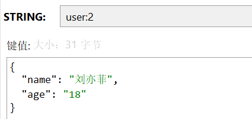

# 一、客戶端简介

在Redis官网中提供了各种语言的客户端，地址：https://redis.io/clients，我们主要学习java的客户端。


市面上大多数使用的还是Jedis，但是spring将`Jedis`和`Lettuce`进行了整合，推出了`Spring Data Redis`

# 二、Jedis入门

Jedis的官网地址为： https://github.com/redis/jedis，我们先快速搭建一个项目

## 1、新建项目并导入依赖

新建一个项目

父项目中已经导入了`spring boot`，而jedis已经包含在内，所以直接在新建模块引用

```xml
<!-- spring boot -->
<dependency>
    <groupId>org.springframework.boot</groupId>
    <artifactId>spring-boot-dependencies</artifactId>
    <version>${spring.boot.version}</version>
    <type>pom</type>
    <scope>import</scope>
</dependency>
```

模块引用

```xml
<dependency>
    <groupId>redis.clients</groupId>
    <artifactId>jedis</artifactId>
</dependency>

<dependency>
    <groupId>org.junit.jupiter</groupId>
    <artifactId>junit-jupiter</artifactId>
    <scope>test</scope>
</dependency>
```

## 2、编写测试类

```java
public class ConnectTest {
    
    private Jedis jedis;
    
    @BeforeEach
    public void connectConfig() {
        // 建立连接
        jedis = new Jedis("47.93.181.157", 6379);
        // 设置密码
        jedis.auth("daniel");
        // 选择数据库，默认为0
        jedis.select(0);
    }
    
    @Test
    public void testRedis() {
        // 插入数据,方法名称为Redis的命令名称
        String result = jedis.set("name", "Java Jedis");
        System.out.println("result:" + result);
        // 获取值
        String name = jedis.get("name");
        System.out.println("name:" + name);
        
    }
    
    @AfterEach
    public void closeCon() {
        // 释放资源
        if (jedis != null) {
            jedis.close();
        }
    }
}
```

## 3、使用Jedis连接池

`Jedis`本身是`线程不安全`的，并且频繁的创建和销毁连接会有性能损耗，因此我们推荐大家使用Jedis连接池代替Jedis的直连方式。

创建一个连接池配置类

```java
package com.daniel.jedis;

public class JedisConnectFactory {
    
    private static final JedisPool jedisPool;
    static {
        JedisPoolConfig jedisPoolConfig = new JedisPoolConfig();
        // 设置连接池
        // 最大连接
        jedisPoolConfig.setMaxTotal(8);
        // 最大空闲连接
        jedisPoolConfig.setMaxIdle(8);
        // 最小空闲连接
        jedisPoolConfig.setMinIdle(0);
        // 设置最长等待时间， ms
        jedisPoolConfig.setMaxWaitMillis(200);
        // 设置连接参数
        jedisPool = new JedisPool(jedisPoolConfig, "47.93.181.157", 6379, 1000, "daniel");
    }
    
    /**
     * 获取Jedis
     * @return
     */
    public static Jedis getJedis(){
        return jedisPool.getResource();
    }
}

```

修改测试类，使用连接池获取连接

```java
	@BeforeEach
    public void connectConfig() {
        // 建立连接
        jedis = JedisConnectFactory.getJedis();
        // 设置密码
        jedis.auth("daniel");
        // 选择数据库，默认为0
        jedis.select(0);
    }
```

# 三、SpringDataRedis

`SpringData`是Spring中数据操作的模块，包含对各种数据库的集成，其中对Redis的集成模块就叫做`SpringDataRedis`.

官网地址：https://spring.io/projects/spring-data-redis

> 提供了对不同Redis客户端的整合（`Lettuce`和`Jedis`）
>
> 提供了`RedisTemplate`统一API来操作Redis
>
> 支持Redis的发布订阅模型
>
> 支持Redis哨兵和Redis集群
>
> 支持基于Lettuce的响应式编程
>
> 支持基于`JDK`、`JSON`、`字符串`、`Spring对象`的数据序列化及反序列化
>
> 支持基于Redis的`JDKCollection`实现


## 1、SpringDataRedis快速入门

`SpringDataRedis`中提供了`RedisTemplate`工具类，其中封装了各种对Redis的操作。并且将不同数据类型的操作API封装到了不同的类型中：

| **API**                         | **返回值类型**  | **说明**              |
| ------------------------------- | --------------- | --------------------- |
| **redisTemplate**.opsForValue() | ValueOperations | 操作String类型数据    |
| **redisTemplate**.opsForHash()  | HashOperations  | 操作Hash类型数据      |
| **redisTemplate**.opsForList()  | ListOperations  | 操作List类型数据      |
| **redisTemplate**.opsForSet()   | SetOperations   | 操作Set类型数据       |
| **redisTemplate**.opsForZSet()  | ZSetOperations  | 操作SortedSet类型数据 |
| **redisTemplate**               |                 | 通用的命令            |

### 导入依赖

SpringBoot的`spring-boot-dependencies` 依赖已经提供了对SpringDataRedis的支持，使用非常简单，直接在子模块导入即可

```xml
<!-- springboot-->
<dependency>
    <groupId>org.springframework.boot</groupId>
    <artifactId>spring-boot-starter</artifactId>
</dependency>
<!--Redis依赖-->
<dependency>
    <groupId>org.springframework.boot</groupId>
    <artifactId>spring-boot-starter-data-redis</artifactId>
</dependency>
<!--连接池依赖-->
<dependency>
    <groupId>org.apache.commons</groupId>
    <artifactId>commons-pool2</artifactId>
</dependency>
<!-- jackson-->
<dependency>
    <groupId>com.fasterxml.jackson.core</groupId>
    <artifactId>jackson-databind</artifactId>
</dependency>
<!--单元测试-->
<dependency>
    <groupId>org.springframework.boot</groupId>
    <artifactId>spring-boot-starter-test</artifactId>
</dependency>
```

### 创建配置文件

```yml
spring:
  redis:
    host: 47.93.181.157
    port: 6379
    password: daniel
    lettuce:
      pool:
        max-active: 8 # 最大连接
        max-idle: 8 # 最大空闲连接
        min-idle: 0 # 最小空闲连接
        max-wait: 100 # 连接等待时间
```

### 编写测试类测试

```java
@SpringBootTest
public class SpringBootJedis {
    
    @Autowired
    private RedisTemplate redisTemplate;
    
    @Test
    public void testSpringbootJedis() {
        redisTemplate.opsForValue().set("boot","SpringBoot SpringDataRedis");
        Object boot = redisTemplate.opsForValue().get("boot");
        System.out.println("boot:"+boot);
    }
}
```

## 2、SpringDataRedis的序列化方式

RedisTemplate可以接收任意Object作为值写入Redis，只不过写入前会把Object序列化为字节形式，默认是采用JDK序列化，得到的结果是这样的：


这种方式会导致：可读性差、内存占用较大

我们可以自定义`RedisTemplate`的序列化方式，代码如下：

```java
@Configuration
public class RedisSerializerConfig {
    @Bean
    public RedisTemplate<String, Object> redisTemplate(RedisConnectionFactory redisConnectionFactory)
            throws UnknownHostException {
        // 创建Template
        RedisTemplate<String, Object> redisTemplate = new RedisTemplate<>();
        // 设置连接工厂
        redisTemplate.setConnectionFactory(redisConnectionFactory);
        // 设置序列化工具
        GenericJackson2JsonRedisSerializer jsonRedisSerializer = new GenericJackson2JsonRedisSerializer();
        // key和 hashKey采用 string序列化
        redisTemplate.setKeySerializer(RedisSerializer.string());
        redisTemplate.setHashKeySerializer(RedisSerializer.string());
        // value和 hashValue采用 JSON序列化
        redisTemplate.setValueSerializer(jsonRedisSerializer);
        redisTemplate.setHashValueSerializer(jsonRedisSerializer);
        return redisTemplate;
    }
}
```

关于序列化问题，我们在配置类中通过添加序列化的配置类进行配置，在测试中可以发现序列过程中需要使用`jackson`的包，所以在使用时注意是否包含该包，一般springboot会包含此包

我们添加测试类测试

```java
@SpringBootTest
public class SpringBootJedis {
    
    @Autowired
    private RedisTemplate<String , Object> redisTemplate;
    
    @Test
    public void testSpringbootJedis() {
        redisTemplate.opsForValue().set("boot","这是一段中文！！！");
        Object boot = redisTemplate.opsForValue().get("boot");
        System.out.println("boot:"+boot);
    }
}

```

测试过程中我们发现，此时redis存储是正常的


## 3、对象存储

我们尝试存储对象

```java
@Test
public void testSpringbootJedis() {
    User user = new User();
    user.setName("刘亦菲");
    user.setAge("18");
    redisTemplate.opsForValue().set("user:1",user);
    Object u = redisTemplate.opsForValue().get("user:1");
    System.out.println("boot:"+u);
}
```

尽管JSON的序列化方式可以满足我们的需求，但依然存在一些问题，如图：


为了在反序列化时知道对象的类型，JSON序列化器会将类的class类型写入json结果中，存入Redis，会带来额外的内存开销。

为了节省内存空间，我们并不会使用JSON序列化器来处理value，而是统一使用String序列化器，要求只能存储String类型的key和value。当需要存储Java对象时，手动完成对象的序列化和反序列化。


Spring默认提供了一个`StringRedisTemplate`类，它的key和value的序列化方式默认就是String方式。省去了我们自定义`RedisTemplate`的过程：

```java
@Autowired
    private StringRedisTemplate stringRedisTemplate;
    // json工具
    private static final ObjectMapper mapper = new ObjectMapper();
    @Test
    public void testSpringbootJedis() throws JsonProcessingException {
        User user = new User();
        user.setName("刘亦菲");
        user.setAge("18");
        // 手动序列化
        String json = mapper.writeValueAsString(user);
        stringRedisTemplate.opsForValue().set("user:2",json);
        String val = stringRedisTemplate.opsForValue().get("user:2");
        // 手动反序列化
        User user1 = mapper.readValue(val, User.class);
        System.out.println("boot:"+user1);
    }
```

结果




## 4、总结

RedisTemplate的两种序列化实践方案：

### 方案一：

> 自定义RedisTemplate
>
> 修改`RedisTemplate`的序列化器为`GenericJackson2JsonRedisSerializer`

### 方案二：

> 使用`StringRedisTemplate`
>
> 写入Redis时，手动把对象序列化为JSON
>
> 读取Redis时，手动把读取到的JSON反序列化为对象


