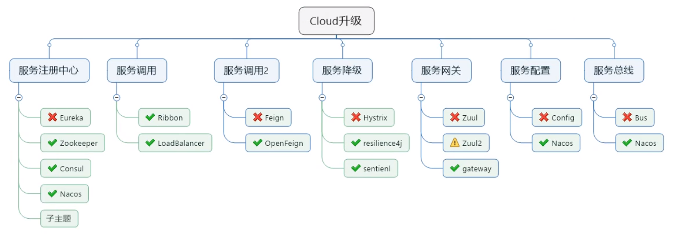
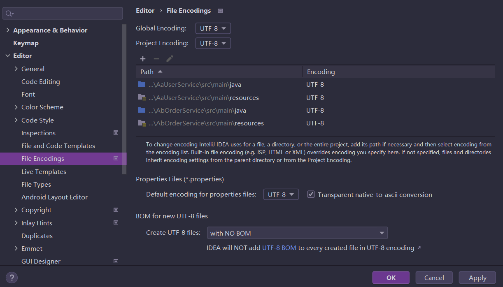
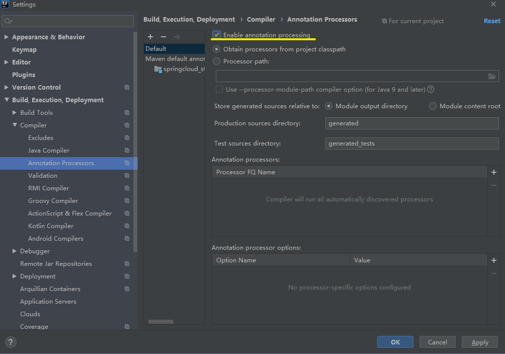
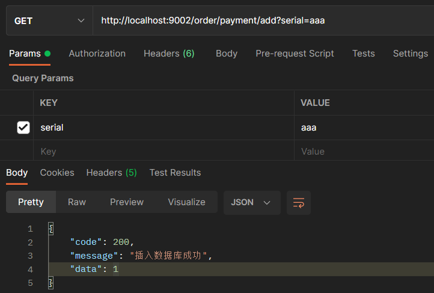

# 一、版本选择

## 1.生成新的Spring Cloud项目

最简单的入门方法是访问[start.spring.io](https://start.spring.io/)，选择您的Spring Boot版本和要使用的Spring Cloud项目。生成项目时，这会将相应的Spring Cloud BOM版本添加到Maven / Gradle文件中。

## 2.将Spring Cloud对应Spring Boot版本

如果您现有的Spring Boot应用程序想要将Spring Cloud添加到该应用程序，则第一步是确定应使用的Spring Cloud版本。您在应用中使用的版本将取决于您使用的Spring Boot的版本。

下表概述了哪个版本的Spring Cloud映射到哪个版本的Spring Boot。

|                         Spring Cloud                         |           Spring Boot            |
| :----------------------------------------------------------: | :------------------------------: |
| [Hoxton](https://github.com/spring-projects/spring-cloud/wiki/Spring-Cloud-Hoxton-Release-Notes) | 2.2.x, 2.3.x (Starting with SR5) |
| [Greenwich](https://github.com/spring-projects/spring-cloud/wiki/Spring-Cloud-Greenwich-Release-Notes) |              2.1.x               |
| [Finchley](https://github.com/spring-projects/spring-cloud/wiki/Spring-Cloud-Finchley-Release-Notes) |              2.0.x               |
| [Edgware](https://github.com/spring-projects/spring-cloud/wiki/Spring-Cloud-Edgware-Release-Notes) |              1.5.x               |
| [Dalston](https://github.com/spring-projects/spring-cloud/wiki/Spring-Cloud-Dalston-Release-Notes) |              1.5.x               |

- 版本对应的详细

  https://start.spring.io/actuator/info对应官网地址

  ```json
  {
  	"git": {
  		"branch": "c3d0cbb64441814bfc39fe8fcb16f6210bc1ae6d",
  		"commit": {
  			"id": "c3d0cbb",
  			"time": "2022-02-20T16:22:17Z"
  		}
  	},
  	"build": {
  		"version": "0.0.1-SNAPSHOT",
  		"artifact": "start-site",
  		"versions": {
  			"spring-boot": "2.6.3",
  			"initializr": "0.13.0-SNAPSHOT"
  		},
  		"name": "start.spring.io website",
  		"time": "2022-02-20T19:25:58.756Z",
  		"group": "io.spring.start"
  	},
  	"bom-ranges": {
  		"azure": {
  			"3.2.0": "Spring Boot >=2.3.0.M1 and <2.4.0-M1",
  			"3.5.0": "Spring Boot >=2.4.0.M1 and <2.5.0-M1",
  			"3.13.0": "Spring Boot >=2.5.0.M1 and <2.7.0-M1"
  		},
  		"codecentric-spring-boot-admin": {
  			"2.4.3": "Spring Boot >=2.3.0.M1 and <2.5.0-M1",
  			"2.5.5": "Spring Boot >=2.5.0.M1 and <2.6.0-M1",
  			"2.6.2": "Spring Boot >=2.6.0.M1 and <2.7.0-M1"
  		},
  		"solace-spring-boot": {
  			"1.1.0": "Spring Boot >=2.3.0.M1 and <2.6.0-M1"
  		},
  		"solace-spring-cloud": {
  			"1.1.1": "Spring Boot >=2.3.0.M1 and <2.4.0-M1",
  			"2.1.0": "Spring Boot >=2.4.0.M1 and <2.6.0-M1"
  		},
  		"spring-cloud": {
  			"Hoxton.SR12": "Spring Boot >=2.2.0.RELEASE and <2.4.0.M1",
  			"2020.0.5": "Spring Boot >=2.4.0.M1 and <2.6.0-M1",
  			"2021.0.0-M1": "Spring Boot >=2.6.0-M1 and <2.6.0-M3",
  			"2021.0.0-M3": "Spring Boot >=2.6.0-M3 and <2.6.0-RC1",
  			"2021.0.0-RC1": "Spring Boot >=2.6.0-RC1 and <2.6.1",
  			"2021.0.1": "Spring Boot >=2.6.1 and <2.6.4-SNAPSHOT",
  			"2021.0.2-SNAPSHOT": "Spring Boot >=2.6.4-SNAPSHOT and <3.0.0-M1",
  			"2022.0.0-M1": "Spring Boot >=3.0.0-M1 and <3.1.0-M1"
  		},
  		"spring-cloud-gcp": {
  			"2.0.8": "Spring Boot >=2.4.0-M1 and <2.6.0-M1",
  			"3.1.0": "Spring Boot >=2.6.0-M1 and <2.7.0-M1"
  		},
  		"spring-cloud-services": {
  			"2.3.0.RELEASE": "Spring Boot >=2.3.0.RELEASE and <2.4.0-M1",
  			"2.4.1": "Spring Boot >=2.4.0-M1 and <2.5.0-M1",
  			"3.3.0": "Spring Boot >=2.5.0-M1 and <2.6.0-M1",
  			"3.4.0": "Spring Boot >=2.6.0-M1 and <2.7.0-M1"
  		},
  		"spring-geode": {
  			"1.3.12.RELEASE": "Spring Boot >=2.3.0.M1 and <2.4.0-M1",
  			"1.4.13": "Spring Boot >=2.4.0-M1 and <2.5.0-M1",
  			"1.5.9": "Spring Boot >=2.5.0-M1 and <2.6.0-M1",
  			"1.6.3": "Spring Boot >=2.6.0-M1 and <2.7.0-M1",
  			"1.7.0-M1": "Spring Boot >=2.7.0-M1 and <2.8.0-M1"
  		},
  		"vaadin": {
  			"14.8.4": "Spring Boot >=2.1.0.RELEASE and <2.8.0-M1"
  		},
  		"wavefront": {
  			"2.0.2": "Spring Boot >=2.1.0.RELEASE and <2.4.0-M1",
  			"2.1.1": "Spring Boot >=2.4.0-M1 and <2.5.0-M1",
  			"2.2.2": "Spring Boot >=2.5.0-M1 and <2.7.0-M1"
  		}
  	},
  	"dependency-ranges": {
  		"native": {
  			"0.9.0": "Spring Boot >=2.4.3 and <2.4.4",
  			"0.9.1": "Spring Boot >=2.4.4 and <2.4.5",
  			"0.9.2": "Spring Boot >=2.4.5 and <2.5.0-M1",
  			"0.10.0": "Spring Boot >=2.5.0-M1 and <2.5.2",
  			"0.10.1": "Spring Boot >=2.5.2 and <2.5.3",
  			"0.10.2": "Spring Boot >=2.5.3 and <2.5.4",
  			"0.10.3": "Spring Boot >=2.5.4 and <2.5.5",
  			"0.10.4": "Spring Boot >=2.5.5 and <2.5.6",
  			"0.10.5": "Spring Boot >=2.5.6 and <2.5.9",
  			"0.10.6": "Spring Boot >=2.5.9 and <2.6.0-M1",
  			"0.11.0-M1": "Spring Boot >=2.6.0-M1 and <2.6.0-RC1",
  			"0.11.0-M2": "Spring Boot >=2.6.0-RC1 and <2.6.0",
  			"0.11.0-RC1": "Spring Boot >=2.6.0 and <2.6.1",
  			"0.11.0": "Spring Boot >=2.6.1 and <2.6.2",
  			"0.11.1": "Spring Boot >=2.6.2 and <2.6.2",
  			"0.11.2": "Spring Boot >=2.6.3 and <2.6.4-SNAPSHOT",
  			"0.11.3-SNAPSHOT": "Spring Boot >=2.6.4-SNAPSHOT and <2.7.0-M1"
  		},
  		"okta": {
  			"1.4.0": "Spring Boot >=2.2.0.RELEASE and <2.4.0-M1",
  			"1.5.1": "Spring Boot >=2.4.0-M1 and <2.4.1",
  			"2.0.1": "Spring Boot >=2.4.1 and <2.5.0-M1",
  			"2.1.4": "Spring Boot >=2.5.0-M1 and <2.7.0-M1"
  		},
  		"mybatis": {
  			"2.1.4": "Spring Boot >=2.1.0.RELEASE and <2.5.0-M1",
  			"2.2.2": "Spring Boot >=2.5.0-M1"
  		},
  		"camel": {
  			"3.5.0": "Spring Boot >=2.3.0.M1 and <2.4.0-M1",
  			"3.10.0": "Spring Boot >=2.4.0.M1 and <2.5.0-M1",
  			"3.13.0": "Spring Boot >=2.5.0.M1 and <2.6.0-M1",
  			"3.15.0": "Spring Boot >=2.6.0.M1 and <2.7.0-M1"
  		},
  		"picocli": {
  			"4.6.2": "Spring Boot >=2.4.0.RELEASE and <2.6.0-M1"
  		},
  		"open-service-broker": {
  			"3.2.0": "Spring Boot >=2.3.0.M1 and <2.4.0-M1",
  			"3.3.1": "Spring Boot >=2.4.0-M1 and <2.5.0-M1",
  			"3.4.0-M2": "Spring Boot >=2.5.0-M1 and <2.6.0-M1"
  		}
  	}
  }
  ```


## 3.本次项目使用版本

|            组件             |     版本      |
| :-------------------------: | :-----------: |
|            cloud            |  Hoxton.SR10  |
|            boot             | 2.3.9.RELEASE |
|        druid.version        |    1.1.16     |
|          java jdk           |     Java8     |
|            Maven            |     3.8.1     |
|            Mysql            |    8.0.16     |
| mybatis.spring.boot.version |     1.3.0     |
|        junit.version        |     4.12      |
|        log4j.version        |    1.2.17     |

spring Cloud为开发人员提供了工具，可以快速构建分布式系统中的一些常见模式(例如配置管理、服务发现、断路器、智能路由、微代理、控制总线)。分布式系统的协调导致了模板模式，使用Spring Cloud开发人员可以快速支持实现这些模式的服务和应用程序。它们可以在任何分布式环境中很好地工作，包括开发人员自己的笔记本电脑、裸金属数据中心和诸如Cloud Foundry这样的托管平台。

==最新可使用==：

- 发行cloud版本：**Hoxton.SR12**
- 支持的boot版本：**2.3.12.RELEASE**

## 4.截止2020年cloud技术使用情况



# 二、父项目的构建(BeginnerSpringCloud)

微服务的构建步骤主要有：

- 建model
- 改pom
- 写yml
- 主启动
- 业务类

### （1）settings配置

#### 1.创建项目

- 使用maven创建基本工程，创建项目BeginnerSpringCloud

#### 2.字符编码

- 统一使用UTF-8字符编码

  

#### 3.注解生效激活



#### 4.选择java版本

- java选择8版本

  

### （2）父项目pom.xml

```xml
<properties>
        <project.build.sourceEncoding>UTF-8</project.build.sourceEncoding>
        <project.reporting.outputEncoding>UTF-8</project.reporting.outputEncoding>
        <spring.cloud.version>Hoxton.SR10</spring.cloud.version>
        <spring.boot.version>2.3.9.RELEASE</spring.boot.version>
        <mysql.version>8.0.16</mysql.version>
        <druid.version>1.1.16</druid.version>
        <mybatis.spring.boot.version>1.3.0</mybatis.spring.boot.version>
        <log4j.version>1.2.17</log4j.version>
        <junit.version>4.12</junit.version>
        <lombok.version>1.18.18</lombok.version>
    </properties>
    <dependencyManagement>
        <dependencies>
            <!-- springCloud -->
            <dependency>
                <groupId>org.springframework.cloud</groupId>
                <artifactId>spring-cloud-dependencies</artifactId>
                <version>${spring.cloud.version}</version>
                <type>pom</type>
                <scope>import</scope>
            </dependency>
            <!-- spring boot -->
            <dependency>
                <groupId>org.springframework.boot</groupId>
                <artifactId>spring-boot-dependencies</artifactId>
                <version>${spring.boot.version}</version>
                <type>pom</type>
                <scope>import</scope>
            </dependency>
            <!-- mysql驱动 -->
            <dependency>
                <groupId>mysql</groupId>
                <artifactId>mysql-connector-java</artifactId>
                <version>${mysql.version}</version>
            </dependency>
            <!-- mybatis -->
            <dependency>
                <groupId>org.mybatis.spring.boot</groupId>
                <artifactId>mybatis-spring-boot-starter</artifactId>
                <version>${mybatis.spring.boot.version}</version>
            </dependency>
            <dependency>
                <groupId>org.mybatis.spring.boot</groupId>
                <artifactId>mybatis-spring-boot-starter</artifactId>
                <version>${mybatis.spring.boot.version}</version>
            </dependency>
            <!-- alibaba druid -->
            <dependency>
                <groupId>com.alibaba</groupId>
                <artifactId>druid</artifactId>
                <version>${druid.version}</version>
            </dependency>
            <!-- log4j -->
            <dependency>
                <groupId>log4j</groupId>
                <artifactId>log4j</artifactId>
                <version>${log4j.version}</version>
            </dependency>
            <!-- junit -->
            <dependency>
                <groupId>junit</groupId>
                <artifactId>junit</artifactId>
                <version>${junit.version}</version>
            </dependency>
            <!-- lombok -->
            <dependency>
                <groupId>org.projectlombok</groupId>
                <artifactId>lombok</artifactId>
                <version>${lombok.version}</version>
            </dependency>
        </dependencies>
    </dependencyManagement>
    <build>
        <finalName>app</finalName>
        <plugins>
            <plugin>
                <groupId>org.springframework.boot</groupId>
                <artifactId>spring-boot-maven-plugin</artifactId>
                <version>2.6.1</version>
            </plugin>
        </plugins>
    </build>
```

- dependencyManagement里只是声明依赖，==并不会导入依赖== ，所以在子项目中要显示的声明所需要的依赖。
- <font color=red>如果不在子项目中声明依赖，是不会从父项目继承该依赖的，只有在子项目中写了具体依赖并且未指定其版本才会在父项目继承，其中version和scope都会继承父pom文件</font>

- 子项目中==使用了版本号== ，就会使用子项目的jar包

# 三、构建User模块

## 1.创建微服务模块

服务名称：==UserApplication（8800）==;

## 2.在pom添加依赖

```xml
<properties>
        <maven.compiler.source>8</maven.compiler.source>
        <maven.compiler.target>8</maven.compiler.target>
    </properties>
    <dependencies>
<!--        引入公共api-->
        <dependency>
            <groupId>com.daniel.cloud</groupId>
            <artifactId>cloud_api</artifactId>
            <version>0.0.1-SNAPSHOT</version>
        </dependency>
        <dependency>
            <groupId>log4j</groupId>
            <artifactId>log4j</artifactId>
        </dependency>
        
        <dependency>
            <groupId>org.springframework.cloud</groupId>
            <artifactId>spring-cloud-starter-netflix-eureka-client</artifactId>
        </dependency>
        <dependency>
            <groupId>org.springframework.boot</groupId>
            <artifactId>spring-boot-starter-web</artifactId>
        </dependency>
        <dependency>
            <groupId>org.springframework.boot</groupId>
            <artifactId>spring-boot-starter-actuator</artifactId>
        </dependency>
        <dependency>
            <groupId>org.mybatis.spring.boot</groupId>
            <artifactId>mybatis-spring-boot-starter</artifactId>
        </dependency>
        <dependency>
            <groupId>com.alibaba</groupId>
            <artifactId>druid-spring-boot-starter</artifactId>
            <version>1.1.16</version>
        </dependency>
        <!--mysql-connector-java-->
        <dependency>
            <groupId>mysql</groupId>
            <artifactId>mysql-connector-java</artifactId>
        </dependency>
        <!--jdbc-->
        <dependency>
            <groupId>org.springframework.boot</groupId>
            <artifactId>spring-boot-starter-jdbc</artifactId>
        </dependency>
        <dependency>
            <groupId>org.springframework.boot</groupId>
            <artifactId>spring-boot-devtools</artifactId>
            <scope>runtime</scope>
            <optional>true</optional>
        </dependency>
        <dependency>
            <groupId>org.springframework.boot</groupId>
            <artifactId>spring-boot-starter-test</artifactId>
            <scope>test</scope>
        </dependency>
    </dependencies>
    <build>
        <finalName>app</finalName>
        <plugins>
            <plugin>
                <groupId>org.springframework.boot</groupId>
                <artifactId>spring-boot-maven-plugin</artifactId>
            </plugin>
        </plugins>
    </build>

```

#### 3.编写yml文件

- ==application.xml==

```yml
server:
  port: 9001
spring:
  application:
    name: user-service
  datasource:
    # 当前数据源操作类型
    type: com.alibaba.druid.pool.DruidDataSource
    # mysql驱动类
    driver-class-name: com.mysql.cj.jdbc.Driver
    url: jdbc:mysql://rm-2ze5r466gf23tkopqqo.mysql.rds.aliyuncs.com:3306/spring_cloud?useUnicode=true&useJDBCCompliantTimezoneShift=true&useLegacyDatetimeCode=false&serverTimezone=UTC
    username: daniel
    password: Daniel2118
mybatis:
  mapper-locations: classpath*:mapper/*.xml
  type-aliases-package: com.daniel.cloud.entity
  # 它一般对应我们的实体类所在的包，这个时候会自动取对应包中不包括包名的简单类名作为包括包名的别名。多个package之间可以用逗号或者分号等来进行分隔（value的值一定要是包的全）
eureka:
  client:
    # 表示自己就是注册中心，不用注册自己
    register-with-eureka: false
    # 表示自己就是注册中心，不用去注册中心获取其他服务的地址
    fetch-registry: false
```

==在eureaka中配置register-with-eureka: false和fetch-registry: false后防止注册报错==

#### 4.编写主启动类

```java
@SpringBootApplication
public class PaymentService9001 {
    public static void main(String[] args) {
        SpringApplication.run(PaymentService9001.class,args);
    }
}
```

#### 5.业务类

- 建MySQL数据库及表

  ```mysql
  -- 创建payment表
  CREATE TABLE payment(
  	id BIGINT(20) NOT NULL auto_increment,
  	serial VARCHAR(200),
  	PRIMARY KEY(id)
  )ENGINE=INNODB auto_increment=1 CHARSET=utf8
  
  -- 插入数据
  INSERT INTO payment(id,serial) VALUES(DEFAULT,'HKJSNS2141');
  INSERT INTO payment(id,serial) VALUES(DEFAULT,'JDNSKJ6356');
  INSERT INTO payment(id,serial) VALUES(DEFAULT,'SJDLJF4545');
  INSERT INTO payment(id,serial) VALUES(DEFAULT,'GYYEJH7754');
  INSERT INTO payment(id,serial) VALUES(DEFAULT,'TIJDFS5477');
  
  SELECT * FROM payment
  ```
  
- entity层（实体类）

  - Payment类

  ```java
  package com.daniel.cloud.domain;
  
  @Component
  public class Payment implements Serializable {
      private Long id;
      private String serial;
      //省略gettr和setter。。。
  }
  
  ```

  - CommonResult<T>

  ```java
  package com.daniel.cloud.domain;
  
  public class CommonResult<T> {
      private Integer code;
      private String  message;
      private T       data;
      
      public CommonResult() {
      }
      
      public CommonResult(Integer code, String message) {
          this(code,message,null);
      }
      
      public CommonResult(Integer code, String message, T data) {
          this.code = code;
          this.message = message;
          this.data = data;
      }
      //省略gettr和setter。。。
  }
  ```

- mapper层（数据访问层）

  PaymentDao

  ```java
  @Mapper
  public interface PaymentDao {
      //添加
      public int add(Payment payment);
     //通过id查询
      public Payment getPaymentById(@Param("id") Long id);
  }
  ```

  ==在resources目录下建立mapper文件对应yml文件路径==

  

  PaymentMapper.xml
  
  ```xml
  <?xml version="1.0" encoding="UTF-8" ?>
  <!DOCTYPE mapper
          PUBLIC "-//mybatis.org//DTD Mapper 3.0//EN"
          "http://mybatis.org/dtd/mybatis-3-mapper.dtd">
  <mapper namespace="com.daniel.cloud.dao.PaymentDao">
      
      <insert id="add" parameterType="Payment" useGeneratedKeys="true" keyProperty="id">
          INSERT INTO payment(serial) VALUES(#{serial});
      </insert>
      
      <select id="getPaymentById" parameterType="Long" resultMap="paymentResultMap">
          select * from payment where id = #{id}
      </select>
      
      <resultMap id="paymentResultMap" type="Payment">
          <id column="id" property="id" jdbcType="BIGINT"/>
          <id column="serial" property="serial" jdbcType="VARCHAR"/>
      </resultMap>
  </mapper>
  ```

-   service层

    ```java
      public interface PaymentService {
          public int add(Payment payment);
        
          public Payment getPaymentById(@Param("id") Long id);
      }
    ```

    实现类

    ```java
    package com.daniel.cloud.services.impl;
    
    @Service
    public class PaymentServiceImpl implements PaymentService {
        @Autowired
        PaymentDao paymentDao;
        @Override
        public int add(Payment payment) {
            return paymentDao.add(payment);
        }
        
        @Override
        public Payment getPaymentById(Long id) {
            return paymentDao.getPaymentById(id);
        }
    }
    ```

- controller层（控制器）

  ```java
  package com.daniel.cloud.controller;
  import com.daniel.cloud.entity.CommonResult;
  import com.daniel.cloud.entity.Payment;
  import com.daniel.cloud.service.PaymentService;
  import org.apache.log4j.Logger;
  import org.springframework.beans.factory.annotation.Autowired;
  import org.springframework.web.bind.annotation.*;
  
  @RestController
  public class PaymentController {
      Logger logger = Logger.getLogger(PaymentController.class);
      @Autowired
      PaymentService paymentService;
      
      @RequestMapping(value = "/payment/add")
      public CommonResult add(@RequestBody Payment payment){
          int result = paymentService.add(payment);
          logger.debug("插入一条数据" + result);
          if (result>0){
              return new CommonResult(200,"插入数据库成功",result);
          }else {
              return new CommonResult(444,"插入数据库失败",null);
          }
      }
      
      @GetMapping(value = "/payment/get/{id}")
      public CommonResult add(@PathVariable("id") Long id){
          Payment payment = paymentService.getPaymentById(id);
          logger.debug("查询到一条数据" + payment);
          if (payment!=null){
              return new CommonResult(200,"查询数据库成功",payment);
          }else {
              return new CommonResult(444,"无对应记录，查询id："+id,null);
          }
      }
  }
  
  ```

#### 6.日志

使用log4j

```properties
#设置
log4j.rootLogger=debug,stdout,D,E
#输出信息到控制抬
log4j.appender.stdout=org.apache.log4j.ConsoleAppender
log4j.appender.stdout.Target=System.out
log4j.appender.stdout.layout=org.apache.log4j.PatternLayout
log4j.appender.stdout.layout.ConversionPattern=[%-5p] %d{yyyy-MM-dd HH:mm:ss,SSS} method:%l%n%m%n
#输出DEBUG 级别以上的日志到=D:/Users/10192/Desktop/SSM-整合/src/main/logs/log.log
log4j.appender.D=org.apache.log4j.DailyRollingFileAppender
#配置你自己的log.log输出路径
log4j.appender.D.File=D:/logs/log.log
log4j.appender.D.Append=true
log4j.appender.D.Threshold=DEBUG
log4j.appender.D.layout=org.apache.log4j.PatternLayout
log4j.appender.D.layout.ConversionPattern=%-d{yyyy-MM-dd HH:mm:ss}  [ %t:%r ] - [ %p ]  %m%n
#输出ERROR 级别以上的日志到=D:/Users/10192/Desktop/SSM-整合/src/main/logs/error.log
log4j.appender.E=org.apache.log4j.DailyRollingFileAppender
#配置你自己的error.log的输出路径
log4j.appender.E.File=D:/logs/error.log
log4j.appender.E.Append=true
log4j.appender.E.Threshold=ERROR
log4j.appender.E.layout=org.apache.log4j.PatternLayout
log4j.appender.E.layout.ConversionPattern=%-d{yyyy-MM-dd HH:mm:ss}  [ %t:%r ] - [ %p ]  %m%n
```

#### 7.测试

(http://localhost:9001/payment/get/1)


在Postman中测试(http://localhost:9002/order/payment/add?serial=aaa)



控制台信息

```java
[DEBUG] 2020-10-10 22:14:19,647 method:com.daniel.cloud.controller.PaymentController.add(PaymentController.java:33)
查询到一条数据Payment{id=1, serial='HKJSNS2141'}
[DEBUG] 2020-10-10 22:15:36,618 method:com.daniel.cloud.controller.PaymentController.add(PaymentController.java:22)
插入一条数据1
```

数据库插入信息


## 三、构建order-service(9002)

### 1、新建model

创建order-service(9002)

### 2、改pom

```xml
<?xml version="1.0" encoding="UTF-8"?>
<project xmlns="http://maven.apache.org/POM/4.0.0" xmlns:xsi="http://www.w3.org/2001/XMLSchema-instance"
         xsi:schemaLocation="http://maven.apache.org/POM/4.0.0 https://maven.apache.org/xsd/maven-4.0.0.xsd">
    <modelVersion>4.0.0</modelVersion>
    <parent>
        <groupId>org.springframework.boot</groupId>
        <artifactId>spring-boot-starter-parent</artifactId>
        <version>2.6.3</version>
        <relativePath/> <!-- lookup parent from repository -->
    </parent>
    <groupId>com.daniel.cloud</groupId>
    <artifactId>order-service</artifactId>
    <version>0.0.1-SNAPSHOT</version>
    <name>order-service</name>
    <description>Demo project for Spring Boot</description>
    <properties>
        <java.version>1.8</java.version>
    </properties>
    <dependencies>
        <!--        引入抽取的公共的api-->
        <dependency>
            <groupId>org.daniel</groupId>
            <artifactId>cloud_api</artifactId>
            <version>1.0-SNAPSHOT</version>
            <scope>compile</scope>
        </dependency>
        <!-- SpringBoot整合Web组件 -->
        <dependency>
            <groupId>org.springframework.boot</groupId>
            <artifactId>spring-boot-starter-web</artifactId>
        </dependency>
        <dependency>
            <groupId>org.springframework.boot</groupId>
            <artifactId>spring-boot-starter-actuator</artifactId>
        </dependency>
        <!--日常通用jar包配置-->
        <!--        热部署-->
        <dependency>
            <groupId>org.springframework.boot</groupId>
            <artifactId>spring-boot-devtools</artifactId>
            <scope>runtime</scope>
            <optional>true</optional>
        </dependency>
        <dependency>
            <groupId>org.springframework.boot</groupId>
            <artifactId>spring-boot-starter-test</artifactId>
            <scope>test</scope>
        </dependency>
    </dependencies>
    
    <build>
        <plugins>
            <plugin>
                <groupId>org.springframework.boot</groupId>
                <artifactId>spring-boot-maven-plugin</artifactId>
            </plugin>
        </plugins>
    </build>

</project>

```

### 3、编写application.yml

```yaml
server:
  port: 9002
```

### 4、编写主启动类

```java
@SpringBootApplication
public class OrderService9002 {
    public static void main(String[] args) {
        SpringApplication.run(OrderService9002.class, args);
    }
    
}
```


### 5、业务类

#### 5.1、配置RestTemplate

新建配置类，将RestTemplate添加至容器中

```java
@Configuration
public class OrderConfig {
    @Bean
    public RestTemplate getRestTemplate(){
        return new RestTemplate();
    }
}
```

#### 5.2、编写控制器

```java
package com.daniel.cloud.controller;

import com.daniel.cloud.domain.CommonResult;
import com.daniel.cloud.domain.Payment;
import org.slf4j.Logger;
import org.slf4j.LoggerFactory;
import org.springframework.beans.factory.annotation.Autowired;
import org.springframework.web.bind.annotation.*;
import org.springframework.web.client.RestTemplate;

@RestController
public class OrderController {
    private static Logger logger =  LoggerFactory.getLogger(OrderController.class);
    final String PAYMENT_URL="http://localhost:9001";
    @Autowired
    RestTemplate restTemplate;
    
    @RequestMapping("/order/payment/add")
    public CommonResult<Payment> add(@RequestParam String serial){
        Payment payment = new Payment();
        payment.setSerial(serial);
        
        logger.info("Order请求添加接口接收数据=====>>>>{}",serial);
        return restTemplate.postForObject(PAYMENT_URL+"/payment/add",payment, CommonResult.class);
    }
    
    @GetMapping("/order/payment/get/{id}")
    public CommonResult<Payment> getById(@PathVariable("id") Long id){
        return restTemplate.getForObject(PAYMENT_URL+"/payment/get/"+id,CommonResult.class);
    }
}
```

==因为此控制器还要使用pay模块中的domain中的实体，所以会考虑将公共部分抽取出来，抽取步骤看下一章==

## 四、工程重构（抽取公共类）

### 1、新建model

创建cloud_api，抽取公共类

### 2、改pom

```xml
<?xml version="1.0" encoding="UTF-8"?>
<project xmlns="http://maven.apache.org/POM/4.0.0" xmlns:xsi="http://www.w3.org/2001/XMLSchema-instance"
         xsi:schemaLocation="http://maven.apache.org/POM/4.0.0 https://maven.apache.org/xsd/maven-4.0.0.xsd">
    <modelVersion>4.0.0</modelVersion>
    <parent>
        <groupId>org.springframework.boot</groupId>
        <artifactId>spring-boot-starter-parent</artifactId>
        <version>2.6.3</version>
        <relativePath/> <!-- lookup parent from repository -->
    </parent>
    <groupId>com.daniel.cloud</groupId>
    <artifactId>cloud_api</artifactId>
    <version>0.0.1-SNAPSHOT</version>
    <name>cloud_api</name>
    <description>Demo project for Spring Boot</description>
    <properties>
        <java.version>1.8</java.version>
    </properties>
    <dependencies>
        <dependency>
            <groupId>org.springframework.boot</groupId>
            <artifactId>spring-boot-starter-web</artifactId>
        </dependency>
        <dependency>
            <groupId>org.springframework.boot</groupId>
            <artifactId>spring-boot-starter-actuator</artifactId>
        </dependency>
        <dependency>
            <groupId>org.springframework.boot</groupId>
            <artifactId>spring-boot-starter-test</artifactId>
            <scope>test</scope>
        </dependency>
    </dependencies>
    
    <build>
        <plugins>
            <plugin>
                <groupId>org.springframework.boot</groupId>
                <artifactId>spring-boot-maven-plugin</artifactId>
            </plugin>
        </plugins>
    </build>

</project>

```


### 3、抽取公共部分

将80端口和8001端口所对应的微服务中的公共部分==entity==抽取出来

为使得项目代码不用改动，将包名命名一致

将order_api模块在maven中==【clean】和【install】==

然后将9001中的entity删除，并分别在order-service和payment-service中引用，删除后重建会出现程序包未找到，这是因为==IDEA中有时不会自动导入，此时需要手动添加步骤如下：==

导入公共依赖

```xml
<!--        引入抽取的公共的api-->
        <dependency>
            <groupId>org.daniel</groupId>
            <artifactId>cloud_api</artifactId>
            <version>1.0-SNAPSHOT</version>
            <scope>compile</scope>
        </dependency>
```

点击==重构==即可。


### 4、测试

4.1、默认端口9001，测试getbyid方法，http://localhost:9002/order/payment/get/1直接访问


4.2、测试添加方法add，http://localhost:9002/order/payment/add?serial=bbbb


