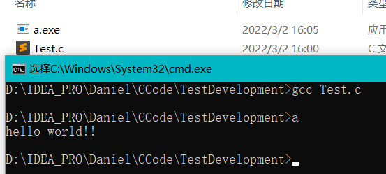
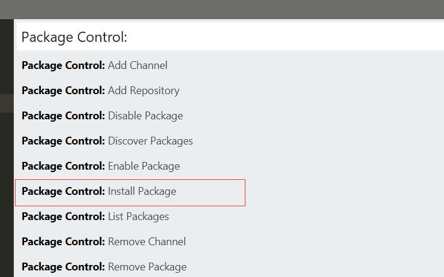
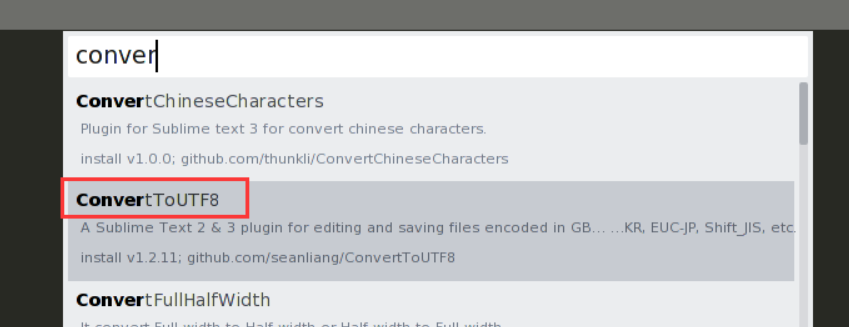
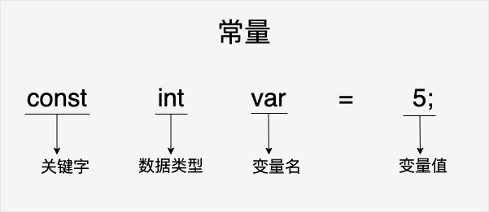

# 一、简介

C 语言是一种通用的高级语言，最初是由丹尼斯·里奇在贝尔实验室为开发 UNIX 操作系统而设计的。C 语言最开始是于 1972 年在 DEC PDP-11 计算机上被首次实现。

在 1978 年，布莱恩·柯林汉（Brian Kernighan）和丹尼斯·里奇（Dennis Ritchie）制作了 C 的第一个公开可用的描述，现在被称为 K&R 标准。

UNIX 操作系统，C编译器，和几乎所有的 UNIX 应用程序都是用 C 语言编写的。由于各种原因，C 语言现在已经成为一种广泛使用的专业语言。

## 1、历史

- C 语言是为了编写 UNIX 操作系统而被发明的。
- C 语言是以 B 语言为基础的，B 语言大概是在 1970 年被引进的。
- C 语言标准是于 1988 年由美国国家标准协会（ANSI，全称 American National Standard Institute）制定的。
- 截至 1973 年，UNIX 操作系统完全使用 C 语言编写。
- 目前，C 语言是最广泛使用的系统程序设计语言。
- 大多数先进的软件都是使用 C 语言实现的。
- 当今最流行的 Linux 操作系统和 RDBMS（Relational Database Management System：关系数据库管理系统） MySQL 都是使用 C 语言编写的。

## 2、特点

- 易于学习。
- 结构化语言。
- 它产生高效率的程序。
- 它可以处理底层的活动。
- 它可以在多种计算机平台上编译。

# 二、配置环境

## 1、下载软件

如果要使用c语言，则需要配置当前系统环境，此处以windows系统为例，准备c语言环境

下载c语言编译环境

Windows 上安装 GCC，您需要安装 MinGW。为了安装 MinGW，请访问 MinGW 的主页 [mingw-w64.org](http://mingw-w64.org/)，进入 MinGW 下载页面，下载最新版本的 MinGW 安装程序，命名格式为 MinGW-<version>.exe。

下载完毕后，安装到指定目录


## 2、配置环境变量

进入系统环境变量配置，将MinGW的执行路径（`D:\Software\mingw64\bin`）配置在path中


进入cmd终端中输入`gcc`命令结果如下则配置成功


## 3、测试环境

在D盘中新建c语言项目目录，创建`Test.c`文件


此处使用`sublime text3`软件作为编辑器

```c
#include <stdio.h>
void main(){
	printf("hello world!!\n");
	return 0;
}
```

使用终端进入当前目录，编译文件

```sh
gcc Test.c # 默认生成a.exe文件直接执行a即可
#指定名称输出
gcc Test.c -o test # 会在该目录下生成指定的文件：test.exe
```



## 4、关于使用Sublime Text3中文乱码

由于使用sublime text3默认使用的是`UTF-8`编码格式，所以需要转换文件格式


打开sublime安装


点击Package Control，找到install Package并点击，如下图所示



再弹出的搜索框中输入conver，找到`converToUTF8`点击并安装。

​	

此时我们点击File，发现多了两个选项`Set File Encoding to`和`Reload with Encoding`。

点击转换后解决乱码问题


如果你是Linux系统，此时如果我们想要把文件保存为GBK仍然做不到，，我们需要下载Codecs33。步骤同刚才下载converToUTF8。

## 5、安装CLion

下载CLion安装包安装

此处只记录CLion软件内MinGW的配置


在配置中配置你系统中安装的编译器

# 三、C 基本语法

C 程序由各种令牌组成，令牌可以是`关键字`、`标识符`、`常量`、`字符串值`，或者是一个`符号`。例如，下面的 C 语句包括五个令牌：

## 1、分号

在 C 程序中，分号是语句结束符。也就是说，每个语句必须以分号结束。它表明一个逻辑实体的结束。

```c
printf("Hello, World!!! \n");
return 0;
```

## 2、注释

两种注释方式：`//` 和`/**/`，==不能在注释内嵌套注释，注释也不能出现在字符串或字符值中==

```c
// 单行注释

/* 单行注释 */

/* 
 多行注释
 多行注释
 多行注释
 */
```

## 3、标识符

C 标识符是用来标识变量、函数，或任何其他用户自定义项目的名称。一个标识符以字母 A-Z 或 a-z 或下划线 _ 开始，后跟零个或多个字母、下划线和数字（0-9）

C 标识符内不允许出现标点字符，比如 @、$ 和 %。C 是`区分大小写`的编程语言。因此，在 C 中，Love和 love是两个不同的标识符。下面列出几个有效的标识符：

```
mohd       zara    abc   move_name  a_123
myname50   _temp   j     a23b9      retVal
```

## 4、关键字

下表列出了 C 中的保留字。这些保留字不能作为常量名、变量名或其他标识符名称。

| 关键字   | 说明                                                         |
| :------- | :----------------------------------------------------------- |
| auto     | 声明自动变量                                                 |
| break    | 跳出当前循环                                                 |
| case     | 开关语句分支                                                 |
| char     | 声明字符型变量或函数返回值类型                               |
| const    | 定义常量，如果一个变量被 const 修饰，那么它的值就不能再被改变 |
| continue | 结束当前循环，开始下一轮循环                                 |
| default  | 开关语句中的"其它"分支                                       |
| do       | 循环语句的循环体                                             |
| double   | 声明双精度浮点型变量或函数返回值类型                         |
| else     | 条件语句否定分支（与 if 连用）                               |
| enum     | 声明枚举类型                                                 |
| extern   | 声明变量或函数是在其它文件或本文件的其他位置定义             |
| float    | 声明浮点型变量或函数返回值类型                               |
| for      | 一种循环语句                                                 |
| goto     | 无条件跳转语句                                               |
| if       | 条件语句                                                     |
| int      | 声明整型变量或函数                                           |
| long     | 声明长整型变量或函数返回值类型                               |
| register | 声明寄存器变量                                               |
| return   | 子程序返回语句（可以带参数，也可不带参数）                   |
| short    | 声明短整型变量或函数                                         |
| signed   | 声明有符号类型变量或函数                                     |
| sizeof   | 计算数据类型或变量长度（即所占字节数）                       |
| static   | 声明静态变量                                                 |
| struct   | 声明结构体类型                                               |
| switch   | 用于开关语句                                                 |
| typedef  | 用以给数据类型取别名                                         |
| unsigned | 声明无符号类型变量或函数                                     |
| union    | 声明共用体类型                                               |
| void     | 声明函数无返回值或无参数，声明无类型指针                     |
| volatile | 说明变量在程序执行中可被隐含地改变                           |
| while    | 循环语句的循环条件                                           |

C99 新增关键字

| `_Bool` | `_Complex` | `_Imaginary` | `inline` | `restrict` |
| ------- | ---------- | ------------ | -------- | ---------- |
|         |            |              |          |            |

C11 新增关键字

| `_Alignas`       | `_Alignof`      | `_Atomic` | `_Generic` | `_Noreturn` |
| ---------------- | --------------- | --------- | ---------- | ----------- |
| `_Static_assert` | `_Thread_local` |           |            |             |

## 5、空格

只包含空格的行，被称为空白行，可能带有注释，C 编译器会完全忽略它。

在 C 中，空格用于描述空白符、制表符、换行符和注释。空格分隔语句的各个部分，让编译器能识别语句中的某个元素（比如 int）在哪里结束，下一个元素在哪里开始。因此，在下面的语句中：

```c
int age;
```

在这里，int 和 age 之间必须至少有一个空格字符（通常是一个空白符），这样编译器才能够区分它们。

# 四、数据类型

在 C 语言中，数据类型指的是用于声明不同类型的变量或函数的一个广泛的系统。变量的类型决定了变量存储占用的空间，以及如何解释存储的位模式。

C 中的类型可分为以下几种：

| 序号 | 类型与描述                                                   |
| :--- | :----------------------------------------------------------- |
| 1    | **基本类型：** 它们是算术类型，包括两种类型：整数类型和浮点类型。 |
| 2    | **枚举类型：** 它们也是算术类型，被用来定义在程序中只能赋予其一定的离散整数值的变量。 |
| 3    | **void 类型：** 类型说明符 *void* 表明没有可用的值。         |
| 4    | **派生类型：** 它们包括：指针类型、数组类型、结构类型、共用体类型和函数类型。 |


数组类型和结构类型统称为聚合类型。函数的类型指的是函数返回值的类型。在本章节接下来的部分我们将介绍基本类型，其他几种类型会在后边几个章节中进行讲解。

## 1、整数类型

下表列出了关于标准整数类型的存储大小和值范围的细节：

| 类型           | 存储大小    | 值范围                                               |
| :------------- | :---------- | :--------------------------------------------------- |
| char           | 1 字节      | -128 到 127 或 0 到 255                              |
| unsigned char  | 1 字节      | 0 到 255                                             |
| signed char    | 1 字节      | -128 到 127                                          |
| int            | 2 或 4 字节 | -32,768 到 32,767 或 -2,147,483,648 到 2,147,483,647 |
| unsigned int   | 2 或 4 字节 | 0 到 65,535 或 0 到 4,294,967,295                    |
| short          | 2 字节      | -32,768 到 32,767                                    |
| unsigned short | 2 字节      | 0 到 65,535                                          |
| long           | 4 字节      | -2,147,483,648 到 2,147,483,647                      |
| unsigned long  | 4 字节      | 0 到 4,294,967,295                                   |

注意，各种类型的存储大小与系统位数有关，但目前通用的以64位系统为主。

以下列出了32位系统与64位系统的存储大小的差别（windows 相同）：


为了得到某个类型或某个变量在特定平台上的准确大小，您可以使用 `sizeof` 运算符。表达式 sizeof(type) 得到对象或类型的存储字节大小。下面的实例演示了获取 int 类型的大小：

**实例**

```c
#include <stdio.h> 
#include <limits.h> 
int main() {  
    printf("int 存储大小 : %lu \n", sizeof(int)); 
    return 0;
}
```

`%lu`为 32 位无符号整数，详细说明查看 [C 库函数 - printf()](https://www.runoob.com/cprogramming/c-function-printf.html)。

windows上编译并执行上面的程序时，它会产生下列结果：

```c
int 存储大小 : 4 
```

## 2、浮点类型

下表列出了关于标准浮点类型的存储大小、值范围和精度的细节：

| 类型        | 存储大小 | 值范围                 | 精度        |
| :---------- | :------- | :--------------------- | :---------- |
| float       | 4 字节   | 1.2E-38 到 3.4E+38     | 6 位有效位  |
| double      | 8 字节   | 2.3E-308 到 1.7E+308   | 15 位有效位 |
| long double | 16 字节  | 3.4E-4932 到 1.1E+4932 | 19 位有效位 |

头文件 `float.h` 定义了宏，在程序中可以使用这些值和其他有关实数二进制表示的细节。下面的实例将输出浮点类型占用的存储空间以及它的范围值：

**实例**

```c
#include <stdio.h>
#include <float.h>
int main()
{
   printf("float 存储最大字节数 : %lu \n", sizeof(float));
   printf("float 最小值: %E\n", FLT_MIN );
   printf("float 最大值: %E\n", FLT_MAX );
   printf("精度值: %d\n", FLT_DIG );
   return 0;
}
```

`%E` 为以指数形式输出单、双精度实数，详细说明查看 [C 库函数 - printf()](https://www.runoob.com/cprogramming/c-function-printf.html)。

当您在 Windows上编译并执行上面的程序时，它会产生下列结果：

```c
float 存储最大字节数 : 4
float 最小值: 1.175494E-038
float 最大值: 3.402823E+038
精度值: 6
```

## 3、void 类型

void 类型指定没有可用的值。它通常用于以下三种情况下：

| 序号 | 类型与描述                                                   |
| :--- | :----------------------------------------------------------- |
| 1    | **函数返回为空** C 中有各种函数都不返回值，或者您可以说它们返回空。不返回值的函数的返回类型为空。例如 **void exit (int status);** |
| 2    | **函数参数为空** C 中有各种函数不接受任何参数。不带参数的函数可以接受一个 void。例如 **int rand(void);** |
| 3    | **指针指向 void** 类型为 void * 的指针代表对象的地址，而不是类型。例如，内存分配函数 **void \*malloc( size_t size );** 返回指向 void 的指针，可以转换为任何数据类型。 |

# 五、变量

变量其实只不过是程序可操作的存储区的名称。C 中每个变量都有特定的类型，类型决定了变量存储的大小和布局，该范围内的值都可以存储在内存中，运算符可应用于变量上。

变量的名称可以由字母、数字和下划线字符组成。它必须以字母或下划线开头。大写字母和小写字母是不同的，因为 C 是大小写敏感的。

## 1、常见数据类型

### char

通常是一个字节（八位）, 这是一个整数类型。

### int

整型，4 个字节，取值范围 -2147483648 到 2147483647。

### float

单精度浮点值。单精度是这样的格式，1位符号，8位指数，23位小数。


### double

双精度浮点值。双精度是1位符号，11位指数，52位小数。


C 语言也允许定义各种其他类型的变量，比如枚举、指针、数组、结构、共用体等等

## 2、变量定义

变量定义就是告诉编译器在何处创建变量的存储，以及如何创建变量的存储。变量定义指定一个数据类型，并包含了该类型的一个或多个变量的列表，语法如下：

```c
type variable_list;
```

这里，**type** 必须是一个有效的 C 数据类型，可以是 char、w_char、int、float、double 或任何用户自定义的对象，**variable_list** 可以由一个或多个标识符名称组成，多个标识符之间用逗号分隔。

```c
int    i, j, k;
char   c, ch;
float  f, salary;
double d;
```

变量可以在声明的时候被初始化（指定一个初始值）

```c
type variable_name = value;
// 例如
extern int d = 3, f = 5;    // d 和 f 的声明与初始化
int d = 3, f = 5;           // 定义并初始化 d 和 f
byte z = 22;                // 定义并初始化 z
char x = 'x';               // 变量 x 的值为 'x'
```

## 3、变量声明

变量声明向编译器保证变量以指定的类型和名称存在，这样编译器在不需要知道变量完整细节的情况下也能继续进一步的编译。变量声明只在编译时有它的意义，在程序连接时编译器需要实际的变量声明。

变量的声明有两种情况：

- 1、一种是需要建立存储空间的。例如：int a 在声明的时候就已经建立了存储空间。
- 2、另一种是不需要建立存储空间的，通过使用extern关键字声明变量名而不定义它。 例如：`extern int a` 其中变量 `a `可以在别的文件中定义的。
- 除非有`extern`关键字，否则都是变量的定义。

```c
extern int i; //声明，不是定义
int i; //声明，也是定义
```

接下来我们通过一段代码来理解

```c
#include <stdio.h>
 
// 函数外定义变量 x 和 y，并且赋值
int x = 3;
int y = 4;
int addtwonum()
{
    // 函数内声明变量 x 和 y 为外部变量
    extern int x;
    extern int y;
    
    return x+y;
}
 
int main()
{
    int result;
    // 调用函数 addtwonum
    result = addtwonum();
    
    printf("result 为: %d",result);  // 结果为：result 为: 7
    return 0;
}
```

> 在上述代码中我们注意到通过在方法中`声明`x和y，此时x和y属于全局变量，但是如果我们在addtwonum方法中`定义`一个y变量并且不赋值会发生什么呢？

```c
int addtwonum()
{
    // 函数内声明变量 x 和 y 为外部变量
    extern int x;
    // 有声明改为定义并不赋值，
    int y;
    return x+y;
}
```

结果输出：result 为: 3

所以此时我们发现，在函数内定义的变量属于局部变量，且int类型定义的变量的初始默认值为0 ，所以最终结果为3+0，因此如果在方法中使用全局变量需要通过`extern`关键字进行声明。

### 外部文件引入

如果需要在一个源文件中引用另外一个源文件中定义的变量，我们只需在引用的文件中将变量加上 extern 关键字的声明即可。

addtwonum.c 文件代码：

```c
#include <stdio.h>
/*外部变量声明*/
extern int x ;
extern int y ;
int addtwonum()
{
    return x+y;
}
```

 test.c 文件代码：

```c
#include <stdio.h>
  
/*定义两个全局变量*/
int x=1;
int y=2;
int addtwonum();
int main(void)
{
    int result;
    result = addtwonum();
    printf("result 为: %d\n",result);
    return 0;
}
```

当上面的代码被编译和执行时，它会产生下列结果：

```sh
gcc addtwonum.c test.c -o main
result 为: 3
```

# 六、常量

常量是固定值，在程序执行期间不会改变。这些固定的值，又叫做**字面量**。

常量可以是任何的基本数据类型，比如整数常量、浮点常量、字符常量，或字符串字面值，也有枚举常量。

常量就像是常规的变量，只不过常量的值在==定义后不能进行修改==。

## 1、整数常量

整数常量可以是十进制、八进制或十六进制的常量。前缀指定基数：

> `0x `或 `0X` 表示十六进制，
>
> `0 `表示八进制
>
> 不带前缀则默认表示十进制。

整数常量也可以带一个后缀，后缀是 U 和 L 的组合

> U 表示无符号整数（unsigned）
>
> L 表示长整数（long）

后缀可以是大写，也可以是小写，U 和 L 的顺序任意。

下面列举几个整数常量的实例：

```c
212         /* 合法的 */
215u        /* 合法的 */
0xFeeL      /* 合法的 */
078         /* 非法的：8 不是八进制的数字 */
032UU       /* 非法的：不能重复后缀 */
```

以下是各种类型的整数常量的实例：

```c
85         /* 十进制 */
0213       /* 八进制 */
0x4b       /* 十六进制 */
30         /* 整数 */
30u        /* 无符号整数 */
30l        /* 长整数 */
30ul       /* 无符号长整数 */
```

## 2、浮点常量

浮点常量由`整数部分`、`小数点`、`小数`部分和`指数`部分组成。您可以使用小数形式或者指数形式来表示浮点常量。

当使用小数形式表示时，必须包含整数部分、小数部分，或同时包含两者。

当使用指数形式表示时， 必须包含小数点、指数，或同时包含两者。带符号的指数是用 e 或 E 引入的。

下面列举几个浮点常量的实例：

```c
3.14159       /* 合法的 */
314159E-5L    /* 合法的 */
510E          /* 非法的：不完整的指数 */
210f          /* 非法的：没有小数或指数 */
.e55          /* 非法的：缺少整数或分数 */
```

## 3、字符常量

字符常量是括在单引号中，例如，'x' 可以存储在 **char** 类型的简单变量中。

字符常量可以是一个普通的字符（例如 'x'）、一个转义序列（例如 '\t'），或一个通用的字符（例如 '\u02C0'）。

在 C 中，有一些特定的字符，当它们前面有反斜杠时，它们就具有特殊的含义，被用来表示如换行符（\n）或制表符（\t）等。

### 转义序列码

```c
\\				\ 字符
\'				' 字符
\"				" 字符
\?				? 字符
\a				警报铃声
\b				退格键
\f				换页符
\n				换行符
\r				回车
\t				水平制表符
\v				垂直制表符
\ooo			一到三位的八进制数
\xhh . . .		一个或多个数字的十六进制数
```

## 4、字符串常量

字符串字面值或常量是括在双引号 `""` 中的。一个字符串包含类似于字符常量的字符：普通的字符、转义序列和通用的字符。

您可以使用空格做分隔符，把一个很长的字符串常量进行分行。

下面的实例显示了一些字符串常量。下面这三种形式所显示的字符串是相同的

```c
"hello, dear"

"hello, \

dear"

"hello, " "d" "ear"
```

## 5、定义常量

在 C 中，有两种简单的定义常量的方式：

> 使用`#define` 预处理器。
>
> 使用`const`关键字。

### #define 预处理器

下面是使用 #define 预处理器定义常量的形式：

```
#define identifier value
```

### const 关键字

您可以使用 **const** 前缀声明指定类型的常量，如下所示：

```
const type variable = value;
```

==const 声明常量要在一个语句内完成,把常量定义为大写字母形式，是一个很好的编程习惯==



#  七、存储类

存储类定义 C 程序中变量/函数的范围（可见性）和生命周期。这些说明符放置在它们所修饰的类型之前。下面列出 C 程序中可用的存储类：

- auto
- register
- static
- extern

## 1、auto 存储类

**auto** 存储类是所有局部变量默认的存储类。

```
{
   int mount;
   auto int month;
}
```

上面的实例定义了两个带有相同存储类的变量，auto 只能用在函数内，即 auto 只能修饰局部变量。

## register 存储类

**register** 存储类用于定义存储在寄存器中而不是 RAM 中的局部变量。这意味着变量的最大尺寸等于寄存器的大小（通常是一个字），且不能对它应用一元的 '&' 运算符（因为它没有内存位置）。

```
{
   register int  miles;
}
```

寄存器只用于需要快速访问的变量，比如计数器。还应注意的是，定义 'register' 并不意味着变量将被存储在寄存器中，它意味着变量可能存储在寄存器中，这取决于硬件和实现的限制。

## static 存储类

**static** 存储类指示编译器在程序的生命周期内保持局部变量的存在，而不需要在每次它进入和离开作用域时进行创建和销毁。因此，使用 static 修饰局部变量可以在函数调用之间保持局部变量的值。

static 修饰符也可以应用于全局变量。当 static 修饰全局变量时，会使变量的作用域限制在声明它的文件内。

全局声明的一个 static 变量或方法可以被任何函数或方法调用，只要这些方法出现在跟 static 变量或方法同一个文件中。

以下实例演示了 static 修饰全局变量和局部变量的应用：

## 实例

\#include <stdio.h>  /* 函数声明 */ void func1(void);  static int count=10;        /* 全局变量 - static 是默认的 */  int main() {  while (count--) {      func1();  }  return 0; }  void func1(void) { /* 'thingy' 是 'func1' 的局部变量 - 只初始化一次 * 每次调用函数 'func1' 'thingy' 值不会被重置。 */                  static int thingy=5;  thingy++;  printf(" thingy 为 %d ， count 为 %d\n", thingy, count); }

实例中 count 作为全局变量可以在函数内使用，thingy 使用 static 修饰后，不会在每次调用时重置。

可能您现在还无法理解这个实例，因为我已经使用了函数和全局变量，这两个概念目前为止还没进行讲解。即使您现在不能完全理解，也没有关系，后续的章节我们会详细讲解。当上面的代码被编译和执行时，它会产生下列结果：

```
 thingy 为 6 ， count 为 9
 thingy 为 7 ， count 为 8
 thingy 为 8 ， count 为 7
 thingy 为 9 ， count 为 6
 thingy 为 10 ， count 为 5
 thingy 为 11 ， count 为 4
 thingy 为 12 ， count 为 3
 thingy 为 13 ， count 为 2
 thingy 为 14 ， count 为 1
 thingy 为 15 ， count 为 0
```

## extern 存储类

**extern** 存储类用于提供一个全局变量的引用，全局变量对所有的程序文件都是可见的。当您使用 **extern** 时，对于无法初始化的变量，会把变量名指向一个之前定义过的存储位置。

当您有多个文件且定义了一个可以在其他文件中使用的全局变量或函数时，可以在其他文件中使用 *extern* 来得到已定义的变量或函数的引用。可以这么理解，*extern* 是用来在另一个文件中声明一个全局变量或函数。

extern 修饰符通常用于当有两个或多个文件共享相同的全局变量或函数的时候，如下所示：

**第一个文件：main.c**

## 实例

\#include <stdio.h>  int count ; extern void write_extern();  int main() {   count = 5;   write_extern(); }

**第二个文件：support.c**

## 实例

\#include <stdio.h>  extern int count;  void write_extern(void) {   printf("count is %d\n", count); }

在这里，第二个文件中的 *extern* 关键字用于声明已经在第一个文件 main.c 中定义的 *count*。现在 ，编译这两个文件，如下所示：

```
 $ gcc main.c support.c
```

这会产生 **a.out** 可执行程序，当程序被执行时，它会产生下列结果：

```
count is 5
```


