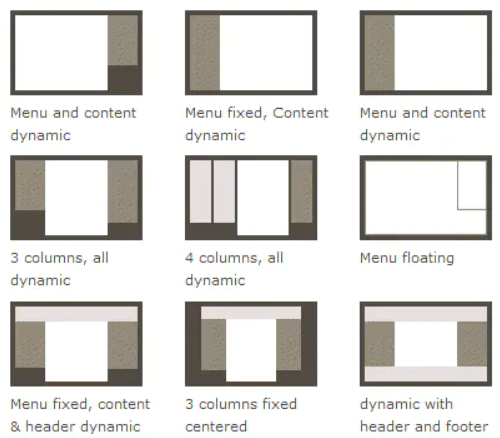
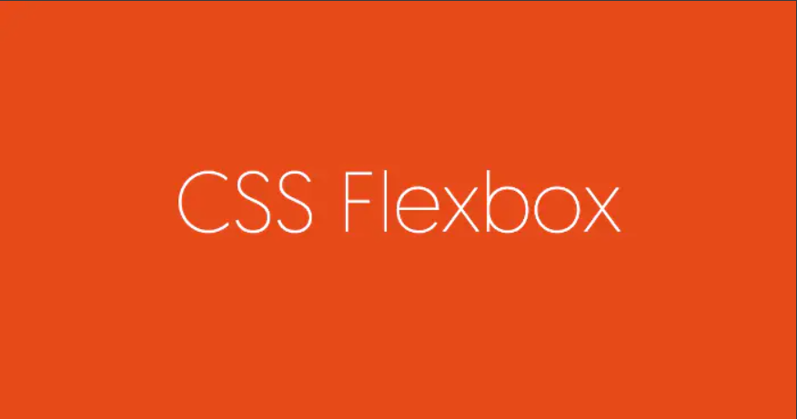
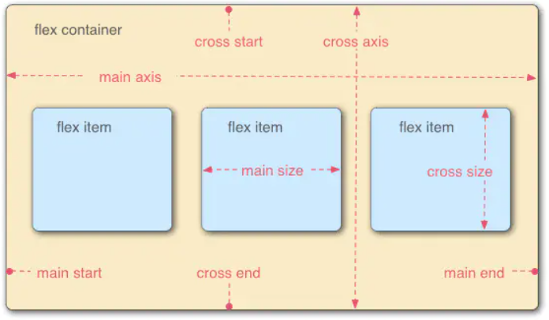
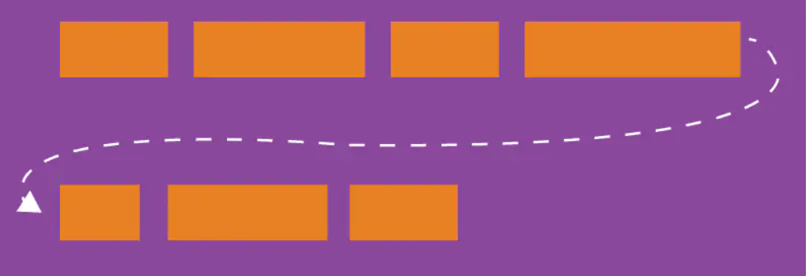
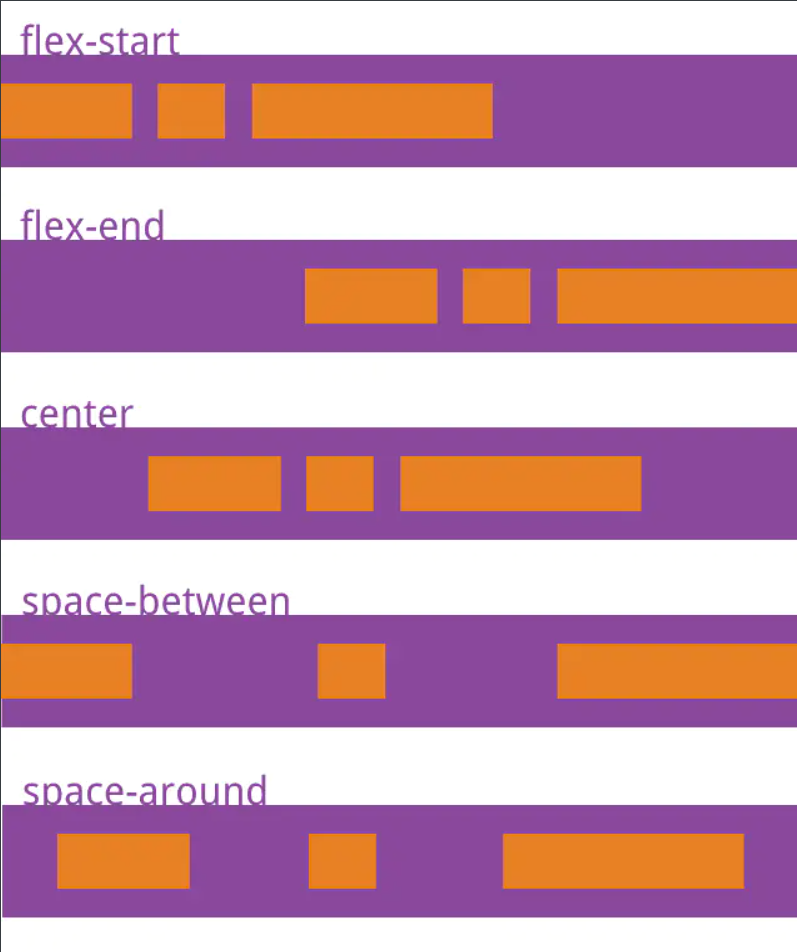
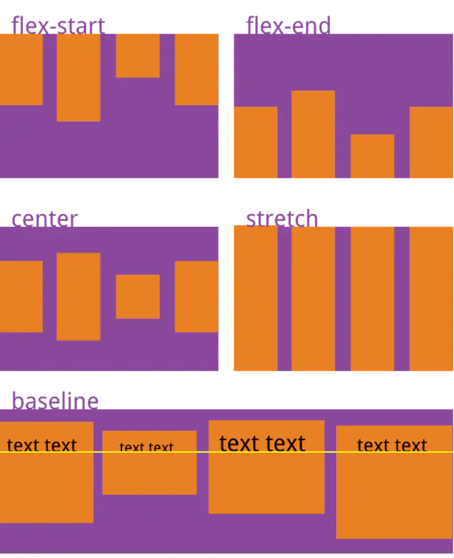
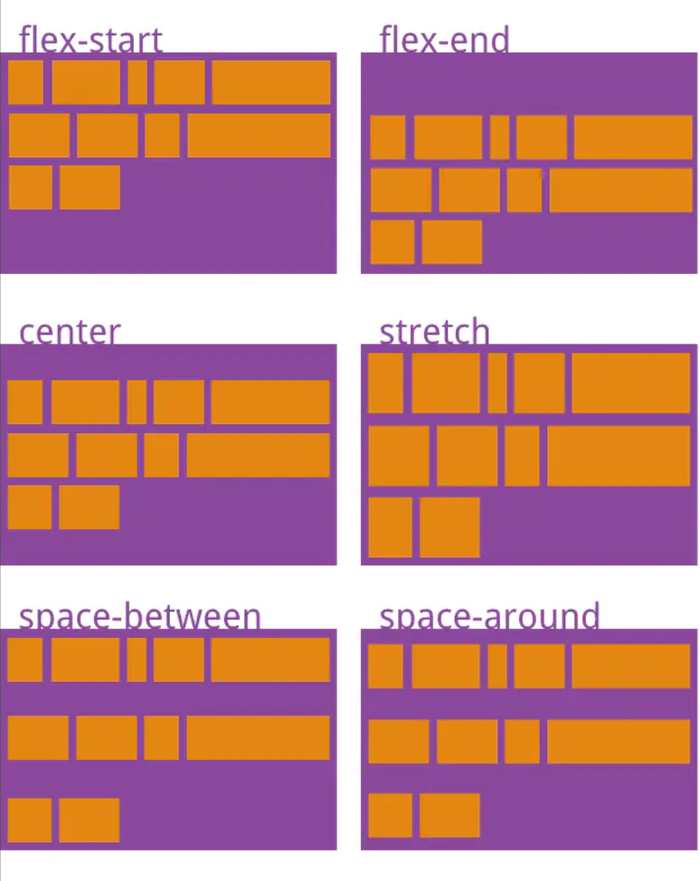
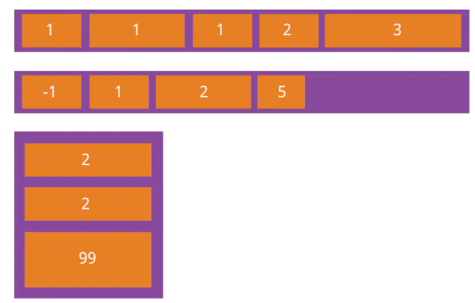
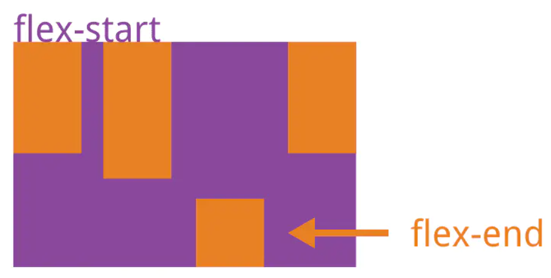

# 一、Flex

FlexiableBox即是弹性盒，用来进行弹性布局，一般跟rem连起来用比较方便，flexbox负责处理页面布局，然后rem处理一些flex顾及不到的地方（rem伸缩布局主要处理尺寸的适配问题），布局还是要传统布局的。



布局的传统解决方案，依赖[display](https://links.jianshu.com/go?to=https%3A%2F%2Fdeveloper.mozilla.org%2Fen-US%2Fdocs%2FWeb%2FCSS%2Fdisplay)属性 +[position](https://links.jianshu.com/go?to=https%3A%2F%2Fdeveloper.mozilla.org%2Fen-US%2Fdocs%2FWeb%2FCSS%2Fposition)属性 +[float](https://links.jianshu.com/go?to=https%3A%2F%2Fdeveloper.mozilla.org%2Fen-US%2Fdocs%2FWeb%2FCSS%2Ffloat)属性。它对于那些特殊布局非常不方便，比如，[垂直居中](https://links.jianshu.com/go?to=https%3A%2F%2Fcss-tricks.com%2Fcentering-css-complete-guide%2F)就不容易实现。




2009年，W3C提出了一种新的方案—-Flex布局，可以简便、完整、响应式地实现各种页面布局。目前，它已经得到了所有浏览器的支持，这意味着，现在就能很安全地使用这项功能。


Flex布局将成为未来布局的首选方案。本文介绍Flex布局的语法。

以下内容主要参考了下面两篇文章：[A Complete Guide to Flexbox](https://links.jianshu.com/go?to=https%3A%2F%2Fcss-tricks.com%2Fsnippets%2Fcss%2Fa-guide-to-flexbox%2F)和[A Visual Guide to CSS3 Flexbox Properties](https://links.jianshu.com/go?to=https%3A%2F%2Fscotch.io%2Ftutorials%2Fa-visual-guide-to-css3-flexbox-properties)。

# 二、Flex布局是什么？

Flex是Flexible Box的缩写，意为”弹性布局”，用来为盒状模型提供最大的灵活性。任何一个容器都可以指定为Flex布局。

```css
.box{
    display:flex;
}
```

行内元素也可以使用Flex布局。

```css
.box{
    display:inline-flex;
}
```

Webkit内核的浏览器，必须加上-webkit前缀。

```css
.box{
    display:-webkit-flex;
    /* Safari */
    display:flex;
}
```

==注意，设为Flex布局以后，子元素的float、clear和vertical-align属性将失效。==

# 三、基本概念

采用`Flex`布局的元素，称为`Flex`容器（`flex container`），简称”容器”。它的所有子元素自动成为容器成员，称为`Flex`项目（`flex item`），简称”项目”。



容器默认存在两根轴：主轴（`main axis`）和侧轴（`cross axis`）。主轴的开始位置（与边框的交叉点）叫做`main start`，结束位置叫做`main end`；侧轴的开始位置叫做cross start，结束位置叫做cross end。

项目默认沿主轴（X方向，可设置主轴的方向则另一个就为侧轴）排列。单个项目占据的主轴空间叫做`main size`，占据的侧轴空间叫做cross size。

# 四、父容器的属性

以下6个属性设置在容器上。

> + `flex-direction`：设置主轴的方向
> + `justify-content`：设置主轴上的子元素排列方式
> + `flex-wrap`：设置子元素是否换行  
> + `align-content`：设置侧轴上的子元素的排列方式（多行）
> + `align-items`：设置侧轴上的子元素排列方式（单行）
> + `flex-flow`：复合属性，相当于同时设置了 flex-direction 和 flex-wrap

## 3.1 flex-direction属性

`flex-direction`属性决定主轴的方向（即项目的排列方向）。

```css
.box{
    flex-direction:row|row-reverse|column|column-reverse;
}
```


它可能有4个值。

> row（默认值）：主轴为水平方向，起点在左端。
>
> row-reverse：主轴为水平方向，起点在右端(翻转排序)。
>
> column：主轴为垂直方向，起点在上沿。
>
> column-reverse：主轴为垂直方向，起点在下沿(翻转排序)。
>

## 3.2 flex-wrap属性

默认情况下，项目都排在一条线（又称”轴线”）上。flex-wrap属性定义，如果一条轴线排不下，如何换行。



```css
.box{
flex-wrap:nowrap|wrap|wrap-reverse;
}
```

它可能取三个值。

### （1）nowrap（默认）：不换行。


### （2）wrap：换行，第一行在上方。


### （3）wrap-reverse：换行，第一行在下方。


## 3.3 flex-flow属性

`flex-flow`属性是`flex-direction`属性和`flex-wrap`属性的简写形式，默认值为`row nowrap`。

```css
.box{
    flex-flow:主轴方向 | 是否换行;
}
```

## 3.4 justify-content属性

`justify-content`属性定义了项目在主轴上的对齐方式。

```css
.box{
    justify-content:flex-start|flex-end|center|space-between|space-around;
}
```

它可能取5个值，具体对齐方式与轴的方向有关。下面假设主轴为从左到右。

> flex-start（默认值）：左对齐
>
> flex-end：右对齐
>
> center： 居中
>
> space-between：两端对齐，项目之间的间隔都相等。
>
> space-around：每个项目两侧的间隔相等。所以，项目之间的间隔比项目与边框的间隔大一倍。




## 3.5 align-items属性

`align-items`属性定义项目在交叉轴上如何对齐。

```css
.box{
    align-items:flex-start|flex-end|center|baseline|stretch;
}
```

它可能取5个值。具体的对齐方式与交叉轴的方向有关，下面假设交叉轴从上到下。

> flex-start：交叉轴的起点对齐。
>
> flex-end：交叉轴的终点对齐。
>
> center：交叉轴的中点对齐。
>
> baseline: 项目的第一行文字的基线对齐。
>
> stretch（默认值）：如果项目未设置高度或设为auto，将占满整个容器的高度。




## 3.6 align-content属性

`align-content`属性定义了多根轴线的对齐方式。如果项目只有一根轴线，该属性不起作用。

```css
.box{
    align-content:flex-start|flex-end|center|space-between|space-around|stretch;
}
```

该属性可能取6个值。

> flex-start：与交叉轴的起点对齐。
>
> flex-end：与交叉轴的终点对齐。
>
> center：与交叉轴的中点对齐。
>
> space-between：与交叉轴两端对齐，轴线之间的间隔平均分布。
>
> space-around：每根轴线两侧的间隔都相等。所以，轴线之间的间隔比轴线与边框的间隔大一倍。
>
> stretch（默认值）：轴线占满整个交叉轴。




# 五、子项目的属性

以下6个属性设置在项目上。

> `order`：属性定义子项的排列顺序（前后顺序）
>
> `flex-grow`:定义项目的放大比例
>
> `flex-shrink`:定义了项目的缩小比例
>
> `flex-basis`:定义了在分配多余空间之前，项目占据的主轴空间（`main size`）
>
> `flex`：子项目占的份数
>
> `align-self`：控制子项自己在侧轴的排列方式

## 4.1 order属性

`order`属性定义项目的排列顺序。数值越小，排列越靠前，==默认为0==。

```css
.item{
    order: -1; /*此时会排在最前面*/
}
```



## 4.2 flex-grow属性

`flex-grow`属性定义项目的放大比例，==默认为0==，即如果存在剩余空间，也不放大。

```css
.item{
    flex-grow:;/* default 0 */
}
```


如果所有项目的`flex-grow`属性都为1，则它们将等分剩余空间（如果有的话）。如果一个项目的`flex-grow`属性为2，其他项目都为1，则前者占据的剩余空间将比其他项多一倍。

## 4.3 flex-shrink属性

`flex-shrink`属性定义了项目的缩小比例，==默认为1==，即如果空间不足，该项目将缩小。

```css
.item{
    flex-shrink:;/* default 1 */
}
```


如果所有项目的`flex-shrink`属性都为1，当空间不足时，都将等比例缩小。如果一个项目的`flex-shrink`属性为0，其他项目都为1，则空间不足时，前者不缩小。

==负值对该属性无效。==

## 4.4 flex-basis属性

`flex-basis`属性定义了在分配多余空间之前，项目占据的主轴空间（`main size`）。浏览器根据这个属性，计算主轴是否有多余空间。它的默认值为`auto`，即项目的本来大小。

```css
.item{
    flex-basis:|auto;/* default auto */
}
```

它可以设为跟width或height属性一样的值（比如350px），则项目将占据固定空间。

## 4.5 flex属性

`flex`属性是`flex-grow`,` flex-shrink `和` flex-basis`的简写，==默认值为`0 1 auto`==。后两个属性可选。

```css
.item{
    flex:none|[<'flex-grow'><'flex-shrink'>?||<'flex-basis'>];
}
```

该属性有两个快捷值：`auto (1 1 auto) `和 `none (0 0 auto)`。

==建议优先使用这个属性，而不是单独写三个分离的属性，因为浏览器会推算相关值。==

## 4.6 align-self属性

`align-self`属性允许单个项目有与其他项目不一样的对齐方式，可覆盖`align-items`属性。默认值为`auto`，表示继承父元素的`align-items`属性，如果没有父元素，则等同于`stretch`。

```css
.item{
    align-self:auto|flex-start|flex-end|center|baseline|stretch;
}
```



该属性可能取6个值，除了`auto`，其他都与`align-items`属性完全一致。

来源：http://www.ruanyifeng.com/blog/2015/07/flex-grammar.html

[案例](./)