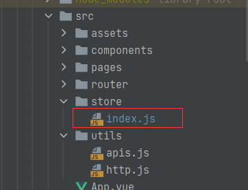

# 前后端

## 1、前后端json数据处理

### 依赖

```xml
<dependency>
    <groupId>com.alibaba</groupId>
    <artifactId>fastjson</artifactId>
    <version>1.2.14</version>
</dependency>
```

### 前端数据格式

```json
editForm:{
    id:'',
    songName: '',
    album: '',
    lyrics: '',
}
```

### 后端接收处理

```java
@RequestMapping("/editSongInfo")
public ResultMap editSongInfo(@RequestBody String data){
    JSONObject parseData = JSON.parseObject(data);
    Song song = songService.selectByPrimaryKey(parseData.getInteger("id"));
    song.setId(parseData.getInteger("id"));
    song.setName(parseData.getString("songName"));
    song.setIntroduction(parseData.getString("album"));
    song.setLyric(parseData.getString("lyrics"));
    ResultMap resultMap = songService.editSongInfo(song);
    return  resultMap;
}
```

## 2、解决通过URL访问静态资源（springboot）

### 新建配置类

```java
package com.daniel.music.config;

import org.springframework.context.annotation.Bean;
import org.springframework.context.annotation.Configuration;
import org.springframework.web.servlet.config.annotation.ResourceHandlerRegistry;
import org.springframework.web.servlet.config.annotation.WebMvcConfigurer;

@Configuration
public class MyStaticResourceConfig {
    @Bean
    public WebMvcConfigurer webMvcConfigurer() {
        return new WebMvcConfigurer() {
            @Override
            public void addResourceHandlers(ResourceHandlerRegistry registry) {
                String userDir = System.getProperty("user.dir");
                String fileUrl = "file:"+userDir+"/Resource/image/songImg/";
                System.out.println("============="+fileUrl);
                registry.addResourceHandler("/pic/**").addResourceLocations(fileUrl);
            }
        };
    }
}

```

值的注意的是他们是如何映射的


## 3、Vuex使用

### 导入

```sh
npm install vuex --save

npm install es6-promise --save # npm
```

### 新建store



```js
import Vue from 'vue';
import Vuex from 'vuex';
Vue.use(Vuex)

const store = new Vuex.Store({
  state:{
    PIC_HOST: 'http://localhost:9090/music/api/pic', // 静态资源访问路径
    isPlay: false,          //是否播放中
    url: '',                //歌曲地址
    id: '',                  //歌曲id
    count: 0 // 计数
  },
  getters: {
    isPlay: state => state.isPlay,
    url: state => state.url,
    id: state => state.id,
    count: state => state.count
  },
  mutations: {
    setIsPlay: (state,isPlay) => {state.isPlay = isPlay},
    setUrl: (state,url) => {state.url = url},
    setId: (state,id) => {state.id = id},
    setCount: (state,count) => {state.count = count}
  }
})

export default store
```

或者更进一步，将下列代码添加到你使用 Vuex 之前的一个地方：

```js
import 'es6-promise/auto'
import store from '@/store/index.js'

new Vue({
  el: '#app',
  store,
  render: h => h(App)
})
```

现在，你可以通过 `store.state` 来获取状态对象，以及通过 `store.commit` 方法触发状态变更

通过`this.$store.state.count`在所有组件中使用

```js
methods: {
  increment() {
    this.$store.commit('setCount',40)
	console.log(this.$store.state.count)
  }
}
```


# 数据库

## 1、数据库表及其数据复制

### show create table 旧表;

这样会将旧表的创建命令列出。我们只需要将该命令拷贝出来，更改table的名字，就可以建立一个完全一样的表

```sql
show create table song;
```

执行后可查看song表的建表语句，复制其建表语句即可创建相同结果表，注意更改表名


然后插入语句即可

```sql
insert into song_test select * from song; # 注意表结构相同才能导入S
```

### 复制表结构及数据到新表

```sql
CREATE TABLE 新表 SELECT * FROM 旧表
```

这种方法会将oldtable中所有的内容都拷贝过来，当然我们可以用`delete from newtable;`来删除。

不过这种方法的一个最不好的地方就是新表中没有了旧表的`primary key、Extra（auto_increment）`等属性。需要自己用&quot;alter&quot;添加，而且容易搞错。

### 只复制表结构到新表

```sql
CREATE TABLE 新表 SELECT * FROM 旧表 WHERE 1=2
# 或
CREATE TABLE 新表 LIKE 旧表
```

### 复制旧表的数据到新表(假设两个表结构一样)

```sql
INSERT INTO 新表 SELECT * FROM 旧表
```

### 复制旧表的数据到新表(假设两个表结构不一样)

```sql
INSERT INTO 新表(字段1,字段2,.......) SELECT 字段1,字段2,...... FROM 旧表
```

### 可以将表1结构复制到表2

```sql
SELECT * INTO 表2 FROM 表1 WHERE 1=2
```

### 可以将表1内容全部复制到表2

```sql
SELECT * INTO 表2 FROM 表1
```

### mysqldump

用mysqldump将表dump出来，改名字后再导回去或者直接在命令行中运行

### 复制旧数据库到新数据库（复制全部表结构并且复制全部表数据）

```sql
\#mysql -u root -ppassword
\>CREATE DATABASE new_db;
\#mysqldump old_db -u root -ppassword--skip-extended-insert --add-drop-table | mysql new_db -u root -ppassword
```


### 表不在同一数据库中（如，db1 table1, db2 table2)

```sql
sql: insert into db1.table1 select * from db2.table2 (完全复制)
insert into db1.table1 select distinct * from db2.table2(不复制重复纪录）
insert into tdb1.able1 select top 5 * from  db2.table2 (前五条纪录)
```


## 案例

### 将song表中的pic字段的路径更改，通过复制表的方式更改

```sql
# 查询song表结构
show create table song;
# 复制其结构并改名为song_test
CREATE TABLE `song_test`
(
    `id`           int(11) NOT NULL AUTO_INCREMENT COMMENT '主键',
    `singer_id`    int(11)      DEFAULT NULL COMMENT '歌手id',
    `name`         varchar(255) DEFAULT NULL COMMENT '革命',
    `introduction` varchar(255) DEFAULT NULL COMMENT '简介',
    `create_time`  datetime     DEFAULT NULL COMMENT '创建时间',
    `update_time`  datetime     DEFAULT NULL COMMENT '更新时间',
    `pic`          varchar(255) DEFAULT NULL COMMENT '歌曲图片',
    `lyric`        text COMMENT '歌词',
    `url`          varchar(255) DEFAULT NULL COMMENT '歌曲地址',
    PRIMARY KEY (`id`)
) ENGINE = InnoDB
  AUTO_INCREMENT = 131
  DEFAULT CHARSET = utf8 COMMENT ='歌曲';
# 复制表song数据到song_test中
# 复制过程中对pic字段做处理，当pic字段中的值前1到12位为'/img/songPic' 时将其替换为'/Resource/image/songImg'
# 例：pic原始值：/img/songPic/daniel.jpg 替换后：/Resource/image/songImg/daniel.jpg
insert into song_test
select id,
       singer_id,
       name,
       introduction,
       create_time,
       update_time,
       (
           CASE substr(pic,1,12)
            WHEN '/img/songPic' THEN concat('/Resource/image/songImg',substr(pic,13))
            ELSE pic
           END
           ),
       lyric,
       url
from song;
# 清空song表
truncate table song;
# 将song_test处理过的数据导入到song表
insert into song select * from song_test;
```


