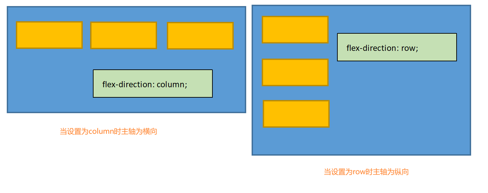
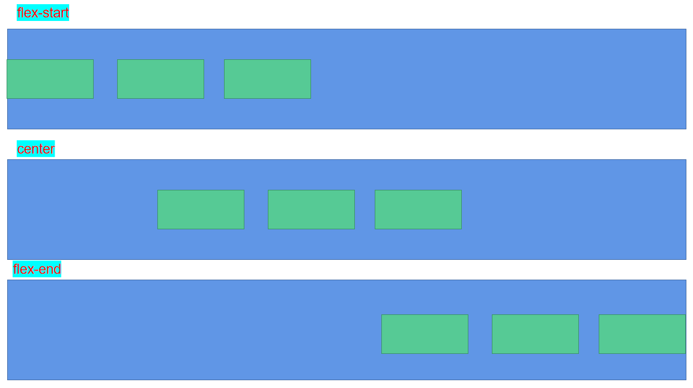
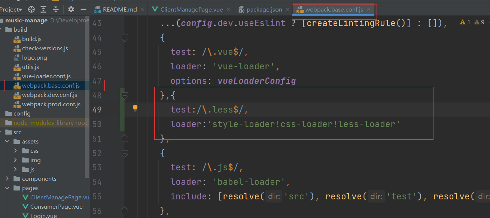
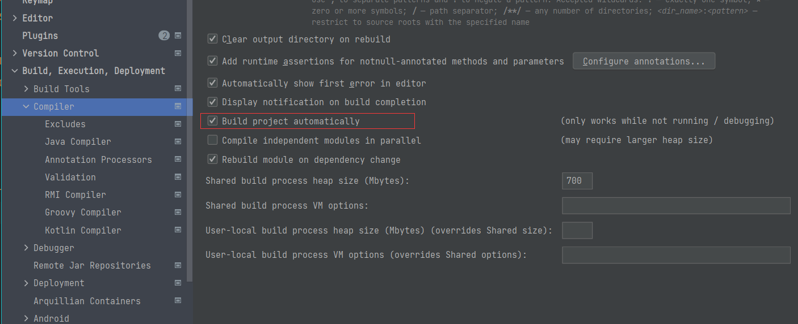

# 前后端访问

## 1、前后端json数据处理

### 依赖

```xml
<dependency>
    <groupId>com.alibaba</groupId>
    <artifactId>fastjson</artifactId>
    <version>1.2.14</version>
</dependency>
```

### 前端数据格式

```json
editForm:{
    id:'',
    songName: '',
    album: '',
    lyrics: '',
}
```

### 后端接收处理

```java
@RequestMapping("/editSongInfo")
public ResultMap editSongInfo(@RequestBody String data){
    JSONObject parseData = JSON.parseObject(data);
    Song song = songService.selectByPrimaryKey(parseData.getInteger("id"));
    song.setId(parseData.getInteger("id"));
    song.setName(parseData.getString("songName"));
    song.setIntroduction(parseData.getString("album"));
    song.setLyric(parseData.getString("lyrics"));
    ResultMap resultMap = songService.editSongInfo(song);
    return  resultMap;
}
```

## 2、解决通过URL访问静态资源（springboot）

### 新建配置类

```java
package com.daniel.music.config;

import org.springframework.context.annotation.Bean;
import org.springframework.context.annotation.Configuration;
import org.springframework.web.servlet.config.annotation.ResourceHandlerRegistry;
import org.springframework.web.servlet.config.annotation.WebMvcConfigurer;

@Configuration
public class MyStaticResourceConfig {
    @Bean
    public WebMvcConfigurer webMvcConfigurer() {
        return new WebMvcConfigurer() {
            @Override
            public void addResourceHandlers(ResourceHandlerRegistry registry) {
                String userDir = System.getProperty("user.dir");
                String fileUrl = "file:"+userDir+"/Resource/image/songImg/";
                System.out.println("============="+fileUrl);
                registry.addResourceHandler("/pic/**").addResourceLocations(fileUrl);
            }
        };
    }
}

```

值的注意的是他们是如何映射的


# 数据库

## 1、数据库表及其数据复制

### show create table 旧表;

这样会将旧表的创建命令列出。我们只需要将该命令拷贝出来，更改table的名字，就可以建立一个完全一样的表

```sql
show create table song;
```

执行后可查看song表的建表语句，复制其建表语句即可创建相同结果表，注意更改表名


然后插入语句即可

```sql
insert into song_test select * from song; -- 注意表结构相同才能导入S
```

### 复制表结构及数据到新表

```sql
CREATE TABLE 新表 SELECT * FROM 旧表
```

这种方法会将oldtable中所有的内容都拷贝过来，当然我们可以用`delete from newtable;`来删除。

不过这种方法的一个最不好的地方就是新表中没有了旧表的`primary key、Extra（auto_increment）`等属性。需要自己用&quot;alter&quot;添加，而且容易搞错。

### 只复制表结构到新表

```sql
CREATE TABLE 新表 SELECT * FROM 旧表 WHERE 1=2
-- 或
CREATE TABLE 新表 LIKE 旧表
```

### 复制旧表的数据到新表(假设两个表结构一样)

```sql
INSERT INTO 新表 SELECT * FROM 旧表
```

### 复制旧表的数据到新表(假设两个表结构不一样)

```sql
INSERT INTO 新表(字段1,字段2,.......) SELECT 字段1,字段2,...... FROM 旧表
```

### 可以将表1结构复制到表2

```sql
SELECT * INTO 表2 FROM 表1 WHERE 1=2
```

### 可以将表1内容全部复制到表2

```sql
SELECT * INTO 表2 FROM 表1
```

### mysqldump

用mysqldump将表dump出来，改名字后再导回去或者直接在命令行中运行

### 复制旧数据库到新数据库（复制全部表结构并且复制全部表数据）

```sql
\#mysql -u root -ppassword
\>CREATE DATABASE new_db;
\#mysqldump old_db -u root -ppassword--skip-extended-insert --add-drop-table | mysql new_db -u root -ppassword
```


### 表不在同一数据库中（如，db1 table1, db2 table2)

```sql
sql: insert into db1.table1 select * from db2.table2 		   -- (完全复制)
insert into db1.table1 select distinct * from db2.table2        -- (不复制重复纪录）
insert into tdb1.able1 select top 5 * from  db2.table2          -- (前五条纪录)
```


## 综合案例

### 将表字段部分内容更改，直接在原表更改

```sql
update song_test
set pic =
        (
            case substr(pic, 1, 23)
                when '/Resource/image/songImg' then concat('/test', substr(pic, 24))
                else pic
                end
            );
```


### 将song表中的pic字段的路径更改，通过复制表的方式更改

```sql
-- 查询song表结构
show create table song;
-- 复制其结构并改名为song_test
CREATE TABLE `song_test`
(
    `id`           int(11) NOT NULL AUTO_INCREMENT COMMENT '主键',
    `singer_id`    int(11)      DEFAULT NULL COMMENT '歌手id',
    `name`         varchar(255) DEFAULT NULL COMMENT '革命',
    `introduction` varchar(255) DEFAULT NULL COMMENT '简介',
    `create_time`  datetime     DEFAULT NULL COMMENT '创建时间',
    `update_time`  datetime     DEFAULT NULL COMMENT '更新时间',
    `pic`          varchar(255) DEFAULT NULL COMMENT '歌曲图片',
    `lyric`        text COMMENT '歌词',
    `url`          varchar(255) DEFAULT NULL COMMENT '歌曲地址',
    PRIMARY KEY (`id`)
) ENGINE = InnoDB
  AUTO_INCREMENT = 131
  DEFAULT CHARSET = utf8 COMMENT ='歌曲';
-- 复制表song数据到song_test中
-- 复制过程中对pic字段做处理，当pic字段中的值前1到12位为'/img/songPic' 时将其替换为'/Resource/image/songImg'
-- 例：pic原始值：/img/songPic/daniel.jpg 替换后：/Resource/image/songImg/daniel.jpg
insert into song_test
select id,
       singer_id,
       name,
       introduction,
       create_time,
       update_time,
       (
           CASE substr(pic,1,12)
            WHEN '/img/songPic' THEN concat('/Resource/image/songImg',substr(pic,13))
            ELSE pic
           END
           ),
       lyric,
       url
from song;
-- 清空song表
truncate table song;
-- 将song_test处理过的数据导入到song表
insert into song select * from song_test;
```

# 前端

## 1、前端创建vue2.0常用命令

### 安装vue-cli

```sh
npm install -g @vue/cli # 安装vue cli
vue -V # 检查是否安装
```

### 创建项目

```sh
vue cerate vue-cli-demo # vue-cli-demo为项目名
cd vue-cli-demo
```

详细步骤见：[vue项目结构化.md](../FrontEnd/VUE/vue项目结构化.md#三vue-cli)

### 导入echarts

```sh
npm install echarts --save
```

### 导入element-ui

```sh
npm i element-ui -S
```

```js
// 在main.js 中使用
import ElementUI from 'element-ui';//引入elementui
Vue.use(ElementUI);// 使用插件
```

### 导入axios

```sh
npm install axios -S
```


### 导入vue-router

```bash
npm install vue-router -S
```

如果在一个模块化工程中使用它，必须要通过 `Vue.use()` 明确地安装路由功能：

```js
import Vue from 'vue'
import VueRouter from 'vue-router'

Vue.use(VueRouter)
```

### 导入vuex

```sh
npm install vuex --save
```

在一个模块化的打包系统中，您必须显式地通过 `Vue.use()` 来安装 Vuex：

```js
import Vue from 'vue'
import Vuex from 'vuex'

Vue.use(Vuex)
```

Vuex 依赖 [Promise (opens new window)](https://developer.mozilla.org/zh-CN/docs/Web/JavaScript/Guide/Using_promises)。如果你支持的浏览器并没有实现 Promise (比如 IE)，那么你可以使用一个 polyfill 的库，例如 [es6-promise (opens new window)](https://github.com/stefanpenner/es6-promise)。

你可以通过 CDN 将其引入：

```html
<script src="https://cdn.jsdelivr.net/npm/es6-promise@4/dist/es6-promise.auto.js"></script>
```

然后 `window.Promise` 会自动可用。

如果你喜欢使用诸如 npm 或 Yarn 等包管理器，可以按照下列方式执行安装：

```bash
npm install es6-promise --save # npm
yarn add es6-promise # Yarn
```

或者更进一步，将下列代码添加到你使用 Vuex 之前的一个地方：

```js
import 'es6-promise/auto'
```

#### 新建store


```js
import Vue from 'vue';
import Vuex from 'vuex';
Vue.use(Vuex)

const store = new Vuex.Store({
  state:{
    PIC_HOST: 'http://localhost:9090/music/api/pic', // 静态资源访问路径
    isPlay: false,          //是否播放中
    url: '',                //歌曲地址
    id: '',                  //歌曲id
    count: 0 // 计数
  },
  getters: {
    isPlay: state => state.isPlay,
    url: state => state.url,
    id: state => state.id,
    count: state => state.count
  },
  mutations: {
    setIsPlay: (state,isPlay) => {state.isPlay = isPlay},
    setUrl: (state,url) => {state.url = url},
    setId: (state,id) => {state.id = id},
    setCount: (state,count) => {state.count = count}
  }
})

export default store
```

或者更进一步，将下列代码添加到你使用 Vuex 之前的一个地方：

```js
import 'es6-promise/auto'
import store from '@/store/index.js'

new Vue({
  el: '#app',
  store,
  render: h => h(App)
})
```

现在，你可以通过 `store.state` 来获取状态对象，以及通过 `store.commit` 方法触发状态变更

通过`this.$store.state.count`在所有组件中使用

```js
methods: {
  increment() {
    this.$store.commit('setCount',40)
	console.log(this.$store.state.count)
  }
}
```

### 导入animate.css

```sh
npm install animate.css -S
```


## 2、vue2.0常用配置文件

### api公共配置类http.js

```js
import axios from 'axios';
axios.defaults.timeout = 5000;  //超市时间是5秒
axios.defaults.withCredentials = true;  //允许跨域
//Content-Type 响应头
axios.defaults.headers.post['Content-Type'] = 'application/x-www-form-urlencoded;charset=UTF-8';
//基础url
axios.defaults.baseURL = "http://localhost:9090/music/api";

//响应拦截器
axios.interceptors.response.use(
  response => {
    //如果reponse里面的status是200，说明访问到接口了，否则错误
    if(response.status == 200){
      return Promise.resolve(response);
    }else{
      return Promise.reject(response);
    }
  },
  error => {
    if(error.response.status){
      switch(error.response.status){
        case 401:       //未登录
          router.replace({
            path:'/',
            query:{
              redirect: router.currentRoute.fullPath
            }
          });
          break;
        case 404:   //没找到
          break;
      }
      return Promise.reject(error.response);
    }
  }
);

/**
 * 封装get方法
 */
export function get(url,params={}){
  return new Promise((resolve,reject) => {
    axios.get(url,{params:params})
      .then(response =>{
        resolve(response.data);
      })
      .catch(err =>{
        reject(err);
      })
  });
}

/**
 * 封装post方法
 */
export function post(url,data={}){
  return new Promise((resolve,reject) => {
    axios.post(url,data)
      .then(response =>{
        resolve(response.data);
      })
      .catch(err =>{
        reject(err);
      })
  });
}

```

### api.js

```js
import Axios from "axios";
import {get, post} from './http'
// =========================歌手列表数据======================================
//获取歌手列表
export const getSingerList = (params) => get('/singer/singerList', params)
//添加歌手
export const addSinger = (params) => post('/singer/addSinger', params)
```


### router/index.js

```js
import Vue from 'vue'
import Router from 'vue-router'

Vue.use(Router)

export default new Router({
  routes: [
    {
      path: '/',
      component: resolve => require(['../pages/Login.vue'], resolve)
    },
    {
      path: '/home',
      component: resolve => require(['../components/Home.vue'], resolve),
      children:[
        {
          path:'/main',
          component: resolve => require(['../pages/mainPage.vue'], resolve),
        },
        {
          path:'/Consumer',
          component: resolve => require(['../pages/ConsumerPage.vue'], resolve),
        },
        {
          path:'/Singer',
          component: resolve => require(['../pages/SingerPage.vue'], resolve),
        },
        {
          path:'/SongList',
          component: resolve => require(['../pages/SongListPage.vue'], resolve),
        },
        {
          name:'SingerManage',
          path:'/SingerManage/:singerId',
          props: true,
          component: resolve => require(['../pages/SingerManage.vue'], resolve),
        },
      ]
    }
  ]
})

```

### store/index.js

```js
import Vue from 'vue';
import Vuex from 'vuex';

Vue.use(Vuex)

const store = new Vuex.Store({
  state: {
    PIC_HOST: 'http://localhost:9090/music/api/pic', // 静态资源访问路径
    isPlay: false,          //是否播放中
    url: '',                //歌曲地址
    id: '',                 //歌曲id
    count: 0                // 计数
  },
  getters: {
    isPlay: state => state.isPlay,
    url: state => state.url,
    id: state => state.id,
    count: state => state.count
  },
  mutations: {
    setIsPlay: (state, isPlay) => {
      state.isPlay = isPlay
    },
    setUrl: (state, url) => {
      state.url = url
    },
    setId: (state, id) => {
      state.id = id
    },
    setCount: (state, count) => {
      state.count = count
    }
  }
})

export default store

```


### main.js

```js
import Vue from 'vue'
import App from './App'
import router from './router/index'
import ElementUI from 'element-ui'
import 'element-ui/lib/theme-chalk/index.css'
import './assets/css/main.css'
import 'babel-polyfill'
import 'es6-promise/auto'
import VCharts from 'v-charts'
import Axios from "axios";
import  '@/assets/js/aixin.js'
import ECharts from "echarts"
import store from '@/store/index.js'

Vue.use(ElementUI)
Vue.use(VCharts)
Vue.use(ECharts)
Vue.prototype.$http = Axios
Axios.defaults.baseURL="http://localhost:9090/music/api"
/* eslint-disable no-new */
new Vue({
  el: '#app',
  router,
  store,
  render: h => h(App)
})

```

## 3、前端存储全局变量

### Window localStorage 属性

使用 `localStorage `创建一个本地存储的 `name/value `对，`name="lastname" value="Smith"`, 然后检索 `"lastname"` 的值，并插入到 `id="result" `的元素上:

```js
// 存储 
localStorage.setItem("lastname", "Smith"); 
// 检索 
document.getElementById("result").innerHTML = localStorage.getItem("lastname");
```


### 定义和使用

`localStorage `和 `sessionStorage `属性允许在浏览器中存储 `key/value` 对的数据。

`localStorage `用于长久保存整个网站的数据，保存的数据没有过期时间，直到手动去删除。

`localStorage `属性是只读的。

提示: 如果你只想将数据保存在当前会话中，可以使用 `sessionStorage` 属性， 该数据对象临时保存同一窗口(或标签页)的数据，在关闭窗口或标签页之后将会删除这些数据。

## 4、Flex布局

当我们使用flex布局时，会利用其优秀的特性，完成页面架构的初步搭建，而flex使用时也应该注意一些常见的问题

### 主轴方向的设置

```less
.box{
    display: flex;
	flex-direction: column;
}
```



### 固定主轴方向后子元素的居中方式

**通过设置父元素justify-content属性**

该属性定义了项目在主轴上的对齐方式

```less
.box{
    justify-content:flex-start|flex-end|center|space-between|space-around;
}
// flex-start（默认值）：左对齐
// flex-end：右对齐
// center： 居中
// space-between：两端对齐，项目之间的间隔都相等。
// space-around：每个项目两侧的间隔相等。所以，项目之间的间隔比项目与边框的间隔大一倍。
```



示例

```less
.box{
    display: flex;
	flex-direction: column;
   	justify-content: center;
    .box-item{
        
    }
}
```

**通过设置父元素align-items属性**

`align-items`属性定义项目在交叉轴上如何对齐。

```less
.box{
    align-items:flex-start|flex-end|center|baseline|stretch;
}
// flex-start：交叉轴的起点对齐。
// flex-end：交叉轴的终点对齐。
// center：交叉轴的中点对齐。
// baseline: 项目的第一行文字的基线对齐。
// stretch（默认值）：如果项目未设置高度或设为auto，将占满整个容器的高度。
```

如`justify-content`属性类似，只不过`justify-content`属性设置主轴方向上的对齐方式，而`align-items`是设置其非主轴方向的对齐方式，例如：主轴为x轴方向且居中方式为（`justify-content:center`）那么所有子元素在x轴的居中位置，此时设置`align-items:center;`则子元素既保持x居中也可保持y轴居中。

## 5、CSS中使用外部字体

当我们需要的字体需要外部文件导入时可以使用css导入

```css
@font-face
{
font-family: myFirstFont;
src: url('aa.ttf'),
     url('aa.eot'); /* IE9+,可以是具体的实际链接 */
}
```

## 6、vue报CSS解析出错


在build文件夹下添加配置loader加载依赖，让其支持外部的less,在原来的代码上添加



```json
{
    test:/\.less$/,
    loader:'style-loader!css-loader!less-loader'
},
```

如果运行还有问题，记得查看**packjosn.js中‘less-loader’版本**，如果过高，比如我一开始是版本8，

执行

```sh
npm uninstall less-loader
```

卸载‘less-loader’并重新安装

```sh
npm install less-loader@5.0.0
```

也可能是版本原因卸载原有的

```sh
npm uninstall --save sass-loader
npm uninstall --save less-loader
npm uninstall --save less
```

然后严格控制版本下载依赖，

```sh
npm install less-loader@4.1.0 --save-dev
npm install less@3.9.0 --save-dev
```


# ElementUI框架

## 1、表格

### ElementUI表格字段过滤

```html
<el-table-column
                 prop="sex"
                 label="性别"
                 width="50"
                 :formatter="formatSex">
</el-table-column>
```

```js
formatSex(row, column) {
    return row.sex === 1 ? '男' : row.sex === 0 ? '女' : '未知'
}
```

# Ubuntu 20.04操作系统

## 用户

### 1、创建用户

#### 添加用户

```sh
root@daniel-esc:~# useradd -d /home/daniel -m -s /bin/bash daniel
```

#### 修改密码

```sh
root@daniel-esc:~# passwd daniel
```


#### 加root权限

```sh
# 修改文件权限
chomd 777 /etc/sudoers

vim /etc/sudoers
# 切换至daniel账户
su -l daniel
```


## JDK

在/home/daniel/software目录下开启终端，解压jdk安装包

```
daniel@daniel:~/software$ tar -zxvf jdk-9.0.1_linux-x64_bin.tar.gz 
```

### 配置环境

`/etc/profile`文件的改变会涉及到系统的环境，也就是有关Linux环境变量的东西

所以，我们要将jdk配置到`/etc/profile`，才可以在任何一个目录访问jdk

```
daniel@daniel:~/software$ vim /etc/profile
```

按i进入编辑，在profile文件尾部添加如下内容

```sh
JAVA_HOME=/home/daniel/software/jdk1.8.0_301
PATH=$JAVA_HOME/bin:$PATH
CLASSPATH=.:$JAVA_HOME/lib/dt.jar:$JAVA_HOME/lib/tools.jar
export JAVA_HOME
export PATH
export CLASSPATH
```

保存并退出编辑（esc :wq）

通过命令source /etc/profile让profile文件立即生效

```sh
daniel@daniel:~/software$ source /etc/profile
```

### 4.测试是否安装成功

```sh
daniel@daniel:~/software$ java -version
```


## 解压

```sh
(1) *.tar 用 tar –xvf 解压
(2) *.gz 用 gzip -d或者gunzip 解压
(3) *.tar.gz和*.tgz 用 tar –xzf 解压
(4) *.bz2 用 bzip2 -d或者用bunzip2 解压
(5) *.tar.bz2用tar –xjf 解压
(6) *.Z 用 uncompress 解压
(7) *.tar.Z 用tar –xZf 解压
(8) *.rar 用 unrar e解压
(9) *.zip 用 unzip 解压
(10) *.xz 用 xz -d 解压
(11) *.tar.xz 用 tar -zJf 解压
```


## Screen命令

#### 语法

```sh
screen [-AmRvx -ls -wipe][-d <作业名称>][-h <行数>][-r <作业名称>][-s <shell>][-S <作业名称>]
```

**参数说明**：

- -A 　将所有的视窗都调整为目前终端机的大小。
- -d<作业名称> 　将指定的screen作业离线。
- -h<行数> 　指定视窗的缓冲区行数。
- -m 　即使目前已在作业中的screen作业，仍强制建立新的screen作业。
- -r<作业名称> 　恢复离线的screen作业。
- -R 　先试图恢复离线的作业。若找不到离线的作业，即建立新的screen作业。
- -s<shell> 　指定建立新视窗时，所要执行的shell。
- -S<作业名称> 　指定screen作业的名称。
- -v 　显示版本信息。
- -x 　恢复之前离线的screen作业。
- -ls或--list 　显示目前所有的screen作业。
- -wipe 　检查目前所有的screen作业，并删除已经无法使用的screen作业。

#### 安装 Screen

现在许多的 Linux 发行版通常都预装了 Screen 。通过运行以下命令，可以查看系统是否安装了 Screen ：

```sh
$ screen --version
Screen version 4.06.02 (GNU) 23-Oct-17 
```

如果你的系统并未安装 Screen ，则可以执行以下命令来安装：

```sh
$ sudo apt install screen
```

#### 启动 Screen 会话

想要启动一个 Screen 会话，只需输入以下命令：

```sh
$ screen
```

输入 `screen` 命令后，你会看到一个布满版权信息的界面，你只需按回车或者空格键就可以跳过这个界面。跳过之后，你就可以看到终端界面了。这个终端和原来的终端并没有什么不同，你一样可以浏览文件夹，打开文件，在原来的终端中能做到的事情，它也可以做到。

你也可以在启动 Screen 会话时，使用 `-S` 参数给会话起名字。例如，我想启动一个叫 `alvin` 的 Screen 会话：

```sh
$ screen -S daniel
```

当你启动了不止一个 Screen 会话时，这可以用来区分其他 Screen 会话。

进入 Screen 终端后，按 `Ctrl a+?` 快捷键，可以查看 Screen 所附带的所有命令：

#### 分离与重新连接 Screen 会话

假如你要更新系统，你输入更新命令后，是需要等待很长时间才更新完毕的。这时，如果你没用 `screen` 命令，一旦你的网络连接断开了，那么更新就会被打断，你就必须要重新开始更新。

Screen 会话的分离功能可以解决这个问题。你可以进入 Screen 终端里执行更新命令，然后输入会话分离快捷键 `Ctrl a+d` ,你会看到以下提示信息：

这就表示你已经成功从 Screen 会话中分离出来并回到原来的 Shell 会话中了。这时，Screen 会话会继续留在后台执行更新任务。而且无论是网络断开连接，还是关闭原来的 Shell 会话，它都不会受到影响。

当然，如果你来不及按会话分离快捷键网络就断开了，Screen 会话也不会关闭，它一样会继续留在后台执行更新任务。

如果你想重新连接到已分离的 Screen 会话，以查看更新进程，只需执行以下命令：

```sh
$ screen -r
```

需要注意的是，该命令只适用于当前终端只启动了一个 Screen 会话的情况。

#### 嵌套 Screen 会话

嵌套 Screen 会话，顾名思义，就是 Screen 会话中的 Screen 会话，是实现用户在一个窗口中使用多个终端的方法之一。

想要启动一个嵌套 Screen 会话很简单，你只需要在 Screen 终端再次输入 `screen` 命令，或者按 `Ctrl a+c` 快捷键，这会在你原来的 Screen 会话中再启动一个 Screen 会话，而原来的 Screen 会话则会在后台保持活动。

例如，你运行了 `top` 命令来监控系统的 CPU 的使用情况：

```sh
$ top
```

而你既不想关掉这个 `top` 进程，又想同时做其他的任务，那么你就可以使用 `Ctrl a+c` 快捷键来启动一个新的 Screen 会话，这样，你既可以保持 `top` 命令在后台运行，又可以去执行其他的任务。

而如果你想切换回执行 `top` 命令的 Screen 会话，可以使用快捷键 `Ctrl a+n` （切换至下一个 Screen 会话）或者 `Ctrl a+p` （切换至上一个 Screen 会话）进行切换。

#### 分离并启动新的 Screen 会话

从 Screen 会话中分离出来再启动新的 Screen 会话，也可以实现用户在一个窗口中使用多个终端。

例如，你启动一个 Screen 会话，然后输入 `df -h` 来查看硬盘的使用情况：

```sh
$ df -h
```

然后你可以按 `Ctrl a+d` 快捷键从 Screen 会话中分离出来，回到原来的终端。这时你就可以再次输入 `screen` 命令启动一个新的 Screen 会话来执行其他的任务。

如果你想重新连接回运行 `df -h` 命令的 Screen 会话，则需要先从新的 Screen 会话中分离出来，然后尝试输入 `screen -r` 命令。这时，由于你并行启动了多个 Screen 会话，然而 `screen` 命令并不知道你想要重新连接到哪个会话中，因此，你会看到以下提示信息：

从图中可以看到，每个 Screen 会话都有自己的 ID（ 4352 与 4294 ）以及自己的名字（ `pts-0.lxlinux` ）。这里可以看到两个会话的名字都是 `pts-0.lxlinux` ，那是因为我启动 Screen 会话的时候，没有指定名字，因此它们都以默认的名字作为自己的名字。

想要重新连接到运行 `df -h` 命令的 Screen 会话，你只需在 `screen -r` 命令后面再加上会话的 ID 就可以了，像这样：

```sh
$ screen -r 4352
```

当然，如果在启动 Screen 会话时，你给会话指定了独一无二的名字，那么你也可以通过会话的名字来指定重新连接到哪个会话，例如，重新连接到名字为 `alvin` 的会话：

```sh
$ screen -r alvin
```

如果你并不知道 Screen 会话的 ID 以及名字，你也可以通过以下命令来查看：

```sh
$ screen -ls
```

#### 关闭 Screen 会话

要关闭 Screen 会话很简单，就和关闭平常的会话一样，你可以使用 `Ctrl d` 快捷键，也可以输入 `exit` 命令关闭：

```sh
$ exit
```

#### 批量关闭会话

如果有20个screen，关闭所有screen

```sh
screen -ls|awk 'NR>=2&&NR<=20{print $1}'|awk '{print "screen -S "$1" -X quit"}'|sh
```


## 系统常用命令

```sh
# 杀死进程
kill -s 9 80410  # 80410为进程号
# 查找程序
ps -aux | grep server.properties # 文件名
```

## ps命令

```sh
ps a 	# 显示现行终端机下的所有程序，包括其他用户的程序。
ps -A	# 显示所有程序。 
ps c 	# 列出程序时，显示每个程序真正的指令名称，而不包含路径，参数或常驻服务的标示。 
ps -e	# 此参数的效果和指定"A"参数相同。 
ps e 	# 列出程序时，显示每个程序所使用的环境变量。 
ps f 	# 用ASCII字符显示树状结构，表达程序间的相互关系。 
ps -H	# 显示树状结构，表示程序间的相互关系。 
ps -N	# 显示所有的程序，除了执行ps指令终端机下的程序之外。 
ps s 	# 采用程序信号的格式显示程序状况。 
ps S 	# 列出程序时，包括已中断的子程序资料。 
ps -t	# 指定终端机编号，并列出属于该终端机的程序的状况。 
ps u 	# 以用户为主的格式来显示程序状况。 
ps x 	# 显示所有程序，不以终端机来区分。
```

ps是显示当前状态处于running的进程，grep表示在这些里搜索，而ps aux是显示所有进程和其状态。

````
$ ps aux | grep amoeba

查到amoeba的进程

```
$ kill -s 9 pid
```

杀死进程
````

## 删除文件文件夹

```sh
rm 文件名 # -r 表示强制删除目录及文件
rmdir 文件夹 #rmdir命令进行文件夹删除，文件夹必须为空

rm -r filename # 删除文件或文件夹及其文件
```


# 项目热部署

### 导入依赖

```xml
<!--devtools热部署-->
<dependency>
    <groupId>org.springframework.boot</groupId>
    <artifactId>spring-boot-devtools</artifactId>
    <optional>true</optional>
    <scope>true</scope>
</dependency>
```

### 配置文件

```yml
spring:
  devtools:
    restart:
      enabled: true  #设置开启热部署
      additional-paths: src/main/java #重启目录
      exclude: WEB-INF/**
  freemarker:
    cache: false    #页面不加载缓存，修改即时生效
```

设置IDEA自动编译



按住``Ctrl+shift+Alt+/`` 进入Registry，勾选`compiler.automake.allow.when.app.running`


