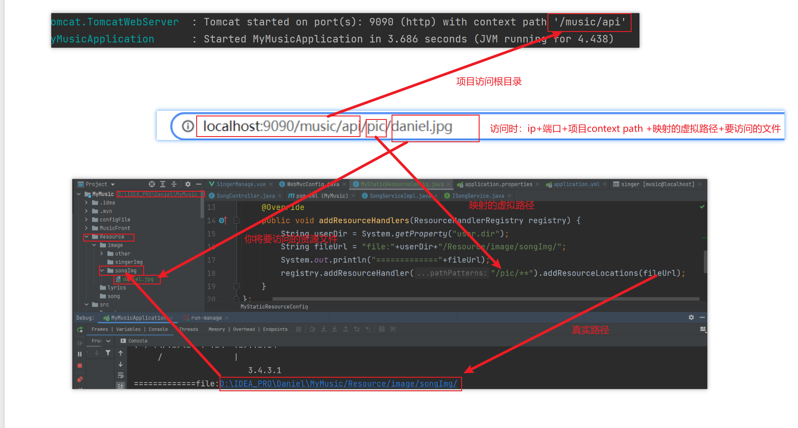

# 1、前后端json数据处理

## 依赖

```xml
<dependency>
    <groupId>com.alibaba</groupId>
    <artifactId>fastjson</artifactId>
    <version>1.2.14</version>
</dependency>
```

## 前端数据格式

```json
editForm:{
    id:'',
    songName: '',
    album: '',
    lyrics: '',
}
```

## 后端接收处理

```java
@RequestMapping("/editSongInfo")
public ResultMap editSongInfo(@RequestBody String data){
    JSONObject parseData = JSON.parseObject(data);
    Song song = songService.selectByPrimaryKey(parseData.getInteger("id"));
    song.setId(parseData.getInteger("id"));
    song.setName(parseData.getString("songName"));
    song.setIntroduction(parseData.getString("album"));
    song.setLyric(parseData.getString("lyrics"));
    ResultMap resultMap = songService.editSongInfo(song);
    return  resultMap;
}
```

# 2、解决通过URL访问静态资源（springboot）

## 新建配置类

```java
package com.daniel.music.config;

import org.springframework.context.annotation.Bean;
import org.springframework.context.annotation.Configuration;
import org.springframework.web.servlet.config.annotation.ResourceHandlerRegistry;
import org.springframework.web.servlet.config.annotation.WebMvcConfigurer;

@Configuration
public class MyStaticResourceConfig {
    @Bean
    public WebMvcConfigurer webMvcConfigurer() {
        return new WebMvcConfigurer() {
            @Override
            public void addResourceHandlers(ResourceHandlerRegistry registry) {
                String userDir = System.getProperty("user.dir");
                String fileUrl = "file:"+userDir+"/Resource/image/songImg/";
                System.out.println("============="+fileUrl);
                registry.addResourceHandler("/pic/**").addResourceLocations(fileUrl);
            }
        };
    }
}

```

值的注意的是他们是如何映射的



